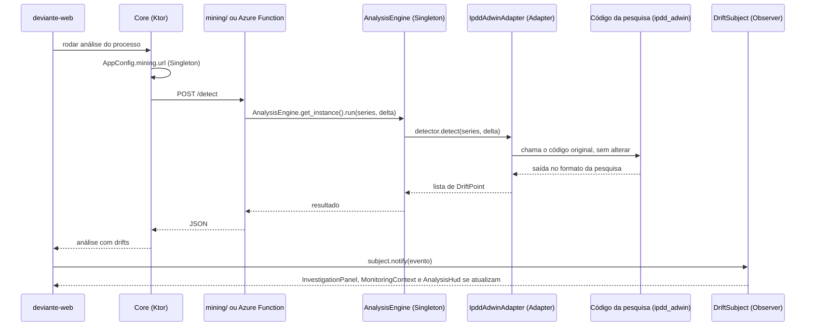

# Defesa Reuso 03: os três padrões de projeto

O enunciado (item 01) pede 3 padrões focados em reuso. Seguimos a **Opção 02**: três padrões, dois exemplos codificados de cada, um padrão de cada família do GoF. As classes estão no banco **Classes** do Notion (coluna Padrão).

| Família | Padrão | Exemplo 1 | Exemplo 2 |
|---|---|---|---|
| Criacional | Singleton | `AppConfig` (Core, Kotlin) | `AnalysisEngine` (análise de drift, Python) |
| Estrutural | Adapter | `IpddAdwinAdapter` → `DriftDetector` | `Pm4pyGraphAdapter` → `GraphMiner` |
| Comportamental | Observer | `DriftSubject` → `InvestigationPanel`, `MonitoringContext` | `DriftSubject` → `AnalysisHud` |

> Estado em 06/10: nenhuma dessas classes existe ainda no código (`deviante-api` e `deviante-web` conferidos). Este roteiro descreve como elas vão funcionar depois de desenvolvidas.

Strategy foi descartado porque dependia de RUL e probabilidade de falha, que estão fora do escopo da v1 (ADR 06).

## Como os padrões aparecem na defesa

Os CRUDs (Processo, Atividade, Equipamento, Agenda) passam só pelo Core, então o **Singleton `AppConfig`** aparece dentro de qualquer CRUD. **Adapter** e **Observer** vivem no fluxo de análise de drift, que é o coração do produto; eles entram num trecho separado, depois dos CRUDs, rodando uma análise num processo que já tem log.

Esse trecho não depende da Azure Function estar no ar: hoje a análise roda no serviço `mining/` (FastAPI no Fly.io), chamado pelo Core em `/api/processes/{id}/analysis`. O adaptador é o mesmo código nos dois lugares; quando a Function existir, ele só muda de casa.

## 1. Singleton

**Por que serve ao reuso:** um único ponto de acesso a um recurso caro ou que precisa ser igual em toda a aplicação. Quem precisa da configuração ou do motor de análise reaproveita a mesma instância, em vez de reconstruí-la.

### 1.1 `AppConfig` (Core, Kotlin)

- **Onde:** `deviante-api/src/main/kotlin/AppConfig.kt` (novo).
- **Como:** `object AppConfig` do Kotlin, que já é um Singleton na linguagem (instância única, criada de forma preguiçosa e segura entre threads). Função `init(config: ApplicationConfig)` chamada uma vez no início; propriedades `database` (jdbcUrl, user, password), `supabase` (url, anonKey), `mining` (url) e os padrões da análise (`delta = 0.002`, janela).
- **Quem usa:** `Database.kt`, `SupabaseAuth.kt` (`configureSupabaseAuthClient`) e `MiningClient.kt` param de ler `environment.config` cada um por conta própria e passam a ler do `AppConfig`.
- **Demonstrar:** em qualquer CRUD, abrir `Database.kt` e mostrar `AppConfig.database.jdbcUrl`; depois mostrar que `SupabaseAuth.kt` lê do mesmo objeto. Fala: "a configuração é carregada uma vez e todo o Core reaproveita a mesma instância".

### 1.2 `AnalysisEngine` (análise de drift, Python)

- **Onde:** `mining/app/analysis_engine.py` (novo); vai para a Azure Function junto com o adaptador.
- **Como:** classe com `_instance` de classe e `get_instance()`, que cria na primeira chamada e devolve a mesma depois. Guarda o `detector: DriftDetector` (o adaptador). Método `run(series, delta)`.
- **Por que aqui:** numa Function "quente", o módulo continua carregado entre chamadas; o Singleton evita recriar o detector a cada requisição.
- **Demonstrar:** teste `mining/tests/test_analysis_engine.py` com `assert AnalysisEngine.get_instance() is AnalysisEngine.get_instance()`; depois rodar a análise na tela e mostrar no código que o endpoint `/detect` chama `get_instance()`.

## 2. Adapter

**Por que serve ao reuso:** o código da pesquisa (IPDD/ADWIN) e a biblioteca pm4py têm interfaces próprias. O adaptador traduz essas interfaces para a que o Deviante espera, sem copiar nem alterar o código original ("envolver, não fazer fork"). Se o detector ou a biblioteca mudarem, só o adaptador muda.

### 2.1 `IpddAdwinAdapter` → `DriftDetector`

- **Onde:** `mining/app/drift_detector.py` (novo) com a interface `DriftDetector` (classe abstrata, método `detect(series, delta) -> list[DriftPoint]`) e `IpddAdwinAdapter`, que a implementa.
- **Adaptado:** `mining/app/ipdd_adwin.py`, o código da pesquisa, que continua como está.
- **Como:** `IpddAdwinAdapter.detect` chama a função original (`detect_performance_drifts`), recebe a saída no formato da pesquisa e converte cada ponto em `DriftPoint(trace_index, mean_before, mean_after)`.
- **Demonstrar:** abrir a interface, o adaptador e o `ipdd_adwin.py` lado a lado; mostrar que `ipdd_adwin.py` não tem nenhuma linha do Deviante. Rodar `test_detector.py`, que passa a testar pelo adaptador. Fala: "o resto do sistema só conhece `DriftDetector`; trocar o algoritmo é escrever outro adaptador".

### 2.2 `Pm4pyGraphAdapter` → `GraphMiner`

- **Onde:** `mining/app/graph_miner.py` (novo) com a interface `GraphMiner` (`mine(event_log) -> ProcessGraph`) e `Pm4pyGraphAdapter`.
- **Adaptado:** o DFG (directly-follows graph) do pm4py.
- **Como:** o adaptador chama o pm4py, recebe o dicionário de pares e frequências e devolve um `ProcessGraph` com `nodes` e `edges` no formato que o front desenha.
- **Demonstrar:** subir um log no processo e mostrar o grafo; no código, mostrar o endpoint chamando `GraphMiner.mine` em vez de chamar o pm4py direto.

## 3. Observer

**Por que serve ao reuso:** quando uma análise termina ou um drift é detectado, várias partes da tela precisam reagir. Com o Observer, quem publica o evento não conhece quem escuta; um painel novo só precisa se inscrever, sem mexer no publicador.

- **Onde:** `deviante-web/src/lib/driftSubject.js` (novo), com `subscribe(observer)`, `unsubscribe(observer)` e `notify(event)`, e uma instância única exportada para o app.
- **Evento:** `{ type: 'analysis-completed' | 'drift-detected', processId, analysisId, driftPoints }`, publicado pelo código que recebe a resposta de `api.runProcessAnalysis`.
- **Observadores:**
  - **Exemplo 1, `InvestigationPanel` e `MonitoringContext`:** o painel de investigação abre no drift mais recente; o contexto de monitoramento marca o equipamento ou processo como "com drift".
  - **Exemplo 2, `AnalysisHud`:** o HUD da análise atualiza a contagem de drifts e o status.
- **Onde ficam:** `InvestigationPanel` e `AnalysisHud` saem de `components/process-analysis/ProcessAnalysisView.jsx` (hoje a tela de análise é um componente só); `MonitoringContext` é um contexto React usado por `pages/MonitoringPage.jsx`.
- **Como cada um se inscreve:** num `useEffect`, `driftSubject.subscribe(observer)` e, no retorno do efeito, `unsubscribe` (evita vazamento quando o componente sai da tela).
- **Demonstrar:** rodar uma análise e mostrar os três componentes mudando ao mesmo tempo; abrir `driftSubject.js` e mostrar a lista `observers` e o laço do `notify`; mostrar o `useEffect` de um observador. Fala: "o código que chama a API não sabe quantos painéis existem".

## 4. Perguntas prováveis

- **Por que um padrão de cada família?** Mostra reuso em três níveis: criação de objetos (Singleton), integração com código de terceiros (Adapter) e comunicação entre componentes (Observer).
- **Singleton não é um antipadrão?** Usamos só onde o recurso é de fato único (configuração, motor de análise). Não guardam estado de negócio, então não escondem dependências entre requisições.
- **Qual a diferença entre Adapter e Facade aqui?** O adaptador implementa uma interface que o sistema já define (`DriftDetector`, `GraphMiner`). Uma fachada só simplificaria uma API, sem obrigar a encaixar numa interface existente.
- **Por que o Observer fica no front?** O evento que interessa ao usuário é "o resultado chegou"; quem precisa reagir são os componentes da tela.

## 5. Checagem antes de ensaiar

- [ ] `AppConfig.kt` criado e usado por `Database.kt`, `SupabaseAuth.kt` e `MiningClient.kt`.
- [ ] `analysis_engine.py`, `drift_detector.py`, `graph_miner.py` e testes no `mining/`.
- [ ] `driftSubject.js` e os três observadores no front.
- [ ] Um processo demo com log carregado e drift conhecido, para a análise sair igual no dia.
