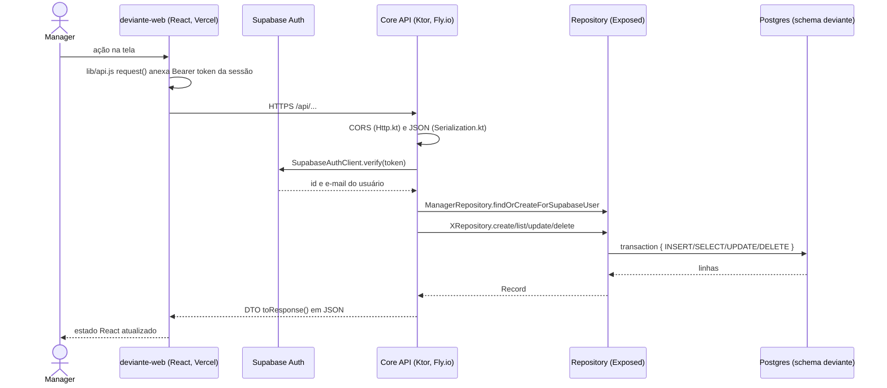

# Defesa Reuso 03: roteiro do Alander (Processo e Atividade)

Prova de autoria em 16/10. Cada integrante demonstra 2 CRUDs com conexão ao banco e explica o caminho do código. Este roteiro cobre **Processo** e **Atividade**. Os dois rodam só no Core (React → Ktor → Supabase Postgres), sem Function nem microsserviços.

> Os caminhos de arquivo valem para a `main` de 06/10. Se o porte das telas do Figma mudar nomes de componentes, atualize a coluna "Front" antes de ensaiar.

## 1. O caminho comum (falar uma vez, no início)

Fala curta: "O front nunca fala com o banco. Ele manda o token do Supabase para o Core; o Core confere o token no Supabase Auth, descobre qual Manager está logado, chama o repositório, e o repositório abre uma transação no Postgres pelo pool do Hikari. A resposta volta como DTO em JSON."

| Camada | Arquivo | O que mostrar |
|---|---|---|
| Cliente HTTP | `deviante-web/src/lib/api.js` → `authHeader()`, `request()` | token Bearer anexado em toda chamada |
| Entrada do Core | `deviante-api/src/main/resources/application.yaml` | ordem dos módulos: Http, Serialization, Database, Routing |
| Conexão | `deviante-api/src/main/kotlin/Database.kt` | HikariCP com 5 conexões, `Database.connect` (depois do desenvolvimento, lê a configuração do Singleton `AppConfig`) |
| Autenticação | `Routing.kt` → `requireSupabaseUser`, `SupabaseAuth.kt` → `verify` | 401 sem token ou token expirado |
| Manager | `repository/ManagerRepository.kt` → `findOrCreateForSupabaseUser` | cria o Manager no primeiro acesso, papel owner/manager |

## 2. CRUD de Processo (objeto ORCA PROCESS)

Tabela `deviante.processes` (`db/ProcessesTable.kt`): `id`, `manager_id` (FK managers), `name`, `company_name`, `description`, `sector`, `created_at`, `updated_at`.

**Estado hoje:** API e telas completas. Só ensaiar.

| Operação | Na tela | Front | HTTP | Core | Banco |
|---|---|---|---|---|---|
| Create | Dashboard, botão "Novo processo" | `DashboardPage.jsx` → `handleCreateProcess` → `api.createProcess()` | `POST /api/processes` | `Routing.kt` rota `post` em `/processes` → `ProcessRepository.create(managerId)` | `INSERT` com nome padrão "Untitled" (criação instantânea, estilo Figma) |
| Read (lista) | Dashboard carrega os cards | `DashboardPage.jsx` → `api.listProcesses()` | `GET /api/processes` | `ProcessRepository.listAll()` | `SELECT ... ORDER BY updated_at DESC` |
| Read (um) | Abrir um card | `ProcessCanvasPage.jsx` → `api.getProcess(id)` | `GET /api/processes/{id}` | `ProcessRepository.findById` | `SELECT ... WHERE id = ? LIMIT 1`; 404 se não existe |
| Update | Aba Detalhes, salvar; ou renomear no topo | `ProcessDetailsTab.jsx` → `api.updateProcess`; `ProcessCanvasPage.jsx` → `api.renameProcess` | `PUT /api/processes/{id}`; `PATCH /api/processes/{id}/name` | validação: nome obrigatório, até 100 caracteres (400 com `fieldErrors`) → `ProcessRepository.update` / `updateName` | `UPDATE ... SET name, description, sector, updated_at` |
| Delete | Aba Detalhes, excluir, digitar o nome e a frase | `ProcessDetailsTab.jsx` → `api.deleteProcess(id, confirmation)` | `DELETE /api/processes/{id}` com corpo | só `owner` (403 para manager) → `validateProcessDeletion` confere nome e frase "quero excluir este processo" → `ProcessRepository.delete` | `DELETE ... WHERE id = ?` |

Roteiro de fala, na ordem:
1. Logar com a conta demo de owner. Mostrar o Dashboard vazio ou com seeds.
2. **Create:** clicar "Novo processo". Mostrar no DevTools o `POST` e a resposta 201. Abrir `ProcessRepository.create`: o Core gera o UUID e grava o `manager_id` de quem está logado.
3. **Read:** voltar ao Dashboard; mostrar `listAll` e o `toResponse()` em `dto/ProcessDto.kt` (o Record vira DTO; datas viram texto ISO).
4. **Update:** renomear e preencher setor. Mostrar a validação no `put("/{id}")` e o 400 se o nome ficar em branco.
5. **Delete:** tentar com uma conta manager para mostrar o 403. Depois, com owner, mostrar a confirmação dupla e o 204.
6. Fechar: "uma tabela, quatro rotas REST, regra de papel no delete".

## 3. CRUD de Atividade (objeto ORCA ACTIVITY)

Tabelas `deviante.activities` (`id`, `name`, `description`, datas) e `deviante.process_activities` (`process_id`, `activity_id`, PK composta), ambas em `db/ActivitiesTable.kt`. A Atividade é um catálogo; a tabela de junção diz quais atividades cada Processo usa (N:N).

**Estado hoje:** API com create, read e update; o vínculo com Processo já tem PUT e DELETE. Não há tela própria, a atividade só aparece no modal de upload de log.

**Desenvolver:**
- **API:** `DELETE /api/activities/{id}` em `Routing.kt` e `ActivitiesRepository.delete(id)`. Regra: se alguma operação de log estiver mapeada para a atividade (`operations.activity_id`), responder 409 "Atividade em uso"; senão apagar os vínculos em `process_activities` e a atividade, na mesma transação.
- **Front:** `api.deleteActivity(id)` em `lib/api.js`; página `ActivitiesPage.jsx` na rota `/activities` (lista, criar, editar, excluir), com item no menu lateral; na aba Detalhes do processo, uma lista de atividades com adicionar e remover (usa `addProcessActivity` e `removeProcessActivity`, que já existem).

| Operação | Na tela | Front | HTTP | Core | Banco |
|---|---|---|---|---|---|
| Create | `/activities`, "Nova atividade" | `api.createActivity` | `POST /api/activities` | nome obrigatório (400) → `ActivitiesRepository.create` | `INSERT INTO activities` |
| Read | `/activities` carrega a lista | `api.listActivities` | `GET /api/activities` | `listAll` | `SELECT` |
| Update | editar nome ou descrição | `api.updateActivity` | `PUT /api/activities/{id}` | `update` | `UPDATE activities` |
| Delete | excluir | `api.deleteActivity` (novo) | `DELETE /api/activities/{id}` (novo) | 409 se em uso → `delete` (novo) | `DELETE FROM process_activities`, depois `activities` |
| Vincular | aba Detalhes do processo, adicionar | `api.addProcessActivity` | `PUT /api/processes/{p}/activities/{a}` | `requireProcess` → `linkToProcess` | `INSERT ... ON CONFLICT DO NOTHING` (`insertIgnore`) |
| Desvincular | remover da lista | `api.removeProcessActivity` | `DELETE /api/processes/{p}/activities/{a}` | `unlinkFromProcess` | `DELETE FROM process_activities` |

Roteiro de fala:
1. Abrir `/activities`, criar "Usinagem" e "Inspeção".
2. Abrir o processo criado antes e vincular as duas. Mostrar `insertIgnore`: vincular duas vezes não duplica, por causa da PK composta.
3. Editar "Inspeção" para "Inspeção final" e mostrar que o nome muda dentro do processo também, porque o vínculo guarda só o id.
4. Excluir uma atividade sem uso (204). Mostrar a regra do 409 no código.
5. Fechar: "três tabelas no meu par de CRUDs: processes, activities e a junção process_activities".

## 4. Perguntas prováveis

- **Por que o front não acessa o banco direto?** A chave do banco ficaria no navegador. O Core concentra regra de negócio (papel, validação) e é o único com credencial do Postgres.
- **Onde fica a transação?** Cada função de repositório roda dentro de `transaction { }` do Exposed; a conexão vem do pool do Hikari aberto em `Database.kt`.
- **Como o Core sabe quem é o usuário?** Pelo token do Supabase; `verify` pergunta ao Supabase Auth e devolve id e e-mail; `findOrCreateForSupabaseUser` liga isso a uma linha em `managers`.
- **O que acontece com os dados ligados a um processo excluído?** Depende do `ON DELETE` das FKs no banco; conferir antes da defesa (ver checagem).
- **E se o Supabase não estiver configurado?** `lib/api.js` cai num mock em `localStorage` (`shouldUseRemoteProcesses`). Na defesa o modo remoto precisa estar ativo.

## 5. Checagem antes de ensaiar

- [ ] DELETE de atividade, `ActivitiesPage` e vínculo na aba Detalhes publicados.
- [ ] Conferir o `ON DELETE` das FKs de `processes` e `activities` no Supabase.
- [ ] Contas demo owner e manager funcionando no site.
- [ ] Atualizar este roteiro se o porte do Figma renomear `DashboardPage`, `ProcessCanvasPage` ou `ProcessDetailsTab`.
