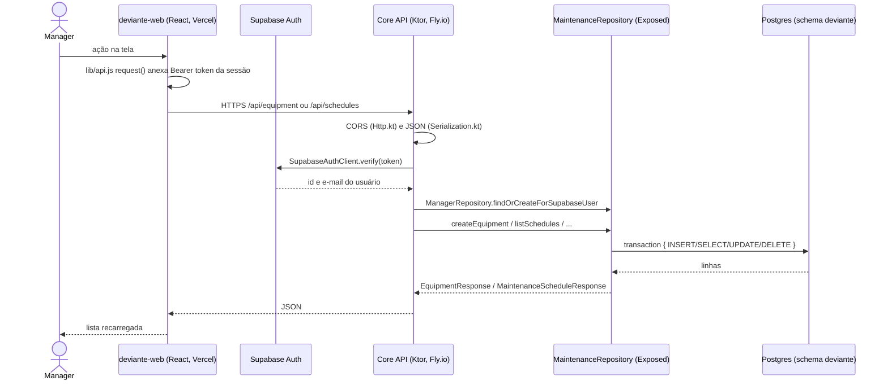

# Defesa Reuso 03: roteiro da Emanuelle (Equipamento e Agenda de manutenção)

Prova de autoria em 16/10. Cada integrante demonstra 2 CRUDs com conexão ao banco e explica o caminho do código. Este roteiro cobre **Equipamento** (máquina) e **Agenda de manutenção**. Os dois rodam só no Core (React → Ktor → Supabase Postgres), sem Function nem microsserviços.

> Os caminhos de arquivo valem para a `main` de 06/10. Se o porte das telas do Figma mudar nomes de componentes, atualize a coluna "Front" antes de ensaiar.

## 1. O caminho comum (falar uma vez, no início)

Fala curta: "O front nunca fala com o banco. Ele manda o token do Supabase para o Core; o Core confere o token no Supabase Auth, descobre qual Manager está logado e chama o `MaintenanceRepository`, que abre uma transação no Postgres pelo pool do Hikari."

| Camada | Arquivo | O que mostrar |
|---|---|---|
| Cliente HTTP | `deviante-web/src/lib/api.js` → `authHeader()`, `request()` | token Bearer anexado em toda chamada |
| Entrada do Core | `deviante-api/src/main/resources/application.yaml` | ordem dos módulos: Http, Serialization, Database, Routing |
| Conexão | `deviante-api/src/main/kotlin/Database.kt` | HikariCP com 5 conexões (depois do desenvolvimento, lê a configuração do Singleton `AppConfig`) |
| Autenticação | `Routing.kt` → `requireSupabaseUser`, `SupabaseAuth.kt` → `verify` | 401 sem token |
| Repositório | `repository/MaintenanceRepository.kt` | um repositório para equipamento, monitoramento e manutenção |

## 2. CRUD de Equipamento (objeto ORCA MACHINE)

Tabela `deviante.equipment` (`db/MonitoringTables.kt` → `EquipmentTable`): `id`, `manager_id` (FK managers), `name`, `tag`, `kind`, `location`, `description`, `manufacturer`, `model`, `serial_number`, `status`, datas. Corpo da requisição: `EquipmentRequest` em `dto/MaintenanceDto.kt` (só `name` é obrigatório).

**Estado hoje:** API completa. A tela `/equipment` (`EquipmentPage.jsx`) lista e cadastra; `api.updateMachine` e `api.deleteMachine` existem em `lib/api.js`, mas nenhuma tela os chama.

**Desenvolver (só front):** em `EquipmentPage.jsx`, reaproveitar `CreateEquipmentModal` para editar (preenchido com a linha clicada) e um botão de excluir com confirmação, chamando `updateMachine` e `deleteMachine` e depois `load()`.

| Operação | Na tela | Front | HTTP | Core | Banco |
|---|---|---|---|---|---|
| Create | `/equipment`, "Novo equipamento" | `CreateEquipmentModal` → `api.createEquipment` | `POST /api/equipment` | nome obrigatório (400) → `createEquipment(managerId, body)` | `INSERT INTO equipment` |
| Read | `/equipment` carrega a tabela | `load()` → `api.listAllMachines` | `GET /api/equipment` | `listEquipment(managerId)` | `SELECT ... WHERE manager_id = ?` |
| Update | editar na linha (novo) | `api.updateMachine` | `PUT /api/equipment/{id}` | `updateEquipment` | `UPDATE equipment`; 404 se não existe |
| Delete | excluir na linha (novo) | `api.deleteMachine` | `DELETE /api/equipment/{id}` | `deleteEquipment` | `DELETE FROM equipment`; 204 |

Roteiro de fala:
1. Logar com uma conta demo. Abrir `/equipment`.
2. **Create:** cadastrar "Torno CNC Prod1", tipo torno, TAG TRN-01. Mostrar o `POST` e o `EquipmentRequest`; no repositório, `assignEquipment` copia os campos do corpo para a linha.
3. **Read:** mostrar que a lista filtra pelo `manager_id` de quem está logado.
4. **Update:** trocar a localização. Mostrar `updateEquipment`, que devolve `null` (vira 404) quando nenhuma linha foi alterada.
5. **Delete:** excluir um equipamento sem agenda. Mostrar o 204.

## 3. CRUD de Agenda de manutenção (objeto ORCA MAINTENANCE)

Tabela `deviante.maintenance_schedules` (`db/MonitoringTables.kt` → `MaintenanceSchedulesTable`): `id`, `equipment_id` (FK equipment, obrigatória), `process_id` (FK processes, opcional), `recommendation_id` (opcional, não usado na defesa), `manager_id`, `title`, `notes`, `scheduled_start`, `scheduled_end`, `status` (`planned`, `in_progress`, `completed`, `canceled`), datas. Corpo: `MaintenanceScheduleRequest` em `dto/MaintenanceDto.kt`.

**Estado hoje:** API com as quatro rotas. A tela `/schedules` (`SchedulesPage.jsx`) só lista, em três visões (lista, kanban, calendário).

**Desenvolver:**
- **API:** no `put("/{id}")` de `/schedules`, a mesma validação do `post` (título obrigatório, datas válidas, fim depois do início).
- **Front:** `api.deleteSchedule(id)` em `lib/api.js`; em `SchedulesPage.jsx`, botão "Nova manutenção" e um modal com título, equipamento (select vindo de `api.listAllMachines`), processo opcional (`api.listProcesses`), início, fim, status e observações; clicar num card abre o mesmo modal para editar ou excluir.

| Operação | Na tela | Front | HTTP | Core | Banco |
|---|---|---|---|---|---|
| Create | "Nova manutenção" (novo) | `api.createSchedule` | `POST /api/schedules` | valida título e datas (400) → `createSchedule`, que confere se o equipamento existe (422 se não) | `INSERT INTO maintenance_schedules` |
| Read | `/schedules`, lista/kanban/calendário | `api.listSchedules({ equipmentId })` | `GET /api/schedules?equipmentId=` | `listSchedules(equipmentId)` | `SELECT ... ORDER BY scheduled_start` |
| Update | clicar no card e salvar (novo) | `api.updateSchedule` | `PUT /api/schedules/{id}` | validação (a acrescentar) → `updateSchedule` | `UPDATE maintenance_schedules` |
| Delete | excluir no modal (novo) | `api.deleteSchedule` (novo) | `DELETE /api/schedules/{id}` | `deleteSchedule` | `DELETE FROM maintenance_schedules`; 204 |

Roteiro de fala:
1. Abrir `/schedules`. Criar "Troca de rolamento" para o Torno CNC Prod1, ligada a um processo, com início amanhã.
2. Mostrar as três visões: a mesma lista, agrupada por status no kanban e por mês no calendário. É só front, a API é uma.
3. **Update:** abrir o card, mudar o status para "Em andamento" e salvar. Mostrar o `PUT` e o card mudando de coluna no kanban.
4. Mostrar a regra de integridade: tentar salvar com fim antes do início (400) e explicar o 422 quando o equipamento não existe.
5. **Delete:** excluir a manutenção (204).
6. Fechar: "duas tabelas no meu par de CRUDs, equipment e maintenance_schedules, ligadas por FK; a agenda ainda aponta para processes, que é o CRUD do Alander".

## 4. Perguntas prováveis

- **Por que um repositório só para equipamento e agenda?** Os dois são do mesmo contexto (manutenção) e compartilham a função `findEquipment`, usada pela agenda para validar a FK.
- **O que acontece ao excluir um equipamento que tem agenda?** Depende do `ON DELETE` da FK `maintenance_schedules.equipment_id`; conferir antes da defesa (ver checagem). Sem cascade, o Postgres recusa e a API deve responder 409.
- **Onde fica a transação?** Cada função do repositório roda em `transaction { }` do Exposed, com conexão do pool aberto em `Database.kt`.
- **Por que datas como texto no JSON?** O corpo traz ISO 8601; o Core converte com `OffsetDateTime.parse` e devolve 400 se o formato for inválido.

## 5. Checagem antes de ensaiar

- [ ] Editar e excluir em `EquipmentPage` publicados.
- [ ] Modal de criar, editar e excluir em `SchedulesPage` e `api.deleteSchedule` publicados.
- [ ] Validação no `PUT /api/schedules/{id}` publicada.
- [ ] Conferir o `ON DELETE` das FKs de `equipment` no Supabase e tratar o 409.
- [ ] Atualizar este roteiro se o porte do Figma renomear `EquipmentPage` ou `SchedulesPage`.
