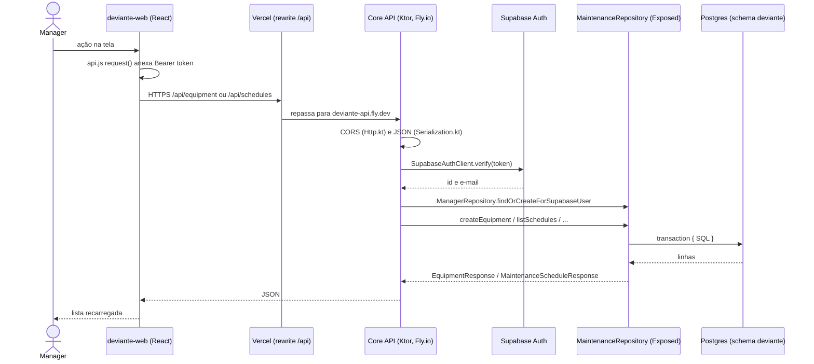

# Defesa Reuso 03: roteiro da Emanuelle (Equipamento e Agenda de manutenção)

Prova de autoria em 16/10. Cada integrante demonstra 2 CRUDs com conexão ao banco e explica o caminho do código. Este roteiro cobre **Equipamento** (máquina) e **Agenda de manutenção**. Os dois rodam só no Core (React → Ktor → Supabase Postgres), sem Function nem microsserviços.

**Como ler.** Cada trecho de código traz a localização exata: repositório, arquivo, linhas e um link fixo no commit (`deviante-api@a8f08fd`, `deviante-web@5c86907`), que não muda mesmo que a `main` ande. Abaixo de cada trecho vem o que falar. Todo trecho é código que está rodando no sistema.

## 0. Mapa do sistema

| Peça | Onde roda | Endereço | Código |
|---|---|---|---|
| Telas | Vercel | `https://deviante.alander.io` (`/equipment`, `/schedules`) | `aland3r/deviante-web` |
| Proxy da API | Vercel (rewrite) | `https://deviante.alander.io/api/*` → `https://deviante-api.fly.dev/api/*` | `deviante-web/vercel.json` |
| Core API | Fly.io, app `deviante-api`, região `iad` | `https://deviante-api.fly.dev/api` | `aland3r/deviante-api` (`src/main/kotlin`) |
| Autenticação | Supabase Auth (Google e contas demo) | `https://<projeto>.supabase.co/auth/v1/user` | chamado por `SupabaseAuth.kt` |
| Banco | Supabase Postgres, schema `deviante` | tabelas `equipment`, `maintenance_schedules`, `managers`, `users` | mapeado em `src/main/kotlin/db/*.kt` |
| Mining (não usado nos CRUDs) | Fly.io, app `deviante-mining` | só o Core chama | `deviante-api/mining/` |

Menu do sistema, onde ficam as duas telas:

📍 `deviante-web/src/components/layout/AppLayout.jsx` · linhas 28–34 · [abrir no GitHub](https://github.com/aland3r/deviante-web/blob/5c86907/src/components/layout/AppLayout.jsx#L28-L34)

```jsx
          {[
            ['/dashboard', 'Projetos'],
            ['/operations', 'Operações'],
            ['/activities', 'Atividades'],
            ['/equipment', 'Equipamentos'],
            ['/schedules', 'Agendamentos'],
          ].map(([to, label]) => (
```

📍 `deviante-web/vercel.json` · linhas 1–6 · [abrir no GitHub](https://github.com/aland3r/deviante-web/blob/5c86907/vercel.json#L1-L6)

```json
{
  "rewrites": [
    { "source": "/api/(.*)", "destination": "https://deviante-api.fly.dev/api/$1" },
    { "source": "/(.*)", "destination": "/index.html" }
  ]
}
```

O navegador sempre chama `/api/...` no próprio domínio do site; a Vercel repassa para o Fly.io. Por isso o front não precisa saber o endereço do Core.

## 1. O caminho comum (falar uma vez, no início)


```mermaid
sequenceDiagram
    actor M as Manager
    participant W as deviante-web (React)
    participant V as Vercel (rewrite /api)
    participant C as Core API (Ktor, Fly.io)
    participant A as Supabase Auth
    participant R as MaintenanceRepository (Exposed)
    participant DB as Postgres (schema deviante)
    M->>W: ação na tela
    W->>W: api.js request() anexa Bearer token
    W->>V: HTTPS /api/equipment ou /api/schedules
    V->>C: repassa para deviante-api.fly.dev
    C->>C: CORS (Http.kt) e JSON (Serialization.kt)
    C->>A: SupabaseAuthClient.verify(token)
    A-->>C: id e e-mail
    C->>R: ManagerRepository.findOrCreateForSupabaseUser
    C->>R: createEquipment / listSchedules / ...
    R->>DB: transaction { SQL }
    DB-->>R: linhas
    R-->>C: EquipmentResponse / MaintenanceScheduleResponse
    C-->>W: JSON
    W-->>M: lista recarregada
```

### 1.1 Front: o cliente HTTP

📍 `deviante-web/src/lib/api.js` · linhas 27–27 · [abrir no GitHub](https://github.com/aland3r/deviante-web/blob/5c86907/src/lib/api.js#L27-L27)

```javascript
const API_BASE = import.meta.env.VITE_API_URL ?? '/api'
```

📍 `deviante-web/src/lib/api.js` · linhas 243–267 · [abrir no GitHub](https://github.com/aland3r/deviante-web/blob/5c86907/src/lib/api.js#L243-L267)

```javascript
async function authHeader() {
  if (!isSupabaseConfigured()) return {}
  const { data } = await getSupabase().auth.getSession()
  const token = data.session?.access_token
  return token ? { Authorization: `Bearer ${token}` } : {}
}

async function request(path, options = {}) {
  const response = await fetch(`${API_BASE}${path}`, {
    headers: {
      'Content-Type': 'application/json',
      ...(await authHeader()),
      ...(options.headers ?? {}),
    },
    ...options,
  })

  if (!response.ok) {
    const payload = await response.json().catch(() => ({}))
    throw new ApiError(payload.message ?? 'Falha na requisição.', payload.fieldErrors ?? {})
  }

  if (response.status === 204) return null
  return response.json()
}
```

Fala: "Toda chamada passa por `request()`. Ele pega o token da sessão do Supabase (`authHeader`) e manda no cabeçalho `Authorization: Bearer`. Se a resposta não for 2xx, transforma o JSON de erro num `ApiError`; se for 204, devolve `null`."

### 1.2 Core: inicialização

📍 `deviante-api/src/main/resources/application.yaml` · linhas 1–18 · [abrir no GitHub](https://github.com/aland3r/deviante-api/blob/a8f08fd/src/main/resources/application.yaml#L1-L18)

```yaml
ktor:
  deployment:
    port: 8080
  application:
    modules:
      - com.deviante.HttpKt.configureHttp
      - com.deviante.SerializationKt.configureSerialization
      - com.deviante.DatabaseKt.configureDatabase
      - com.deviante.RoutingKt.configureRouting

database:
  jdbcUrl: ${DATABASE_JDBC_URL:jdbc:postgresql://localhost:5432/postgres?sslmode=require}
  user: ${DATABASE_USER:postgres}
  password: ${DATABASE_PASSWORD:}

supabase:
  url: ${SUPABASE_URL:}
  anonKey: ${SUPABASE_ANON_KEY:}
```

📍 `deviante-api/src/main/kotlin/Http.kt` · linhas 8–24 · [abrir no GitHub](https://github.com/aland3r/deviante-api/blob/a8f08fd/src/main/kotlin/Http.kt#L8-L24)

```kotlin
fun Application.configureHttp() {
    install(CORS) {
        allowMethod(HttpMethod.Get)
        allowMethod(HttpMethod.Post)
        allowMethod(HttpMethod.Put)
        allowMethod(HttpMethod.Delete)
        allowMethod(HttpMethod.Patch)
        allowMethod(HttpMethod.Options)

        allowHeader(HttpHeaders.Authorization)
        allowHeader(HttpHeaders.ContentType)
        allowHeader(HttpHeaders.Accept)

        allowCredentials = true
        anyHost()
    }
}
```

📍 `deviante-api/src/main/kotlin/Database.kt` · linhas 9–28 · [abrir no GitHub](https://github.com/aland3r/deviante-api/blob/a8f08fd/src/main/kotlin/Database.kt#L9-L28)

```kotlin
fun Application.configureDatabase() {
    AppConfig.init(environment.config)
    val jdbcUrl = AppConfig.jdbcUrl
    val user = AppConfig.dbUser
    val password = AppConfig.dbPassword

    val hikariConfig = HikariConfig().apply {
        this.jdbcUrl = jdbcUrl
        this.username = user
        this.password = password
        driverClassName = "org.postgresql.Driver"
        maximumPoolSize = 5
    }

    val dataSource = HikariDataSource(hikariConfig)
    Database.connect(dataSource)

    // Seed demo data if needed (idempotent check inside)
    SeedDemoData.runIfNeeded()
}
```

Fala: "O Ktor sobe os módulos nesta ordem: CORS, JSON, banco e rotas. O Hikari mantém um pool de até 5 conexões com o Postgres; o Exposed usa esse pool em cada `transaction { }`."

### 1.3 Core: autenticação e Manager

📍 `deviante-api/src/main/kotlin/Routing.kt` · linhas 109–123 · [abrir no GitHub](https://github.com/aland3r/deviante-api/blob/a8f08fd/src/main/kotlin/Routing.kt#L109-L123)

```kotlin
private suspend fun ApplicationCall.requireSupabaseUser(authClient: SupabaseAuthClient): SupabaseUser? {
    val header = request.headers[HttpHeaders.Authorization]
    val token = header?.removePrefix("Bearer ")?.trim()
    if (token.isNullOrBlank()) {
        respond(HttpStatusCode.Unauthorized, ErrorResponse("Você precisa estar autenticado."))
        return null
    }

    val user = authClient.verify(token)
    if (user == null) {
        respond(HttpStatusCode.Unauthorized, ErrorResponse("Sessão inválida ou expirada."))
        return null
    }
    return user
}
```

📍 `deviante-api/src/main/kotlin/SupabaseAuth.kt` · linhas 44–71 · [abrir no GitHub](https://github.com/aland3r/deviante-api/blob/a8f08fd/src/main/kotlin/SupabaseAuth.kt#L44-L71)

```kotlin
    /** Verifies a Supabase access token by asking Supabase Auth who it belongs to. */
    suspend fun verify(accessToken: String): SupabaseUser? {
        if (baseUrl.isBlank() || anonKey.isBlank()) {
            logger.error("Supabase auth is not configured (SUPABASE_URL / SUPABASE_ANON_KEY missing).")
            return null
        }

        return try {
            val response = client.get("$baseUrl/auth/v1/user") {
                header(HttpHeaders.Authorization, "Bearer $accessToken")
                header("apikey", anonKey)
            }
            if (!response.status.isSuccess()) {
                logger.warn("Supabase rejected the access token: {} {}", response.status, response.bodyAsText())
                return null
            }

            val body = response.body<SupabaseUserResponse>()
            SupabaseUser(
                id = UUID.fromString(body.id),
                email = body.email ?: "",
                fullNameHint = body.user_metadata?.full_name ?: body.user_metadata?.name ?: "",
            )
        } catch (error: Exception) {
            logger.error("Failed to verify Supabase access token.", error)
            null
        }
    }
```

📍 `deviante-api/src/main/kotlin/repository/ManagerRepository.kt` · linhas 53–73 · [abrir no GitHub](https://github.com/aland3r/deviante-api/blob/a8f08fd/src/main/kotlin/repository/ManagerRepository.kt#L53-L73)

```kotlin
    fun findOrCreateForSupabaseUser(supabaseUserId: UUID, email: String, fullNameHint: String): ManagerRecord =
        transaction {
            val existing = (ManagersTable innerJoin UsersTable)
                .selectAll()
                .where { ManagersTable.userId eq supabaseUserId }
                .limit(1)
                .firstOrNull()
                ?.toManagerRecord()
            if (existing != null) {
                // Re-derive the role on every login: a manager row created
                // before its e-mail was added to OWNER_EMAILS/MENTOR_EMAILS
                // would otherwise stay stuck on the role it got at signup.
                val expected = detectRole(existing.email)
                if (existing.role == expected) return@transaction existing

                ManagersTable.update({ ManagersTable.userId eq supabaseUserId }) {
                    it[ManagersTable.role] = expected
                    it[ManagersTable.updatedAt] = OffsetDateTime.now()
                }
                return@transaction existing.copy(role = expected)
            }
```

Fala: "O Core pergunta ao Supabase Auth de quem é o token (401 se não houver ou se for inválido) e acha ou cria a linha do Manager. O `manager.id` é o que vai em `equipment.manager_id`."

📍 `deviante-api/src/main/kotlin/repository/ManagerRepository.kt` · linhas 19–34 · [abrir no GitHub](https://github.com/aland3r/deviante-api/blob/a8f08fd/src/main/kotlin/repository/ManagerRepository.kt#L19-L34)

```kotlin
        // Contas de demonstração do login (RF-01/RF-02): um papel por conta.
        private val DEMO_ROLES = mapOf(
            "demo-administrador@deviante.alander.io" to "admin",
            "demo-gestor@deviante.alander.io" to "manager",
            "demo-operador@deviante.alander.io" to "operator",
            "demo-tecnico@deviante.alander.io" to "technician",
        )

        internal fun roleForEmail(email: String): String {
            val normalized = email.trim().lowercase()
            return when {
                normalized in OWNER_EMAILS -> "owner"
                normalized in MENTOR_EMAILS -> "mentor"
                else -> DEMO_ROLES[normalized] ?: "manager"
            }
        }
```

📍 `deviante-api/src/main/kotlin/Routing.kt` · linhas 125–140 · [abrir no GitHub](https://github.com/aland3r/deviante-api/blob/a8f08fd/src/main/kotlin/Routing.kt#L125-L140)

```kotlin
/**
 * Exclusões (processo, atividade, equipamento, agenda) são permitidas só ao
 * administrador e ao gestor; operador, técnico e mentor recebem 403.
 */
private suspend fun ApplicationCall.requireDeleter(
    authClient: SupabaseAuthClient,
    managerRepository: ManagerRepository,
): ManagerRecord? {
    val user = requireSupabaseUser(authClient) ?: return null
    val manager = managerRepository.findOrCreateForSupabaseUser(user.id, user.email, user.fullNameHint)
    if (!manager.canDelete()) {
        respond(HttpStatusCode.Forbidden, ErrorResponse("Somente o administrador ou o gestor pode excluir."))
        return null
    }
    return manager
}
```

📍 `deviante-web/src/lib/permissions.js` · linhas 1–5 · [abrir no GitHub](https://github.com/aland3r/deviante-web/blob/5c86907/src/lib/permissions.js#L1-L5)

```javascript
// Excluir (processo, atividade, equipamento, agenda) é só do administrador e do
// gestor. A API repete a regra (403); aqui ela só decide se o botão aparece.
export const DELETE_ROLES = new Set(['owner', 'admin', 'manager'])

export const canDelete = (user) => DELETE_ROLES.has(user?.role)
```

Fala: "Cada conta demo tem um papel. Excluir é só do administrador e do gestor: na tela o botão nem aparece para os outros (`canDelete`), e o Core repete a regra em toda rota de exclusão (`requireDeleter`, 403)."

📍 `deviante-api/src/main/kotlin/Routing.kt` · linhas 1551–1555 · [abrir no GitHub](https://github.com/aland3r/deviante-api/blob/a8f08fd/src/main/kotlin/Routing.kt#L1551-L1555)

```kotlin
private fun runCatchingUuid(value: String): UUID? = try {
    UUID.fromString(value)
} catch (_: IllegalArgumentException) {
    null
}
```

## 2. CRUD de Equipamento (objeto ORCA MACHINE)

### 2.1 Tabela e DTOs

📍 `deviante-api/src/main/kotlin/db/MonitoringTables.kt` · linhas 6–24 · [abrir no GitHub](https://github.com/aland3r/deviante-api/blob/a8f08fd/src/main/kotlin/db/MonitoringTables.kt#L6-L24)

```kotlin
object EquipmentTable : Table(name = "equipment") {
    override val tableName = "deviante.equipment"
    val id = uuid("id")
    val managerId = uuid("manager_id").references(ManagersTable.id).nullable()
    val name = varchar("name", 150)
    val tag = varchar("tag", 100).nullable()
    val kind = varchar("kind", 100).nullable()
    val location = varchar("location", 200).nullable()
    val description = text("description")
    val manufacturer = varchar("manufacturer", 150).nullable()
    val model = varchar("model", 150).nullable()
    val serialNumber = varchar("serial_number", 150).nullable()
    val status = varchar("status", 30)
    val assetUrl = text("asset_url").nullable()
    val assetFormat = varchar("asset_format", 20).nullable()
    val createdAt = timestampWithTimeZone("created_at")
    val updatedAt = timestampWithTimeZone("updated_at")
    override val primaryKey = PrimaryKey(id)
}
```

📍 `deviante-api/src/main/kotlin/dto/MaintenanceDto.kt` · linhas 6–48 · [abrir no GitHub](https://github.com/aland3r/deviante-api/blob/a8f08fd/src/main/kotlin/dto/MaintenanceDto.kt#L6-L48)

```kotlin
@Serializable
data class EquipmentRequest(
    val name: String,
    val tag: String? = null,
    val kind: String? = null,
    val location: String? = null,
    val description: String = "",
    val manufacturer: String? = null,
    val model: String? = null,
    val serialNumber: String? = null,
    val status: String = "active",
    val assetUrl: String? = null,
    val assetFormat: String? = null,
)

@Serializable
data class EquipmentResponse(
    val id: String,
    val name: String,
    val tag: String? = null,
    val kind: String? = null,
    val location: String? = null,
    val description: String,
    val manufacturer: String? = null,
    val model: String? = null,
    val serialNumber: String? = null,
    val status: String,
    val assetUrl: String? = null,
    val assetFormat: String? = null,
    val createdAt: String,
    val updatedAt: String,
    val processIds: List<String> = emptyList(),
    val processNames: List<String> = emptyList(),
    val monitoringIds: List<String> = emptyList(),
    val monitoringNames: List<String> = emptyList(),
    val parameterCount: Int = 0,
    val readingCount: Int = 0,
    val analysisCount: Int = 0,
    val latestRulValue: Double? = null,
    val latestRulUnit: String? = null,
    val latestFailureProbability: Double? = null,
    val latestAnalysisAt: String? = null,
)
```

Fala: "Só `name` é obrigatório no `EquipmentRequest`. A resposta traz, além das colunas, os nomes dos processos e monitoramentos ligados. No banco, apagar um equipamento apaga em cascata as agendas, vínculos com processos e monitoramentos, parâmetros e recomendações (conferido no Supabase em 13/10)."

📍 `deviante-api/src/main/kotlin/repository/MaintenanceRepository.kt` · linhas 381–391 · [abrir no GitHub](https://github.com/aland3r/deviante-api/blob/a8f08fd/src/main/kotlin/repository/MaintenanceRepository.kt#L381-L391)

```kotlin
    private fun assignEquipment(row: UpdateBuilder<*>, body: EquipmentRequest) {
        row[EquipmentTable.name] = body.name.trim(); row[EquipmentTable.description] = body.description.trim()
        row[EquipmentTable.tag] = body.tag?.trim()?.takeIf(String::isNotBlank)
        row[EquipmentTable.kind] = body.kind?.trim()?.takeIf(String::isNotBlank)
        row[EquipmentTable.location] = body.location?.trim()?.takeIf(String::isNotBlank)
        row[EquipmentTable.manufacturer] = body.manufacturer?.trim()?.takeIf(String::isNotBlank)
        row[EquipmentTable.model] = body.model?.trim()?.takeIf(String::isNotBlank)
        row[EquipmentTable.serialNumber] = body.serialNumber?.trim()?.takeIf(String::isNotBlank)
        row[EquipmentTable.status] = body.status; row[EquipmentTable.assetUrl] = body.assetUrl?.trim()?.takeIf(String::isNotBlank)
        row[EquipmentTable.assetFormat] = body.assetFormat?.trim()?.takeIf(String::isNotBlank)
    }
```

📍 `deviante-api/src/main/kotlin/repository/MaintenanceRepository.kt` · linhas 399–399 · [abrir no GitHub](https://github.com/aland3r/deviante-api/blob/a8f08fd/src/main/kotlin/repository/MaintenanceRepository.kt#L399-L399)

```kotlin
    private fun equipment(r: ResultRow) = EquipmentResponse(r[EquipmentTable.id].toString(), r[EquipmentTable.name], r[EquipmentTable.tag], r[EquipmentTable.kind], r[EquipmentTable.location], r[EquipmentTable.description], r[EquipmentTable.manufacturer], r[EquipmentTable.model], r[EquipmentTable.serialNumber], r[EquipmentTable.status], r[EquipmentTable.assetUrl], r[EquipmentTable.assetFormat], r[EquipmentTable.createdAt].iso(), r[EquipmentTable.updatedAt].iso())
```

Fala: "`assignEquipment` é reaproveitada no insert e no update: limpa espaços e grava `null` no que veio vazio. `equipment(r)` transforma a linha em DTO."

### 2.2 Create — tela `/equipment`, botão "Novo equipamento"

📍 `deviante-web/src/pages/EquipmentPage.jsx` · linhas 52–54 · [abrir no GitHub](https://github.com/aland3r/deviante-web/blob/5c86907/src/pages/EquipmentPage.jsx#L52-L54)

```jsx
  const actions = <button onClick={() => setCreating(true)} className="flex items-center gap-1.5 px-3.5 py-2 rounded-lg text-xs font-semibold text-white" style={{ background: 'var(--ok-strong)' }}><Plus size={12} />Novo equipamento</button>
  return <Surface title="Equipamentos" subtitle={`${rows.length} ativos cadastrados com histórico, análises e vínculos.`} icon={Cpu} actions={actions}>
    {creating && <CreateEquipmentModal onClose={() => setCreating(false)} onCreate={async (data) => { await api.createEquipment(toEquipmentRequest(data)); setCreating(false); load() }} />}
```

📍 `deviante-web/src/pages/EquipmentPage.jsx` · linhas 109–110 · [abrir no GitHub](https://github.com/aland3r/deviante-web/blob/5c86907/src/pages/EquipmentPage.jsx#L109-L110)

```jsx
function CreateEquipmentModal({ initial = null, onClose, onCreate }) {
  const [values, setValues] = useState({ name: initial?.name ?? '', kind: initial?.kind ?? 'generico', tag: initial?.tag ?? '', location: initial?.location ?? '', manufacturer: initial?.manufacturer ?? '', model: initial?.model ?? '' }); const [busy, setBusy] = useState(false)
```

📍 `deviante-web/src/pages/EquipmentPage.jsx` · linhas 11–12 · [abrir no GitHub](https://github.com/aland3r/deviante-web/blob/5c86907/src/pages/EquipmentPage.jsx#L11-L12)

```jsx
const EQUIPMENT_FIELDS = ['name', 'tag', 'kind', 'location', 'description', 'manufacturer', 'model', 'serialNumber', 'status', 'assetUrl', 'assetFormat']
const toEquipmentRequest = (values) => Object.fromEntries(EQUIPMENT_FIELDS.filter((key) => values[key] !== undefined).map((key) => [key, values[key] ?? null]))
```

📍 `deviante-web/src/lib/api.js` · linhas 489–489 · [abrir no GitHub](https://github.com/aland3r/deviante-web/blob/5c86907/src/lib/api.js#L489-L489)

```javascript
  createEquipment: (data) => request('/equipment', { method: 'POST', body: JSON.stringify(data) }),
```

📍 `deviante-api/src/main/kotlin/Routing.kt` · linhas 479–485 · [abrir no GitHub](https://github.com/aland3r/deviante-api/blob/a8f08fd/src/main/kotlin/Routing.kt#L479-L485)

```kotlin
                post {
                    val user = call.requireSupabaseUser(authClient) ?: return@post
                    val manager = managerRepository.findOrCreateForSupabaseUser(user.id, user.email, user.fullNameHint)
                    val body = call.receive<EquipmentRequest>()
                    if (body.name.isBlank()) { call.respond(HttpStatusCode.BadRequest, ErrorResponse("Nome do equipamento é obrigatório.")); return@post }
                    call.respond(HttpStatusCode.Created, maintenanceRepository.createEquipment(manager.id, body))
                }
```

📍 `deviante-api/src/main/kotlin/repository/MaintenanceRepository.kt` · linhas 100–107 · [abrir no GitHub](https://github.com/aland3r/deviante-api/blob/a8f08fd/src/main/kotlin/repository/MaintenanceRepository.kt#L100-L107)

```kotlin
    fun createEquipment(managerId: UUID, body: EquipmentRequest): EquipmentResponse = transaction {
        val id = UUID.randomUUID(); val now = OffsetDateTime.now()
        EquipmentTable.insert {
            it[EquipmentTable.id] = id; it[EquipmentTable.managerId] = managerId
            assignEquipment(it, body); it[EquipmentTable.createdAt] = now; it[EquipmentTable.updatedAt] = now
        }
        findEquipment(id)!!
    }
```

Fala: "O modal só habilita 'Cadastrar' com nome preenchido. `toEquipmentRequest` manda só os campos que a API aceita. A rota valida de novo (400 'Nome do equipamento é obrigatório') e o repositório gera o UUID, grava o `manager_id` de quem está logado e devolve a linha recém-criada (201)."

### 2.3 Read — tela `/equipment`

📍 `deviante-web/src/pages/EquipmentPage.jsx` · linhas 16–30 · [abrir no GitHub](https://github.com/aland3r/deviante-web/blob/5c86907/src/pages/EquipmentPage.jsx#L16-L30)

```jsx
export default function EquipmentPage() {
  const [rows, setRows] = useState([])
  const [query, setQuery] = useState('')
  const [processId, setProcessId] = useState('')
  const [monitoringId, setMonitoringId] = useState('')
  const [health, setHealth] = useState('')
  const [error, setError] = useState('')
  const [loading, setLoading] = useState(true)
  const [creating, setCreating] = useState(false)
  const [editing, setEditing] = useState(null)
  const { user } = useAuth()
  const allowDelete = canDelete(user)
  const load = () => api.listAllMachines().then((data) => setRows(Array.isArray(data) ? data : data?.items ?? [])).catch((err) => setError(err instanceof ApiError ? err.message : 'Não foi possível carregar os equipamentos.')).finally(() => setLoading(false))
  useEffect(() => { load() }, []) // eslint-disable-line react-hooks/exhaustive-deps

```

📍 `deviante-web/src/lib/api.js` · linhas 488–488 · [abrir no GitHub](https://github.com/aland3r/deviante-web/blob/5c86907/src/lib/api.js#L488-L488)

```javascript
  listAllMachines: () => request('/equipment'),
```

📍 `deviante-api/src/main/kotlin/Routing.kt` · linhas 474–478 · [abrir no GitHub](https://github.com/aland3r/deviante-api/blob/a8f08fd/src/main/kotlin/Routing.kt#L474-L478)

```kotlin
                get {
                    val user = call.requireSupabaseUser(authClient) ?: return@get
                    val manager = managerRepository.findOrCreateForSupabaseUser(user.id, user.email, user.fullNameHint)
                    call.respond(maintenanceRepository.listEquipment(manager.id))
                }
```

📍 `deviante-api/src/main/kotlin/repository/MaintenanceRepository.kt` · linhas 48–55 · [abrir no GitHub](https://github.com/aland3r/deviante-api/blob/a8f08fd/src/main/kotlin/repository/MaintenanceRepository.kt#L48-L55)

```kotlin
    fun listEquipment(managerId: UUID): List<EquipmentResponse> = transaction {
        val rows = EquipmentTable.selectAll()
            .where { EquipmentTable.managerId eq managerId }
            .orderBy(EquipmentTable.updatedAt, SortOrder.DESC)
            .toList()
        if (rows.isEmpty()) return@transaction emptyList()
        val equipmentIds = rows.map { it[EquipmentTable.id] }

```

Fala: "A lista filtra pelo `manager_id` de quem está logado, então cada gestor só vê os próprios equipamentos. Os filtros da tela (busca, processo, monitoramento) rodam no navegador sobre essa lista."

Read de um equipamento:

📍 `deviante-api/src/main/kotlin/Routing.kt` · linhas 486–491 · [abrir no GitHub](https://github.com/aland3r/deviante-api/blob/a8f08fd/src/main/kotlin/Routing.kt#L486-L491)

```kotlin
                get("/{id}") {
                    call.requireSupabaseUser(authClient) ?: return@get
                    val id = call.parameters["id"]?.let(::runCatchingUuid)
                    val item = id?.let(maintenanceRepository::findEquipment)
                    if (item == null) call.respond(HttpStatusCode.NotFound, ErrorResponse("Equipamento não encontrado.")) else call.respond(item)
                }
```

📍 `deviante-api/src/main/kotlin/repository/MaintenanceRepository.kt` · linhas 96–98 · [abrir no GitHub](https://github.com/aland3r/deviante-api/blob/a8f08fd/src/main/kotlin/repository/MaintenanceRepository.kt#L96-L98)

```kotlin
    fun findEquipment(id: UUID): EquipmentResponse? = transaction {
        EquipmentTable.selectAll().where { EquipmentTable.id eq id }.firstOrNull()?.let(::equipment)
    }
```

### 2.4 Update — lápis na linha do equipamento

📍 `deviante-web/src/pages/EquipmentPage.jsx` · linhas 80–80 · [abrir no GitHub](https://github.com/aland3r/deviante-web/blob/5c86907/src/pages/EquipmentPage.jsx#L80-L80)

```jsx
              <button type="button" onClick={() => setEditing(machine)} aria-label={`Editar ${machine.name}`} className="p-1.5 rounded hover:bg-secondary text-muted-foreground hover:text-foreground"><Pencil size={12} /></button>
```

📍 `deviante-web/src/pages/EquipmentPage.jsx` · linhas 55–55 · [abrir no GitHub](https://github.com/aland3r/deviante-web/blob/5c86907/src/pages/EquipmentPage.jsx#L55-L55)

```jsx
    {editing && <CreateEquipmentModal initial={editing} onClose={() => setEditing(null)} onCreate={async (data) => { await api.updateMachine(editing.id, toEquipmentRequest({ ...editing, ...data })); setEditing(null); load() }} />}
```

📍 `deviante-web/src/lib/api.js` · linhas 470–472 · [abrir no GitHub](https://github.com/aland3r/deviante-web/blob/5c86907/src/lib/api.js#L470-L472)

```javascript
  updateMachine: (machineId, patch) => request(`/equipment/${machineId}`, {
    method: 'PUT', body: JSON.stringify(patch),
  }),
```

📍 `deviante-api/src/main/kotlin/Routing.kt` · linhas 492–499 · [abrir no GitHub](https://github.com/aland3r/deviante-api/blob/a8f08fd/src/main/kotlin/Routing.kt#L492-L499)

```kotlin
                put("/{id}") {
                    call.requireSupabaseUser(authClient) ?: return@put
                    val id = call.parameters["id"]?.let(::runCatchingUuid)
                    val body = call.receive<EquipmentRequest>()
                    if (id == null || body.name.isBlank()) { call.respond(HttpStatusCode.BadRequest, ErrorResponse("Equipamento ou nome inválido.")); return@put }
                    val item = maintenanceRepository.updateEquipment(id, body)
                    if (item == null) call.respond(HttpStatusCode.NotFound, ErrorResponse("Equipamento não encontrado.")) else call.respond(item)
                }
```

📍 `deviante-api/src/main/kotlin/repository/MaintenanceRepository.kt` · linhas 109–112 · [abrir no GitHub](https://github.com/aland3r/deviante-api/blob/a8f08fd/src/main/kotlin/repository/MaintenanceRepository.kt#L109-L112)

```kotlin
    fun updateEquipment(id: UUID, body: EquipmentRequest): EquipmentResponse? = transaction {
        if (EquipmentTable.update({ EquipmentTable.id eq id }) { assignEquipment(it, body); it[EquipmentTable.updatedAt] = OffsetDateTime.now() } == 0) null
        else findEquipment(id)
    }
```

Fala: "O lápis abre o mesmo modal do cadastro, preenchido (`initial`). Como o `PUT` grava todas as colunas, o front reenvia os valores atuais junto com os alterados (`{ ...editing, ...data }`). Se o `UPDATE` não alterou nenhuma linha, o repositório devolve `null` e a rota responde 404."

### 2.5 Delete — lixeira na linha (só administrador e gestor)

📍 `deviante-web/src/pages/EquipmentPage.jsx` · linhas 81–81 · [abrir no GitHub](https://github.com/aland3r/deviante-web/blob/5c86907/src/pages/EquipmentPage.jsx#L81-L81)

```jsx
              {allowDelete && <button type="button" onClick={() => removeEquipment(machine)} aria-label={`Excluir ${machine.name}`} className="p-1.5 rounded hover:bg-red-950/40" style={{ color: 'var(--crit-soft)' }}><Trash2 size={12} /></button>}
```

📍 `deviante-web/src/pages/EquipmentPage.jsx` · linhas 46–50 · [abrir no GitHub](https://github.com/aland3r/deviante-web/blob/5c86907/src/pages/EquipmentPage.jsx#L46-L50)

```jsx
  async function removeEquipment(machine) {
    if (!window.confirm(`Excluir o equipamento "${machine.name}"? Parâmetros, leituras, análises e agendamentos dele também serão apagados.`)) return
    try { await api.deleteMachine(machine.id); setRows((current) => current.filter((row) => row.id !== machine.id)) }
    catch (err) { setError(err instanceof ApiError ? err.message : 'Não foi possível excluir o equipamento.') }
  }
```

📍 `deviante-web/src/lib/api.js` · linhas 473–473 · [abrir no GitHub](https://github.com/aland3r/deviante-web/blob/5c86907/src/lib/api.js#L473-L473)

```javascript
  deleteMachine: (machineId) => request(`/equipment/${machineId}`, { method: 'DELETE' }),
```

📍 `deviante-api/src/main/kotlin/Routing.kt` · linhas 500–505 · [abrir no GitHub](https://github.com/aland3r/deviante-api/blob/a8f08fd/src/main/kotlin/Routing.kt#L500-L505)

```kotlin
                delete("/{id}") {
                    call.requireDeleter(authClient, managerRepository) ?: return@delete
                    val id = call.parameters["id"]?.let(::runCatchingUuid)
                    if (id == null || !maintenanceRepository.deleteEquipment(id)) call.respond(HttpStatusCode.NotFound, ErrorResponse("Equipamento não encontrado."))
                    else call.respond(HttpStatusCode.NoContent)
                }
```

📍 `deviante-api/src/main/kotlin/repository/MaintenanceRepository.kt` · linhas 114–114 · [abrir no GitHub](https://github.com/aland3r/deviante-api/blob/a8f08fd/src/main/kotlin/repository/MaintenanceRepository.kt#L114-L114)

```kotlin
    fun deleteEquipment(id: UUID): Boolean = transaction { EquipmentTable.deleteWhere { EquipmentTable.id eq id } > 0 }
```

Fala: "A confirmação avisa que parâmetros, leituras, análises e agendas do equipamento vão junto, porque o banco apaga em cascata. O Core confere o papel antes (`requireDeleter`). Resposta 204, e a linha sai da tabela sem recarregar."

### 2.6 Roteiro de fala

1. Logar e abrir `https://deviante.alander.io/equipment`.
2. **Create:** cadastrar "Torno CNC Prod1", tipo torno, TAG TRN-01. Mostrar no DevTools o `POST /api/equipment` e o 201.
3. **Read:** mostrar a lista e o `WHERE manager_id = ?` no repositório.
4. **Update:** clicar no lápis e editar a localização (`PUT /api/equipment/{id}`).
5. **Delete:** clicar na lixeira de um equipamento sem agenda (204). Explicar que, com agenda, o banco apaga a agenda junto (cascata). Entrar como operador e mostrar que a lixeira não aparece.

## 3. CRUD de Agenda de manutenção (objeto ORCA MAINTENANCE)

### 3.1 Tabela e DTOs

📍 `deviante-api/src/main/kotlin/db/MonitoringTables.kt` · linhas 142–157 · [abrir no GitHub](https://github.com/aland3r/deviante-api/blob/a8f08fd/src/main/kotlin/db/MonitoringTables.kt#L142-L157)

```kotlin
object MaintenanceSchedulesTable : Table(name = "maintenance_schedules") {
    override val tableName = "deviante.maintenance_schedules"
    val id = uuid("id")
    val equipmentId = uuid("equipment_id").references(EquipmentTable.id)
    val processId = uuid("process_id").references(ProcessesTable.id).nullable()
    val recommendationId = uuid("recommendation_id").references(MaintenanceRecommendationsTable.id).nullable()
    val managerId = uuid("manager_id").references(ManagersTable.id)
    val title = varchar("title", 200)
    val notes = text("notes")
    val scheduledStart = timestampWithTimeZone("scheduled_start")
    val scheduledEnd = timestampWithTimeZone("scheduled_end").nullable()
    val status = varchar("status", 30)
    val createdAt = timestampWithTimeZone("created_at")
    val updatedAt = timestampWithTimeZone("updated_at")
    override val primaryKey = PrimaryKey(id)
}
```

📍 `deviante-api/src/main/kotlin/dto/MaintenanceDto.kt` · linhas 211–236 · [abrir no GitHub](https://github.com/aland3r/deviante-api/blob/a8f08fd/src/main/kotlin/dto/MaintenanceDto.kt#L211-L236)

```kotlin
@Serializable
data class MaintenanceScheduleRequest(
    val equipmentId: String,
    val processId: String? = null,
    val recommendationId: String? = null,
    val title: String,
    val notes: String = "",
    val scheduledStart: String,
    val scheduledEnd: String? = null,
    val status: String = "planned",
)

@Serializable
data class MaintenanceScheduleResponse(
    val id: String,
    val equipmentId: String,
    val processId: String? = null,
    val recommendationId: String? = null,
    val title: String,
    val notes: String,
    val scheduledStart: String,
    val scheduledEnd: String? = null,
    val status: String,
    val createdAt: String,
    val updatedAt: String,
)
```

Fala: "Cada agenda pertence a um equipamento (`equipment_id`, obrigatório) e pode apontar para um processo (`process_id`, opcional), que é o CRUD do Alander. Se o processo for apagado, a agenda fica sem processo (`SET NULL`); se o equipamento for apagado, a agenda vai junto (`CASCADE`). As datas trafegam como texto ISO 8601."

📍 `deviante-api/src/main/kotlin/repository/MaintenanceRepository.kt` · linhas 405–405 · [abrir no GitHub](https://github.com/aland3r/deviante-api/blob/a8f08fd/src/main/kotlin/repository/MaintenanceRepository.kt#L405-L405)

```kotlin
    private fun schedule(r: ResultRow) = MaintenanceScheduleResponse(r[MaintenanceSchedulesTable.id].toString(), r[MaintenanceSchedulesTable.equipmentId].toString(), r[MaintenanceSchedulesTable.processId]?.toString(), r[MaintenanceSchedulesTable.recommendationId]?.toString(), r[MaintenanceSchedulesTable.title], r[MaintenanceSchedulesTable.notes], r[MaintenanceSchedulesTable.scheduledStart].iso(), r[MaintenanceSchedulesTable.scheduledEnd]?.iso(), r[MaintenanceSchedulesTable.status], r[MaintenanceSchedulesTable.createdAt].iso(), r[MaintenanceSchedulesTable.updatedAt].iso())
```

### 3.2 Tela `/schedules` (menu "Agendamentos")

📍 `deviante-web/src/lib/api.js` · linhas 490–504 · [abrir no GitHub](https://github.com/aland3r/deviante-web/blob/5c86907/src/lib/api.js#L490-L504)

```javascript
  listSchedules: (params = {}) => {
    const query = new URLSearchParams(Object.entries(params).filter(([, value]) => value != null && value !== '')).toString()
    return request(`/schedules${query ? `?${query}` : ''}`).then((payload) => {
      const rows = Array.isArray(payload) ? payload : payload?.items ?? []
      const normalized = rows.map((row) => ({
        ...row,
        scheduledStart: row.scheduledStart ?? row.plannedFor ?? null,
        scheduledEnd: row.scheduledEnd ?? null,
      }))
      return Array.isArray(payload) ? normalized : { ...payload, items: normalized }
    })
  },
  createSchedule: (data) => request('/schedules', { method: 'POST', body: JSON.stringify(data) }),
  updateSchedule: (id, patch) => request(`/schedules/${id}`, { method: 'PUT', body: JSON.stringify(patch) }),
  deleteSchedule: (id) => request(`/schedules/${id}`, { method: 'DELETE' }),
```

### 3.3 Read — lista, kanban e calendário

📍 `deviante-web/src/pages/SchedulesPage.jsx` · linhas 13–20 · [abrir no GitHub](https://github.com/aland3r/deviante-web/blob/5c86907/src/pages/SchedulesPage.jsx#L13-L20)

```jsx
export default function SchedulesPage() {
  const [rows, setRows] = useState([]); const [view, setView] = useState('list'); const [error, setError] = useState(''); const [loading, setLoading] = useState(true)
  const [searchParams] = useSearchParams()
  const equipmentId = searchParams.get('equipmentId')
  const [editing, setEditing] = useState(null) // null = fechado, {} = nova, linha = edição
  const { user } = useAuth()
  const load = () => api.listSchedules({ equipmentId }).then((data) => setRows(Array.isArray(data) ? data : data?.items ?? [])).catch((err) => setError(err instanceof ApiError ? err.message : 'Não foi possível carregar os agendamentos.')).finally(() => setLoading(false))
  useEffect(() => { load() }, [equipmentId]) // eslint-disable-line react-hooks/exhaustive-deps
```

📍 `deviante-api/src/main/kotlin/Routing.kt` · linhas 789–794 · [abrir no GitHub](https://github.com/aland3r/deviante-api/blob/a8f08fd/src/main/kotlin/Routing.kt#L789-L794)

```kotlin
                get {
                    val u=call.requireSupabaseUser(authClient)?:return@get
                    managerRepository.findOrCreateForSupabaseUser(u.id,u.email,u.fullNameHint)
                    val equipmentId = call.request.queryParameters["equipmentId"]?.let(::runCatchingUuid)
                    call.respond(maintenanceRepository.listSchedules(equipmentId))
                }
```

📍 `deviante-api/src/main/kotlin/repository/MaintenanceRepository.kt` · linhas 345–353 · [abrir no GitHub](https://github.com/aland3r/deviante-api/blob/a8f08fd/src/main/kotlin/repository/MaintenanceRepository.kt#L345-L353)

```kotlin
    fun listSchedules(equipmentId: UUID? = null): List<MaintenanceScheduleResponse> = transaction {
        val query = MaintenanceSchedulesTable.selectAll()
        if (equipmentId != null) query.where { MaintenanceSchedulesTable.equipmentId eq equipmentId }
        query.orderBy(MaintenanceSchedulesTable.scheduledStart).map(::schedule)
    }

    fun findSchedule(id: UUID): MaintenanceScheduleResponse? = transaction {
        MaintenanceSchedulesTable.selectAll().where { MaintenanceSchedulesTable.id eq id }.firstOrNull()?.let(::schedule)
    }
```

Fala: "As três visões usam a mesma lista; só muda o agrupamento no front (por status no kanban, por mês no calendário). O filtro `?equipmentId=` vem da página do equipamento. Clicar num card abre o modal de edição."

### 3.4 Create e Update — botão "Nova manutenção" ou clique no card

📍 `deviante-web/src/pages/SchedulesPage.jsx` · linhas 22–26 · [abrir no GitHub](https://github.com/aland3r/deviante-web/blob/5c86907/src/pages/SchedulesPage.jsx#L22-L26)

```jsx
  async function save(data) {
    if (editing?.id) await api.updateSchedule(editing.id, data)
    else await api.createSchedule(data)
    setEditing(null); load()
  }
```

📍 `deviante-web/src/pages/SchedulesPage.jsx` · linhas 45–62 · [abrir no GitHub](https://github.com/aland3r/deviante-web/blob/5c86907/src/pages/SchedulesPage.jsx#L45-L62)

```jsx
const toLocalInput = (iso) => { if (!iso) return ''; const date = new Date(iso); return new Date(date.getTime() - date.getTimezoneOffset() * 60000).toISOString().slice(0, 16) }
const toIso = (local) => local ? new Date(local).toISOString() : null

function ScheduleModal({ initial, onClose, onSave, onDelete }) {
  const [equipment, setEquipment] = useState([])
  const [values, setValues] = useState({
    equipmentId: initial.equipmentId ?? '', title: initial.title ?? '', notes: initial.notes ?? '',
    scheduledStart: toLocalInput(initial.scheduledStart), scheduledEnd: toLocalInput(initial.scheduledEnd), status: initial.status ?? 'planned',
  })
  const [busy, setBusy] = useState(false); const [error, setError] = useState('')
  useEffect(() => { api.listAllMachines().then((data) => setEquipment(Array.isArray(data) ? data : data?.items ?? [])).catch(() => setEquipment([])) }, [])
  const set = (key) => (event) => setValues((current) => ({ ...current, [key]: event.target.value }))
  const valid = values.equipmentId && values.title.trim() && values.scheduledStart && (!values.scheduledEnd || values.scheduledEnd >= values.scheduledStart)
  const run = async (action) => { setBusy(true); setError(''); try { await action() } catch (err) { setError(err instanceof ApiError ? err.message : 'Não foi possível salvar a manutenção.') } finally { setBusy(false) } }
  const submit = (event) => { event.preventDefault(); if (!valid) return; run(() => onSave({
    equipmentId: values.equipmentId, processId: initial.processId ?? null, recommendationId: initial.recommendationId ?? null,
    title: values.title.trim(), notes: values.notes.trim(), scheduledStart: toIso(values.scheduledStart), scheduledEnd: toIso(values.scheduledEnd), status: values.status,
  })) }
```

📍 `deviante-api/src/main/kotlin/Routing.kt` · linhas 795–800 · [abrir no GitHub](https://github.com/aland3r/deviante-api/blob/a8f08fd/src/main/kotlin/Routing.kt#L795-L800)

```kotlin
                post {
                    val u=call.requireSupabaseUser(authClient)?:return@post; val m=managerRepository.findOrCreateForSupabaseUser(u.id,u.email,u.fullNameHint); val body=call.receive<MaintenanceScheduleRequest>()
                    val start=runCatching{OffsetDateTime.parse(body.scheduledStart)}.getOrNull(); val end=body.scheduledEnd?.let{runCatching{OffsetDateTime.parse(it)}.getOrNull()}
                    if(body.title.isBlank()||start==null||(body.scheduledEnd!=null&&end==null)||(end!=null&&end<start)) { call.respond(HttpStatusCode.BadRequest,ErrorResponse("Agenda de manutenção inválida.")); return@post }
                    val item=runCatching{maintenanceRepository.createSchedule(m.id,body)}.getOrNull(); if(item==null) call.respond(HttpStatusCode.UnprocessableEntity,ErrorResponse("Referências da agenda inválidas.")) else call.respond(HttpStatusCode.Created,item)
                }
```

📍 `deviante-api/src/main/kotlin/repository/MaintenanceRepository.kt` · linhas 355–367 · [abrir no GitHub](https://github.com/aland3r/deviante-api/blob/a8f08fd/src/main/kotlin/repository/MaintenanceRepository.kt#L355-L367)

```kotlin
    fun createSchedule(managerId: UUID, body: MaintenanceScheduleRequest): MaintenanceScheduleResponse? = transaction {
        val equipmentId = UUID.fromString(body.equipmentId)
        if (findEquipment(equipmentId) == null) return@transaction null
        val id = UUID.randomUUID(); val now = OffsetDateTime.now()
        MaintenanceSchedulesTable.insert {
            it[MaintenanceSchedulesTable.id] = id; it[MaintenanceSchedulesTable.equipmentId] = equipmentId
            it[MaintenanceSchedulesTable.processId] = body.processId?.let(UUID::fromString); it[MaintenanceSchedulesTable.recommendationId] = body.recommendationId?.let(UUID::fromString)
            it[MaintenanceSchedulesTable.managerId] = managerId; it[MaintenanceSchedulesTable.title] = body.title.trim(); it[MaintenanceSchedulesTable.notes] = body.notes.trim()
            it[MaintenanceSchedulesTable.scheduledStart] = OffsetDateTime.parse(body.scheduledStart); it[MaintenanceSchedulesTable.scheduledEnd] = body.scheduledEnd?.let(OffsetDateTime::parse)
            it[MaintenanceSchedulesTable.status] = body.status; it[MaintenanceSchedulesTable.createdAt] = now; it[MaintenanceSchedulesTable.updatedAt] = now
        }
        findSchedule(id)
    }
```

📍 `deviante-api/src/main/kotlin/Routing.kt` · linhas 801–813 · [abrir no GitHub](https://github.com/aland3r/deviante-api/blob/a8f08fd/src/main/kotlin/Routing.kt#L801-L813)

```kotlin
                put("/{id}") {
                    call.requireSupabaseUser(authClient) ?: return@put
                    val id = call.parameters["id"]?.let(::runCatchingUuid)
                    val body = call.receive<MaintenanceScheduleRequest>()
                    val start = runCatching { OffsetDateTime.parse(body.scheduledStart) }.getOrNull()
                    val end = body.scheduledEnd?.let { runCatching { OffsetDateTime.parse(it) }.getOrNull() }
                    if (id == null || body.title.isBlank() || start == null || (body.scheduledEnd != null && end == null) || (end != null && end < start)) {
                        call.respond(HttpStatusCode.BadRequest, ErrorResponse("Agenda de manutenção inválida."))
                        return@put
                    }
                    val item = runCatching { maintenanceRepository.updateSchedule(id, body) }.getOrNull()
                    if (item == null) call.respond(HttpStatusCode.NotFound, ErrorResponse("Agenda não encontrada.")) else call.respond(item)
                }
```

📍 `deviante-api/src/main/kotlin/repository/MaintenanceRepository.kt` · linhas 369–377 · [abrir no GitHub](https://github.com/aland3r/deviante-api/blob/a8f08fd/src/main/kotlin/repository/MaintenanceRepository.kt#L369-L377)

```kotlin
    fun updateSchedule(id: UUID, body: MaintenanceScheduleRequest): MaintenanceScheduleResponse? = transaction {
        val changed = MaintenanceSchedulesTable.update({ MaintenanceSchedulesTable.id eq id }) {
            it[MaintenanceSchedulesTable.equipmentId] = UUID.fromString(body.equipmentId); it[MaintenanceSchedulesTable.processId] = body.processId?.let(UUID::fromString)
            it[MaintenanceSchedulesTable.recommendationId] = body.recommendationId?.let(UUID::fromString); it[MaintenanceSchedulesTable.title] = body.title.trim(); it[MaintenanceSchedulesTable.notes] = body.notes.trim()
            it[MaintenanceSchedulesTable.scheduledStart] = OffsetDateTime.parse(body.scheduledStart); it[MaintenanceSchedulesTable.scheduledEnd] = body.scheduledEnd?.let(OffsetDateTime::parse)
            it[MaintenanceSchedulesTable.status] = body.status; it[MaintenanceSchedulesTable.updatedAt] = OffsetDateTime.now()
        }
        if (changed == 0) null else findSchedule(id)
    }
```

Fala: "O mesmo modal cria (`POST`) ou edita (`PUT`). O campo de data do navegador não tem fuso, então `toIso` converte para ISO 8601 antes de enviar. O Core valida título, formato das datas e fim depois do início (400) tanto no `POST` quanto no `PUT`. No `POST`, o repositório confere se o equipamento existe; se não, a rota responde 422. O select de equipamento vem do CRUD de Equipamento: é a FK aparecendo na tela."

### 3.5 Delete — botão "Excluir" no modal (só administrador e gestor)

📍 `deviante-web/src/pages/SchedulesPage.jsx` · linhas 27–31 · [abrir no GitHub](https://github.com/aland3r/deviante-web/blob/5c86907/src/pages/SchedulesPage.jsx#L27-L31)

```jsx
  async function remove() {
    if (!window.confirm(`Excluir a manutenção "${editing.title}"?`)) return
    await api.deleteSchedule(editing.id)
    setEditing(null); load()
  }
```

📍 `deviante-web/src/pages/SchedulesPage.jsx` · linhas 36–36 · [abrir no GitHub](https://github.com/aland3r/deviante-web/blob/5c86907/src/pages/SchedulesPage.jsx#L36-L36)

```jsx
    {editing && <ScheduleModal initial={editing} onClose={() => setEditing(null)} onSave={save} onDelete={editing.id && canDelete(user) ? remove : null} />}</Surface>
```

📍 `deviante-api/src/main/kotlin/Routing.kt` · linhas 814–814 · [abrir no GitHub](https://github.com/aland3r/deviante-api/blob/a8f08fd/src/main/kotlin/Routing.kt#L814-L814)

```kotlin
                delete("/{id}") { call.requireDeleter(authClient, managerRepository)?:return@delete; val id=call.parameters["id"]?.let(::runCatchingUuid); if(id==null||!maintenanceRepository.deleteSchedule(id)) call.respond(HttpStatusCode.NotFound,ErrorResponse("Agenda não encontrada.")) else call.respond(HttpStatusCode.NoContent) }
```

📍 `deviante-api/src/main/kotlin/repository/MaintenanceRepository.kt` · linhas 379–379 · [abrir no GitHub](https://github.com/aland3r/deviante-api/blob/a8f08fd/src/main/kotlin/repository/MaintenanceRepository.kt#L379-L379)

```kotlin
    fun deleteSchedule(id: UUID): Boolean = transaction { MaintenanceSchedulesTable.deleteWhere { MaintenanceSchedulesTable.id eq id } > 0 }
```

Fala: "O botão só é passado ao modal quando a agenda já existe e o usuário pode excluir (`canDelete`). O Core confere o papel de novo e responde 204."

### 3.6 Roteiro de fala

1. Abrir `https://deviante.alander.io/schedules`. Clicar "Nova manutenção": "Troca de rolamento", Torno CNC Prod1, início amanhã (Create: `POST /api/schedules`, 201).
2. Mostrar as três visões (lista, kanban, calendário): mesma API, agrupamentos diferentes.
3. Abrir o card, mudar o status para "Em andamento" e salvar (Update: `PUT /api/schedules/{id}`). O card muda de coluna no kanban.
4. Tentar salvar com fim antes do início: 400. Explicar o 422 quando o equipamento não existe.
5. Excluir a manutenção (Delete: 204). Entrar como operador e mostrar que o botão "Excluir" não aparece.
6. Fechar: "no meu par de CRUDs são duas tabelas, `equipment` e `maintenance_schedules`, ligadas por FK; a agenda ainda aponta para `processes`, que é o CRUD do Alander".

## 4. Perguntas prováveis

- **Por que um repositório só para equipamento e agenda?** Os dois são do mesmo contexto (manutenção) e a agenda reaproveita `findEquipment` para validar a FK antes do insert.
- **O que acontece ao excluir um equipamento que tem agenda?** O banco apaga a agenda junto (`ON DELETE CASCADE` em `maintenance_schedules.equipment_id`).
- **Onde fica a transação?** Cada função do repositório roda em `transaction { }` do Exposed, com conexão do pool aberto em `Database.kt`.
- **Por que datas como texto no JSON?** O corpo traz ISO 8601; o Core converte com `OffsetDateTime.parse` e responde 400 se o formato for inválido.

## 5. Checagem antes de ensaiar

- [ ] Deploy da API no Fly.io concluído (sem ele, os papéis por conta e a validação do `PUT` não estão no site).
- [ ] Ensaiar com a conta demo do gestor (exclui) e a do operador (sem botão de excluir).
