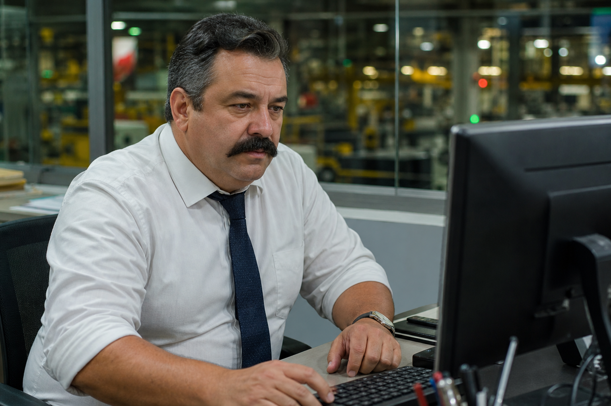
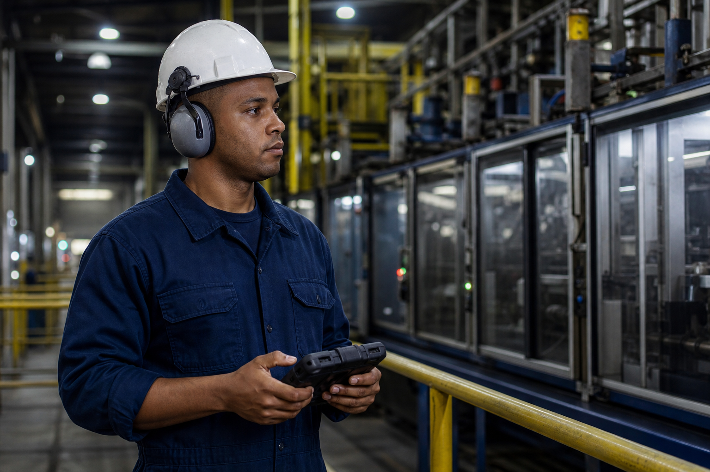
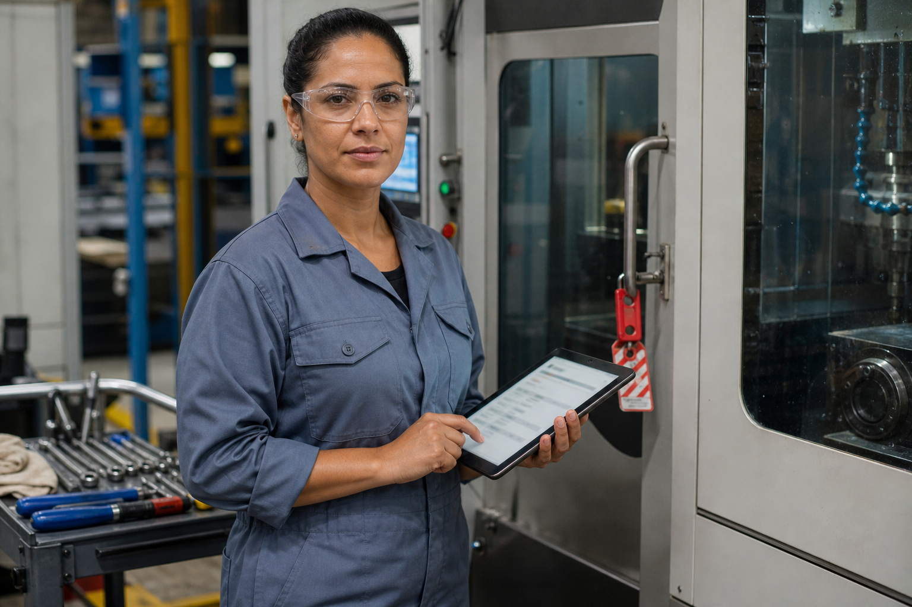
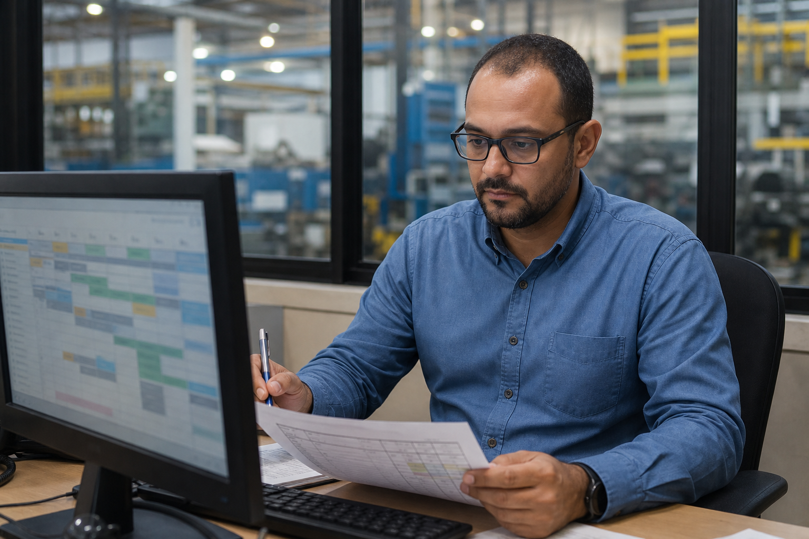
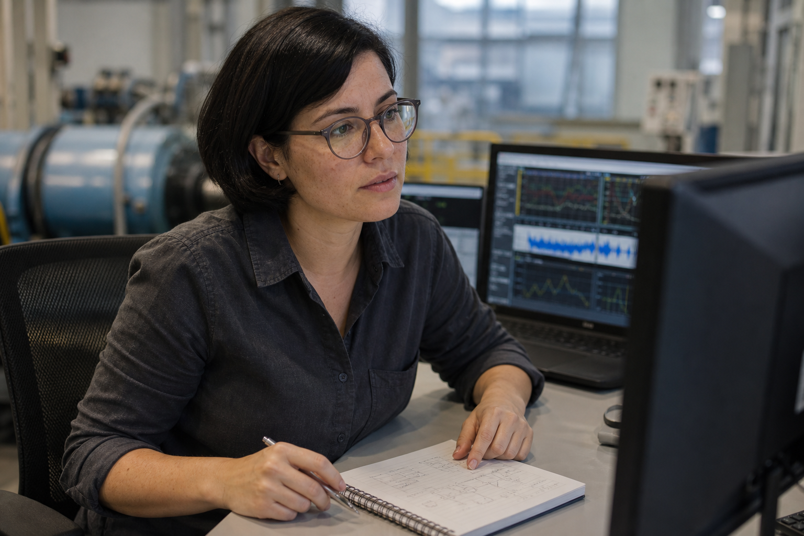

# Personas propostas para Deviante

Perfis fictícios e hipóteses de projeto baseados no storyboard e no cenário solicitado. Nomes, idades, falas e imagens são ilustrativos; não representam entrevistas ou usuários reais. Necessidades descrevem oportunidades de projeto, não funcionalidades confirmadas.

## Camila Rocha, 34 anos

**Gerente de manutenção • home office**

**Contexto:** Gerencia a manutenção remotamente. Nesta situação, está em casa com o bebê recém-nascido no colo e tem apenas uma mão livre para usar o celular.

**Objetivo:** Agendar e reagendar mudanças na programação de manutenção sem interromper o cuidado com o bebê.

**Dificuldades:** Formulários longos, botões pequenos, gestos com duas mãos e perda de dados ao interromper uma tarefa.

**Necessidades:** Fluxo curto no celular, alvos de toque amplos, rascunho automático e confirmação clara de data, equipe e máquina.

**Sinal de sucesso:** Concluir um reagendamento com uma mão e retomar a tarefa do ponto em que parou.

> Quero mudar o horário da manutenção com a mão que está livre.

## Ricardo Almeida, 48 anos

**Gestor de manutenção industrial**

**Contexto:** Responde pela continuidade da produção e coordena a manutenção. Recebe ligações de emergência fora do expediente e precisa decidir rapidamente.

**Objetivo:** Antecipar falhas e definir quando intervir antes que a produção pare.

**Dificuldades:** Paradas inesperadas, custos de reparo emergencial e pressão por respostas imediatas.

**Necessidades:** Visão resumida da condição das máquinas, prioridade dos alertas e recomendação de manutenção explicada.

**Sinal de sucesso:** Planejar intervenções com antecedência e reduzir chamados inesperados.

> Preciso saber qual máquina exige atenção e até quando posso agir.

## Lucas Santos, 28 anos

**Operador de produção • turno noturno**

**Contexto:** Acompanha máquinas durante a madrugada. Tem pouco tempo para relatar anomalias e precisa comunicar o que aconteceu com clareza.

**Objetivo:** Registrar sinais de problema e acionar a pessoa responsável rapidamente.

**Dificuldades:** Ruído, iluminação limitada e necessidade de repetir o mesmo relato em canais diferentes.

**Necessidades:** Identificação fácil da máquina, registro rápido de ocorrência e confirmação de que o responsável foi avisado.

**Sinal de sucesso:** Comunicar uma anomalia com localização e contexto suficientes para a equipe agir.

> Quero avisar o problema e saber se alguém já está cuidando dele.

## Joana Ferreira, 37 anos

**Técnica de manutenção**

**Contexto:** Executa intervenções no chão de fábrica e consulta informações perto dos equipamentos. Precisa conciliar a tarefa física com o registro do serviço.

**Objetivo:** Entender o problema, preparar ferramentas e registrar o que foi realizado.

**Dificuldades:** Histórico incompleto, instruções dispersas e dificuldade de preencher relatórios durante o atendimento.

**Necessidades:** Histórico por máquina, checklist objetivo, registros com fotos e um fluxo simples de conclusão.

**Sinal de sucesso:** Realizar a intervenção com informação suficiente e deixar um registro útil para a próxima equipe.

> Antes de abrir a máquina, preciso saber o que já aconteceu com ela.

## Bruno Costa, 41 anos

**Planejador de manutenção**

**Contexto:** Organiza as intervenções e negocia janelas com a produção. Trabalha com mudanças frequentes de prioridade, disponibilidade de equipe e peças.

**Objetivo:** Transformar recomendações de manutenção em uma programação viável.

**Dificuldades:** Conflitos de horário, mudanças de última hora e informação desencontrada entre equipes.

**Necessidades:** Calendário compartilhado, visibilidade de recursos, alertas de conflito e histórico de reagendamentos.

**Sinal de sucesso:** Agendar a manutenção no prazo recomendado com equipe e recursos disponíveis.

> A melhor data só funciona se a equipe e a produção puderem cumprir.

## Helena Martins, 32 anos

**Engenheira de confiabilidade**

**Contexto:** Analisa dados de sensores e investiga padrões de falha. Apoia o gestor na decisão de quando intervir e avalia a qualidade das recomendações.

**Objetivo:** Distinguir alterações relevantes de ruído e explicar a recomendação de manutenção.

**Dificuldades:** Alertas sem contexto, sinais inconsistentes e dificuldade de comparar previsão com o que aconteceu.

**Necessidades:** Tendências históricas, identificação do sensor, qualidade do dado e rastreabilidade da análise.

**Sinal de sucesso:** Apresentar evidências compreensíveis para uma decisão de manutenção bem fundamentada.

> Quero entender quais sinais sustentam essa recomendação.

