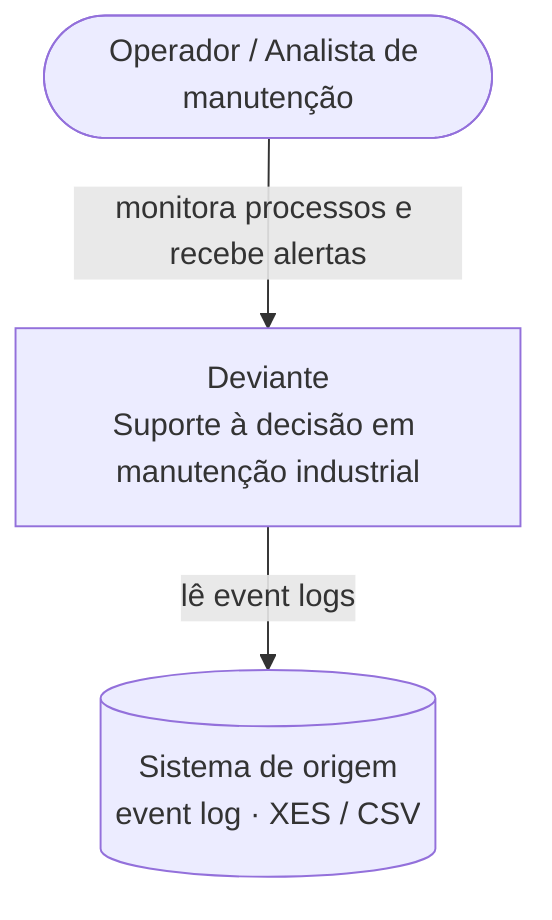
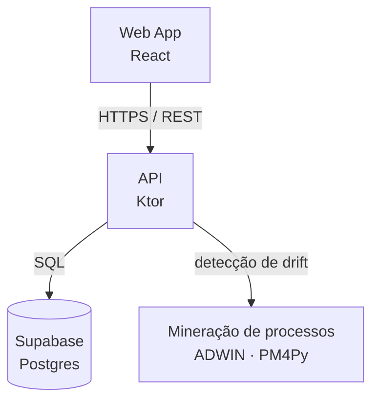
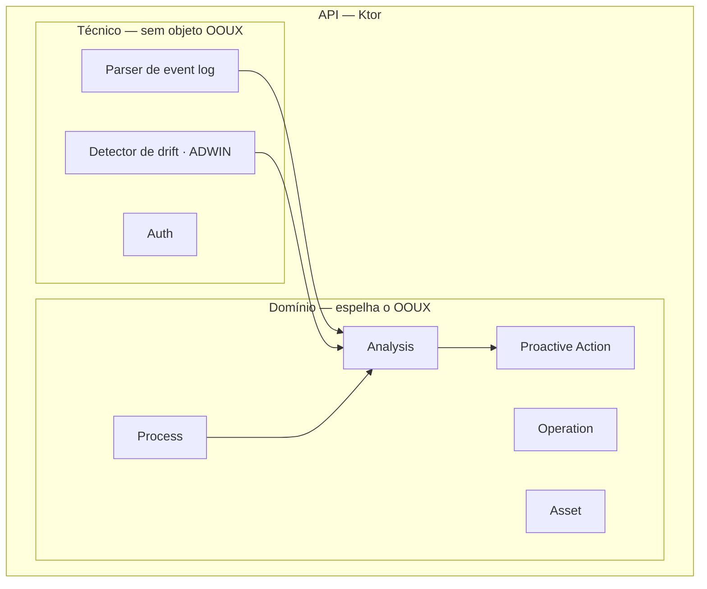
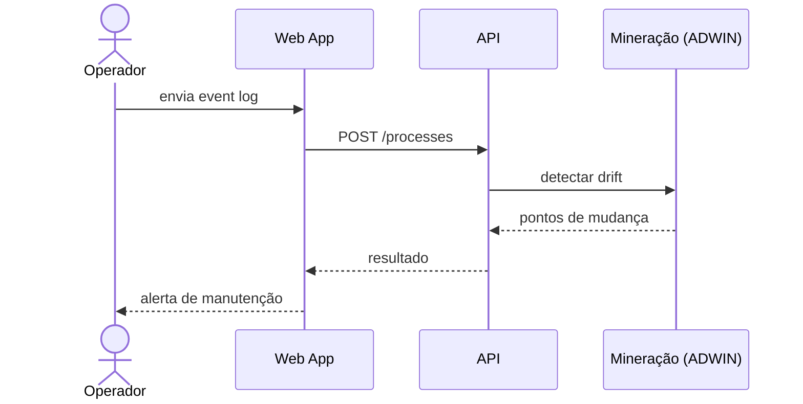
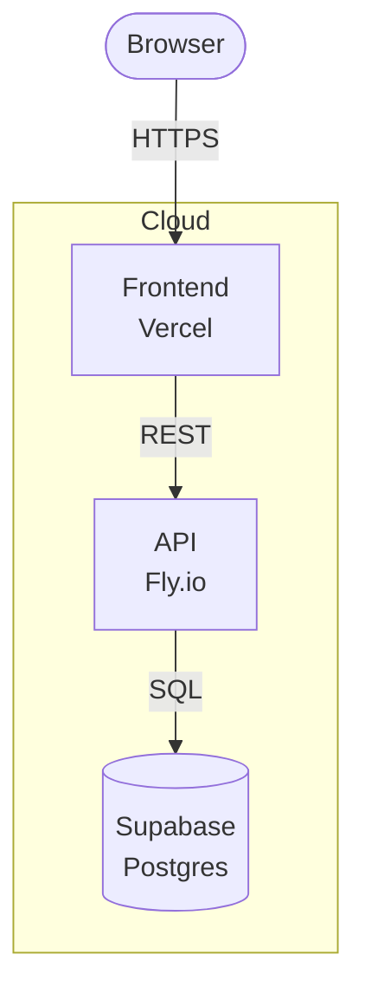

# Arquitetura do Deviante — arc42

> **Nota:** este é o esqueleto arc42 (12 seções). Os textos abaixo são
> _placeholders substituíveis_ — escreva o conteúdo real direto no Obsidian e
> dê push; o site atualiza sozinho. Os diagramas ficam **embutidos no meio das
> seções** como blocos ` ```mermaid ` (C4 / UML) e renderizam inline.

---

## 1. Introdução e Metas

_Substituir: visão geral do sistema e o que ele resolve._

### 1.1 Visão Geral de Requisitos

_Substituir: resumo dos requisitos funcionais essenciais — as principais
funcionalidades que o Deviante precisa entregar e por quê._

### 1.2 Metas de Qualidade

| Prioridade | Meta de qualidade | Cenário (substituir) |
|-----------|-------------------|----------------------|
| 1 | _(ex.: Precisão de detecção)_ | _…_ |
| 2 | _(ex.: Latência)_ | _…_ |
| 3 | _(ex.: Usabilidade)_ | _…_ |

### 1.3 Stakeholders

| Papel | Contato | Expectativa (substituir) |
|-------|---------|--------------------------|
| _(ex.: Operador)_ | _…_ | _…_ |
| _(ex.: Analista de manutenção)_ | _…_ | _…_ |
| _(ex.: Gestor de manutenção)_ | _…_ | _…_ |

## 2. Restrições da Arquitetura

_Substituir: restrições técnicas, organizacionais e convenções que limitam as
decisões (stack fixa, normas, prazos, etc.)._

## 3. Contexto e Escopo

_Substituir: fronteira do sistema, atores externos e interfaces._

### 3.1 Contexto de negócio

**C4 — Nível 1 · System Context** — sistema, usuários e sistemas externos.



## 4. Estratégia da Solução

_Substituir: decisões-chave de tecnologia e de arquitetura que endereçam as
metas de qualidade — resumo antes do detalhe._

## 5. Visão de Blocos de Construção

_Substituir: decomposição estática do sistema. A Building Block View do arc42 é
hierárquica — mesma lógica de zoom do C4: o Nível 1 decompõe o sistema, o Nível 2
abre um bloco em seus componentes._

### 5.1 Nível 1 — Visão geral do sistema

**C4 — Nível 2 · Container** — frontend, backend/API, banco e serviços.



### 5.2 Nível 2 — Componentes da API

Os **componentes de domínio** espelham os objetos do OOUX — ver [[UX/OBJECTS]].
Aqui aparece só a decomposição em software; o modelo de domínio não é
redescrito (arc42 recomenda referenciar em vez de duplicar). Somam-se a eles os
**componentes técnicos**, que não têm objeto OOUX correspondente.

**C4 — Nível 3 · Component**



| Componente | Objeto OOUX | Papel |
|-----------|-------------|-------|
| Process | Process | _(substituir)_ |
| Operation | Operation | _(substituir)_ |
| Asset | Asset | _(substituir)_ |
| Analysis | Analysis | _(substituir)_ |
| Proactive Action | Proactive Action | _(substituir)_ |
| Parser / Detector / Auth | — (técnico) | _(substituir)_ |

## 6. Visão de Runtime

_Substituir: cenários dinâmicos importantes (ex.: upload de log → detecção de
drift → alerta). Aqui cabe C4 Dynamic, UML de sequência, atividade ou BPMN — o
placeholder abaixo é uma sequência UML._



## 7. Visão de Implantação

_Substituir: mapeamento para infraestrutura e os canais entre os nós._

**C4 — Deployment** — onde os containers executam.



## 8. Conceitos Transversais

_Substituir: padrões recorrentes — modelo de domínio, segurança/autenticação,
i18n, tratamento de erros, observabilidade._

## 9. Decisões de Arquitetura

_Substituir: registro de decisões (ADRs) relevantes, com contexto e
consequências._

## 10. Requisitos de Qualidade

_Substituir: árvore de qualidade e cenários de qualidade detalhados (refina a
seção 1)._

## 11. Riscos e Dívida Técnica

_Substituir: riscos conhecidos e dívida técnica, ordenados por prioridade._

## 12. Glossário

| Termo | Definição (substituir) |
|-------|------------------------|
| _Drift_ | _…_ |
| _Event log_ | _…_ |
| _Sojourn time_ | _…_ |
