# Arquitetura do Deviante — arc42

**Grupo:** Alander Menezes Arantes de Ávila, Emanuelle Skolut Jose.

---

## 1. Introdução e Metas

O Deviante é um sistema de suporte a decisões para a gestão de manutenção industrial capaz de detectar desvios temporais a partir de registros do chão de fábrica. Orientado por técnicas de mineração de processo e aprendizagem de máquina, o sistema identifica quando o tempo de execução de uma atividade do processo produtivo muda de comportamento, sinalizando possíveis anomalias que facilitam as decisões de gestores de manutenção no agendamento de inspeções e manutenções no momento mais adequado. O objetivo do projeto é a redução de custos para a empresa e o aumento da disponibilidade dos ativos industriais.

A presente documentação apresenta um conjunto de decisões de design que afetam a estrutura e o comportamento do sistema Deviante. Tais decisões incluem a escolha de padrões arquiteturais, a definição de componentes e suas interações, e a consideração de requisitos funcionais e não funcionais. A arquitetura proposta serve como um guia para o desenvolvimento, influenciando diretamente a qualidade do software e a eficiência do processo de desenvolvimento.

### 1.1 Visão Geral de Requisitos

O Deviante apoia o gestor de manutenção numa atividade de negócio: perceber, a partir dos registros do chão de fábrica, que uma máquina começou a demorar mais do que o normal e fornecer recursos para agir antes da falha, momento em que o custo de manutenção é menor. As tabelas abaixo resumem os requisitos:

**Requisitos funcionais**

| ID | Requisito | Atendido por |
|---|---|---|
| RF-01 | Login via conta Google (OAuth) | Microfrontend + Supabase Auth |
| RF-02 | Validar o papel do usuário na autenticação: administrador, gestor, operador ou técnico | Supabase Auth (papel no JWT) + Core API |
| RF-03 | Administrador cria, lista, atualiza e exclui todos os processos do sistema | Core API |
| RF-04 | Gestor cadastra, lista, atualiza e exclui operadores e técnicos da sua empresa | Core API |
| RF-05 | Gestor cria, lista, atualiza e exclui os processos da sua empresa | Core API |
| RF-06 | Processos da empresa visíveis para todos os seus gestores, operadores e técnicos | Core API |
| RF-07 | Operador cria, lista, atualiza e exclui atividades de processos | Core API |
| RF-08 | Gestor cadastra atividades e registros de eventos a partir de logs CSV ou XES | MS1 · Ingestão + Core API |
| RF-09 | Gerar e exibir o DFG (Directly-Follows Graph) do log carregado | MS1 · Ingestão (FastAPI + PM4Py, MongoDB Atlas) |
| RF-10 | Mapear atividades do log em uma ou mais operações do processo, e editar e remover esse mapeamento | Core API |
| RF-11 | Gestor cria, lista, atualiza e exclui os monitoramentos da sua empresa | Core API |
| RF-12 | Gestor cadastra, lista, atualiza e exclui máquinas, agrupa em monitoramentos e associa a processos, que as exibem no detalhe | Core API |
| RF-13 | Carregar log CSV ou XES de uma máquina e registrar seus parâmetros no monitoramento | MS1 · Ingestão + Core API |
| RF-14 | Configurar os parâmetros da análise: filtro de traces antes da 1ª execução e sensibilidade do IPDD/ADWIN para reexecutar sem novo upload | MS2 |
| RF-15 | Executar a análise de desvio (drift) sobre um processo ou máquina, com o cálculo IPDD/ADWIN numa função sem estado | MS2 · Análises (FastAPI, Azure SQL) + Azure Function (HTTP Trigger) |
| RF-16 | Exibir o diagnóstico de saúde de uma máquina monitorada, incluindo a degradação de seus componentes | Core API |
| RF-17 | Criar ações proativas (manutenção ou inspeção) a partir de uma recomendação, e editá-las e excluí-las | Core API |
| RF-18 | Técnico registra a execução de uma ação proativa e reabilita a máquina | Core API |
| RF-19 | Encaminhar os CRUDs da interface para Core API, MS1 e MS2 sem acesso direto da interface | BFF (NestJS) |
| RF-20 | Exibir numa única tela a visão consolidada do processo, via `GET /aggregated-data` | BFF (MS1, MS2 e Azure Function) |

**Requisitos não funcionais de negócio**

| ID | Requisito | Atendido por |
|---|---|---|
| RNF-01 | Back-end em Kotlin | Core API (Ktor) |
| RNF-02 | Persistência poliglota por serviço: Core no PostgreSQL do Supabase, MS1 no MongoDB Atlas e MS2 no Azure SQL | Core API, MS1, MS2 |
| RNF-03 | Interface em React + Vite | Microfrontend |
| RNF-04 | Figma como fonte única de tokens e componentes de UI | Microfrontend |
| RNF-05 | Microsserviços Python em FastAPI, consumidos via REST | MS1, MS2 |
| RNF-06 | Microsserviços Python como Azure Functions (serverless) | Parcial: o IPDD/ADWIN é Function; MS1 e MS2 rodam no Fly.io (ADR 04) |
| RNF-07 | Ingestão multiformato (CSV, XES, JSON) só por configuração | MS1 (parser por formato) |
| RNF-08 | Isolamento de dados por gestor (filtro pelo JWT) e por serviço (um usuário de banco próprio por serviço; o Core com role própria, sem o usuário `postgres`) | Core API e usuários de banco de cada serviço (§8.2) |
| RNF-09 | Git e CI/CD com build, testes e deploy a cada alteração | GitHub Actions em cada repositório |
| RNF-10 | Autenticação Supabase Auth com Google; JWT com usuário e papel | Supabase Auth, API Gateway, BFF, Core API |

**Requisitos não funcionais de arquitetura (Cloud)**

| ID | Requisito | Atendido por |
|---|---|---|
| RNF-12 | SPA estruturada como microfrontend que consome só o BFF | Microfrontend |
| RNF-13 | BFF em Node.js (Express ou NestJS) | BFF (NestJS) |
| RNF-14 | Microservices com Database per Service | Core, MS1 e MS2, cada um com seu banco (persistência poliglota) |
| RNF-15 | Microserviço 1 com MongoDB Atlas (Free Tier) | MS1 |
| RNF-16 | Microserviço 2 com Azure SQL (Free, 1 DTU) | MS2 |
| RNF-17 | Azure Function exposta via HTTP | Azure Function (HTTP Trigger) |
| RNF-18 | API Gateway na AWS | API Gateway |
| RNF-19 | Arquitetura Orientada a Eventos | Azure Service Bus (`EventLogParsed`, `DriftDetected`) |
| RNF-20 | Clean Architecture (Domain, Application, Infrastructure, API) | Todos os serviços (§5.2) |
| RNF-21 | Vertical Slice (uma pasta por feature) | Todos os serviços (§5.2) |
| RNF-22 | Testes unitários e de arquitetura | §8.5 |
| RNF-23 | Swagger no BFF, microserviços e eventos | OpenAPI do NestJS e do FastAPI |
| RNF-24 | Imagens do BFF e dos microserviços no Docker Hub | §7 |
| RNF-25 | Aplicação em URLs da nuvem, não localhost | §7 |

### 1.2 Metas de Qualidade

As cinco metas abaixo são as qualidades que mais pesam para os stakeholders, em ordem de prioridade, com o nome da característica da ISO/IEC 25010:2023 a que cada uma corresponde. Cada meta tem um cenário verificável; a seção 4 mostra como a arquitetura atende cada uma e a seção 10 detalha os cenários.

| Prioridade | Meta | ISO/IEC 25010 | Cenário |
|---|---|---|---|
| 1 | Correção analítica | Adequação funcional (correção) | Para os logs sintéticos `DR_*` o drift detectado cai a até 5 traces do ponto injetado (ground truth de `adwin_dataset.py`). |
| 2 | Modificabilidade | Manutenibilidade (modificabilidade) | Um novo formato de log (ex.: JSON) entra com uma nova subclasse de parser, sem alterar MS2, BFF ou Core. |
| 3 | Isolamento | Confiabilidade (tolerância a falhas) | Uma falha no MS2 ou na Function não derruba o CRUD de processos e equipamentos; o BFF devolve o agregado parcial. |
| 4 | Segurança | Segurança (confidencialidade, autenticidade) | Nenhum serviço é acessível sem JWT válido emitido pelo Supabase Auth; dados de um gestor não aparecem para outro. |
| 5 | Implantabilidade | Flexibilidade (instalabilidade) | Cada serviço é uma imagem Docker publicada no Docker Hub e implantada de forma independente. |

### 1.3 Stakeholders

Pessoas e papéis que precisam conhecer, aprovar ou usar esta arquitetura. Os três primeiros são os usuários do sistema; os demais avaliam, orientam ou constroem o projeto.

| Papel / Nome | Contato | Expectativa |
|---|---|---|
| Operador do maquinário | Usuário do sistema | Informar as atividades da cadeia produtiva e registrar os dados. |
| Gestor de manutenção | Usuário do sistema | Monitorar os dados, gerar análises a partir do processo registrado e acionar a manutenção a tempo. |
| Técnico de manutenção | Usuário do sistema | Saber o que fazer, registrar a manutenção realizada e reabilitar a máquina no sistema. |
| Analista / mentor | Grupo de pesquisa IPDD (PUCPR) | Validar as análises e ajustar a sensibilidade do IPDD/ADWIN. |
| Denise M. V. Sato, autora do framework IPDD | [denise.vecino@pucpr.br](mailto:denise.vecino@pucpr.br) | Ver o método aplicado com fidelidade ao trabalho original. |
| Luiz F. Picolo, pesquisador do grupo IPDD | [luiz.picolo@pucpr.edu.br](mailto:luiz.picolo@pucpr.edu.br) | Ver o detector reaproveitado sem alteração e com resultados reproduzíveis. |
| Eduardo de Freitas Loures, orientador PIBITI | [eduardo.loures@pucpr.br](mailto:eduardo.loures@pucpr.br) | Orientar a pesquisa e validar a aplicação na manutenção industrial. |
| Manoel Valerio da Silveira Neto, professor de Arquitetura e Soluções Cloud | [manoel.valerio@pucpr.br](mailto:manoel.valerio@pucpr.br) | Avaliar estilos arquiteturais e implantação em nuvem. |
| Tiago Adelino Navarro, professor de Desenvolvimento Orientado a Reuso | [tiago.adelino@pucpr.edu.br](mailto:tiago.adelino@pucpr.edu.br) | Avaliar padrões de projeto, variabilidade e reuso. |
| Grupo de desenvolvimento: Alander Menezes Arantes de Ávila, Emanuelle Skolut Jose | [menezes.alander@pucpr.edu.br](mailto:menezes.alander@pucpr.edu.br) | Uma arquitetura que caiba no prazo e no free tier. |

---

## 2. Restrições da Arquitetura

O Deviante atende a três frentes, cada uma com suas restrições e demandas.

A primeira é a Iniciação Tecnológica (PIBITI), vigente de agosto de 2025 a julho de 2026 e apresentada no SEMIC em outubro de 2026. O produto continua uma pesquisa da PUCPR que envolve graduandos, mestrandos e doutorandos. Por isso parte da estratégia já chega consolidada e validada pelo grupo de pesquisa: o PM4Py para minerar o processo e o IPDD/ADWIN para detectar os desvios de desempenho.

As outras duas são disciplinas do 6º período de Engenharia de Software da PUCPR. **Arquitetura e Soluções Cloud** define o estilo e a infraestrutura: microfrontend, BFF em Node.js, dois microsserviços com bancos próprios (MongoDB Atlas e Azure SQL), uma Azure Function, API Gateway na AWS e comunicação por eventos, com Clean Architecture, Vertical Slice, testes unitários e de arquitetura, imagens no Docker Hub, repositórios públicos e documentação arc42 com C4. **Desenvolvimento Orientado a Reuso** pede que o projeto seja modelado com padrões de projeto, deixe explícitos os pontos de variabilidade e reaproveite componentes existentes em vez de reescrevê-los.

As restrições abaixo seguem o template arc42 em três grupos: técnicas, organizacionais e convenções. Cada uma traz o motivo que a impõe.

### 2.1 Restrições técnicas

| ID | Restrição | Motivo |
|---|---|---|
| RT1 | Interface como microfrontend em React que consome só o BFF | Exigência de Cloud (RNF-12). React + Vite é decisão do grupo (RNF-03). |
| RT2 | BFF em Node.js (NestJS), com o endpoint `GET /aggregated-data` | Exigência de Cloud (RNF-13, RF-19, RF-20). |
| RT3 | Microsserviço 1 com MongoDB Atlas (Free Tier) | Exigência de Cloud (RNF-15). |
| RT4 | Microsserviço 2 com Azure SQL (Free, 1 DTU) | Exigência de Cloud (RNF-16). 1 DTU limita consultas pesadas. |
| RT5 | Azure Function com HTTP Trigger ou Message Trigger | Exigência de Cloud (RNF-17, RF-15). |
| RT6 | API Gateway na AWS como porta de entrada | Exigência de Cloud (RNF-18). |
| RT7 | Comunicação assíncrona por eventos entre serviços | Exigência de Cloud (RNF-19). |
| RT8 | Back-end de domínio em Kotlin; microsserviços analíticos em Python com FastAPI | Decisão do grupo (RNF-01, RNF-05). PM4Py e o código IPDD/ADWIN só existem em Python. |
| RT9 | Supabase para autenticação (Google) e PostgreSQL do Core | Decisão do grupo (RNF-02, RNF-10). O domínio do Core é relacional (ADR 03 e 08). |
| RT10 | Código IPDD/ADWIN da pesquisa reaproveitado sem reescrita | Fidelidade científica: o método publicado precisa dar os mesmos resultados. |
| RT11 | Só serviços gratuitos (free tiers) | Projeto acadêmico sem orçamento. Limites de memória, conexões e DTU condicionam o desenho. |

### 2.2 Restrições organizacionais

| ID | Restrição | Motivo |
|---|---|---|
| RO1 | Equipe de dois alunos | Grupo do projeto integrador (PjBL) do 6º período. |
| RO2 | Prazos: documentação de Cloud em 15/10/2026; Reuso e apresentação do PIBITI em 16/10/2026; arquitetura completa de Cloud em 12/11/2026 | Calendário das disciplinas e do PIBITI. |
| RO3 | Método analítico definido pela pesquisa e validado pelo orientador | O PIBITI continua o trabalho do grupo de pesquisa IPDD da PUCPR. |
| RO4 | Um repositório público no GitHub por serviço, cada um com README (arquitetura, tecnologias, como rodar, nomes dos alunos) | Exigência de Cloud. |
| RO5 | Imagem Docker do BFF e de cada microsserviço publicada no Docker Hub | Exigência de Cloud (RNF-24). |
| RO6 | CI com build, testes e deploy a cada alteração; testes unitários e de arquitetura | RNF-09 e exigência de Cloud (RNF-22). |
| RO7 | Demonstração em URLs da nuvem, não localhost, em vídeo no YouTube com todos os integrantes falando | Exigência de Cloud (RNF-25). |

### 2.3 Convenções

| ID | Convenção | Motivo |
|---|---|---|
| C1 | Documentação de arquitetura no template arc42 (12 seções), com diagramas C4 nos níveis de contexto, contêineres e componentes | Exigência de Cloud. |
| C2 | Diagramas em Mermaid, versionados como texto | Renderizam a partir do próprio texto, sem ferramenta de desenho. |
| C3 | Clean Architecture (`domain`, `application`, `infrastructure`, `api`) com uma pasta por feature (Vertical Slice) | Exigência de Cloud (RNF-20, RNF-21). |
| C4 | APIs e eventos documentados em Swagger/OpenAPI | Exigência de Cloud (RNF-23). |
| C5 | Figma como fonte única de tokens e componentes de interface | Decisão do grupo (RNF-04). |
| C6 | Documentação em português; código, nomes de classes e eventos em inglês | Público da documentação é a banca da PUCPR; código segue o padrão das bibliotecas. |

---

## 3. Contexto e Escopo

O Deviante é tratado aqui como uma caixa-preta. Dentro do escopo estão o registro do processo, a importação do event log, a análise de desvios e o registro das manutenções. Fora do escopo ficam o sistema de origem da fábrica (MES/ERP), que só exporta o log, e o provedor de identidade (Google). Os três usuários acessam o sistema pelo navegador.

### 3.1 Contexto de negócio

**C4 — Nível 1 · System Context**

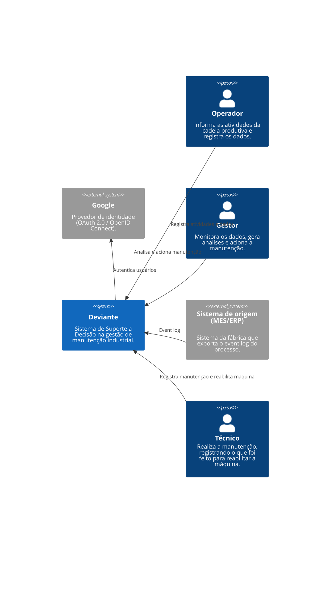
```mermaid
%%{init: {"wrap": true, "c4": {"width": 200, "wrap": true}}}%%
C4Context

    System(e1, " ", " ")
    Person(operador, "Operador", "Informa as atividades da cadeia produtiva e registra os dados.")
    System_Ext(google, "Google", "Provedor de identidade (OAuth 2.0 / OpenID Connect).")
    Person(gestor, "Gestor", "Monitora os dados, gera analises e aciona a manutenção.")
    System(deviante, "Deviante", "Sistema de Suporte a Decisão na gestão de manutenção industrial.")
    System_Ext(mes, "Sistema de origem (MES/ERP)", "Sistema da fábrica que exporta o event log do processo.")
    System(e4, " ", " ")
    Person(tecnico, "Técnico", "Realiza a manutenção, registrando o que foi feito para reabilitar a máquina.")
    System(e5, " ", " ")

    Rel(operador, deviante, "Registra atividades e dados")
    Rel(gestor, deviante, "Analisa e aciona manutenção")
    Rel(tecnico, deviante, "Registra manutenção e reabilita maquina")
    Rel(mes, deviante, "Event log")
    Rel(deviante, google, "Autentica usuários")

    UpdateRelStyle(gestor, deviante, $offsetX="-100", $offsetY="-75")
    UpdateRelStyle(mes, deviante, $offsetX="-15", $offsetY="-20")

    UpdateElementStyle(e1, $bgColor="transparent", $borderColor="transparent", $fontColor="transparent")
    UpdateElementStyle(e4, $bgColor="transparent", $borderColor="transparent", $fontColor="transparent")
    UpdateElementStyle(e5, $bgColor="transparent", $borderColor="transparent", $fontColor="transparent")

    UpdateLayoutConfig($c4ShapeInRow="3", $c4BoundaryInRow="1")
```

| Parceiro | Entrada | Saída |
|---|---|---|
| Operador | Atividades da cadeia produtiva, event log, leituras | Processo registrado |
| Gestor de manutenção | Mapeamentos, parâmetros de análise, acionamento da manutenção | Grafo, drifts, recomendações |
| Técnico de manutenção | Manutenção realizada, reabilitação da máquina | Manutenções agendadas |
| Sistema de origem (MES/ERP) | — | Event log XES/CSV (exportado pelo gestor) |
| Google | — | Identidade (OAuth 2.0) |

### 3.2 Contexto técnico

Todo o tráfego externo entra por um único canal, o API Gateway da AWS, e segue para o BFF. Os canais internos entre os serviços aparecem na seção 5 (C4 nível 2) e na seção 7.

| Parceiro | Canal técnico | Entrada/saída de negócio que passa por ele |
|---|---|---|
| Operador, gestor e técnico (navegador) | HTTPS/JSON até o API Gateway e o BFF, com JWT no header `Authorization` | Atividades, mapeamentos, parâmetros de análise e manutenções entram; grafo, drifts e recomendações saem |
| Sistema de origem (MES/ERP) | Arquivo XES ou CSV enviado por upload (multipart via HTTPS) | Event log do processo |
| Google | OAuth 2.0 / OpenID Connect, intermediado pelo Supabase Auth | Identidade do usuário (JWT) |

---

## 4. Estratégia da Solução

Esta seção resume as decisões que dão forma ao Deviante: como o sistema é dividido, quais tecnologias usa, quais padrões arquiteturais e de projeto adota e como isso atende às metas de qualidade (seção 1.2) dentro das restrições da seção 2. A estrutura detalhada está na seção 5 e os conceitos transversais na seção 8.

### 4.1 Decomposição e integração

O sistema é dividido por responsabilidade, cada parte com seu banco (Database per Service). A interface é um microfrontend em React que conversa só com o BFF em NestJS, e o BFF fica atrás do API Gateway da AWS. O domínio (processos, atividades, máquinas, monitoramentos e manutenções) fica na Core API em Kotlin/Ktor sobre o Postgres do Supabase, que também cuida do login. A ingestão do log e o grafo do processo ficam no MS1 (FastAPI + PM4Py, MongoDB Atlas) e as análises de desvio no MS2 (FastAPI, Azure SQL). Cada serviço usa o banco que combina com o seu dado (persistência poliglota): relacional no Core, documentos no MS1 e Azure SQL no MS2.

**Núcleo analítico.** O IPDD/ADWIN roda numa Azure Function sem estado, chamada sob demanda, reaproveitando o código da pesquisa sem reescrita para preservar os resultados do método publicado.

**Integração.** Os serviços trocam eventos no Azure Service Bus (`EventLogParsed`, `DriftDetected`). Assim ingestão, análise e domínio evoluem e falham separados, e o BFF consegue devolver um agregado parcial quando um deles está fora.

### 4.2 Padrões arquiteturais e de projeto

No nível da arquitetura, o Deviante combina microsserviços com Database per Service, Backend for Frontend (BFF), API Gateway e comunicação orientada a eventos (publish/subscribe no Service Bus); dentro de cada serviço, Clean Architecture com uma pasta por feature (Vertical Slice). No nível do código, adota um padrão de cada família GoF: o **Singleton** (criacional) garante uma única instância do motor de análise na Function (`AnalysisEngine`) e da configuração (`AppConfig`); o **Adapter** (estrutural) envolve o código IPDD/ADWIN da pesquisa (`IpddAdwinAdapter` → `DriftDetector`) e o PM4Py (`Pm4pyGraphAdapter` → `GraphMiner`) atrás de interfaces próprias; e o **Observer** (comportamental) faz o `DriftSubject` notificar `InvestigationPanel`, `MonitoringContext` e `AnalysisHud` no microfrontend quando um drift é detectado. Os detalhes de cada padrão estão na seção 8.3.

### 4.3 Tecnologia e operação

Só serviços gratuitos: Vercel para a interface, Fly.io para a Core API, o MS1 e o MS2 (ADR 04), Azure para a Function, o Service Bus e o Azure SQL. Cada serviço vira uma imagem no Docker Hub e é publicado pelo GitHub Actions.

### 4.4 Metas de qualidade e abordagens

A tabela liga cada meta de qualidade (seção 1.2) à abordagem que a atende.

| Meta de qualidade | Cenário | Abordagem de solução |
|---|---|---|
| Correção analítica | Para os logs sintéticos `DR_*`, o drift detectado cai a até 5 traces do ponto injetado. | Reaproveitar o IPDD/ADWIN original por um Adapter (`IpddAdwinAdapter`), sem reescrita, e validar contra o ground truth de `adwin_dataset.py` (seções 8.3 e 10). |
| Modificabilidade | Um novo formato de log (ex.: JSON) entra sem alterar MS2, BFF ou Core. | Um parser por formato isolado no MS1; eventos separam o MS1 de quem consome o log; Clean Architecture e Vertical Slice limitam o impacto da mudança (seções 5 e 8). |
| Isolamento | Uma falha no MS2 ou na Function não derruba o CRUD de processos e equipamentos; o BFF devolve o agregado parcial. | Database per Service, Function sem estado, eventos idempotentes no Service Bus e BFF com timeout por serviço (seções 5, 6 e 8). |
| Segurança | Nenhum serviço responde sem JWT válido do Supabase Auth; dados de um gestor não aparecem para outro. | Login Google pelo Supabase Auth, JWT validado no API Gateway e nos serviços, filtro por gestor em todo repositório do Core e um usuário de banco por serviço (seção 8.2). |
| Implantabilidade | Cada serviço é uma imagem Docker no Docker Hub, implantada de forma independente. | Um repositório, uma imagem e um pipeline do GitHub Actions por serviço (seção 7). |

---

## 5. Visão de Blocos de Construção

Esta seção abre a caixa-preta do contexto da seção 3 (C4 nível 1) e mostra a decomposição estática do Deviante em três níveis, na mesma lógica de zoom do C4: o nível 1 mostra os containers, o nível 2 abre o Core API em componentes e o nível 3 detalha o código em UML. Cada nível traz o diagrama, a motivação da divisão e os blocos que ele contém.

### 5.1 Nível 1 — Containers (C4 · Nível 2)

Caixa branca do Deviante. O Supabase Auth (login com Google) e o sistema de origem (MES/ERP) aparecem como externos.

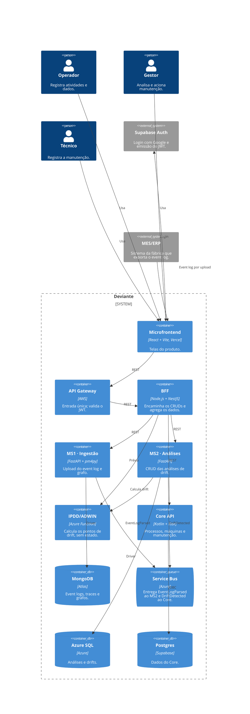
```mermaid
%%{init: {"wrap": true, "c4": {"width": 200, "wrap": true}}}%%
C4Container

    Person(operador, "Operador", "Registra atividades e dados.")
    Person(gestor, "Gestor", "Analisa e aciona manutenção.")
    Person(tecnico, "Técnico", "Registra a manutenção.")
    System_Ext(auth, "Supabase Auth", "Login com Google e emissão do JWT.")
    System(s1, " ", " ")
    System(s2, " ", " ")
    System(s3, " ", " ")
    System_Ext(mes, "MES/ERP", "Sistema da fábrica que exporta o event log.")

    System_Boundary(dv, "Deviante") {
        Container(s4, " ", " ")
        Container(web, "Microfrontend", "React + Vite, Vercel", "Telas do produto.")
        Container(gw, "API Gateway", "AWS", "Entrada única; valida o JWT.")
        Container(bff, "BFF", "Node.js + NestJS", "Encaminha os CRUDs e agrega os dados.")
        Container(ms1, "MS1 · Ingestão", "FastAPI + pm4py", "Upload do event log e grafo.")
        Container(ms2, "MS2 · Análises", "FastAPI", "CRUD das análises de drift.")
        Container(fn, "IPDD/ADWIN", "Azure Function", "Calcula os pontos de drift, sem estado.")
        Container(core, "Core API", "Kotlin + Ktor", "Processos, máquinas e manutenção.")
        ContainerDb(dbMs1, "MongoDB", "Atlas", "Event logs, traces e grafos.")
        ContainerQueue(bus, "Service Bus", "Azure", "Entrega EventLogParsed ao MS2 e DriftDetected ao Core.")
        ContainerDb(dbMs2, "Azure SQL", "Azure", "Análises e drifts.")
        ContainerDb(dbCore, "Postgres", "Supabase", "Dados do Core.")
    }

    Rel(operador, web, "Usa")
    Rel(gestor, web, "Usa")
    Rel(tecnico, web, "Usa")
    Rel(web, auth, "Login")
    Rel(mes, web, "Event log por upload")
    Rel(web, gw, "REST")
    Rel(gw, bff, "REST")
    Rel(bff, fn, "Prévia")
    Rel(bff, core, "REST")
    Rel(bff, ms1, "REST")
    Rel(bff, ms2, "REST")
    Rel(ms2, fn, "Calcula drift")
    Rel(ms1, bus, "EventLogParsed")
    Rel(ms2, bus, "DriftDetected")
    Rel(core, dbCore, "JDBC")
    Rel(ms1, dbMs1, "Driver")
    Rel(ms2, dbMs2, "Driver")

    UpdateRelStyle(ms2, fn, $offsetX="-5", $offsetY="-20")
    UpdateRelStyle(mes, web, $offsetX="60", $offsetY="-90")

    UpdateElementStyle(s1, $bgColor="transparent", $borderColor="transparent", $fontColor="transparent")
    UpdateElementStyle(s2, $bgColor="transparent", $borderColor="transparent", $fontColor="transparent")
    UpdateElementStyle(s3, $bgColor="transparent", $borderColor="transparent", $fontColor="transparent")
    UpdateElementStyle(s4, $bgColor="transparent", $borderColor="transparent", $fontColor="transparent")

    UpdateLayoutConfig($c4ShapeInRow="4", $c4BoundaryInRow="1")
```

**Motivação.** Cada serviço é dono de um grupo de objetos ORCA e do seu próprio banco, para que ingestão, análise e domínio evoluam e sejam implantados separadamente (meta de manutenibilidade, §4). Cada banco combina com o dado do serviço (persistência poliglota, ADR 08): o domínio do Core é relacional e fica no Postgres, os logs e traces do MS1 são documentos e ficam no MongoDB, e as análises do MS2 ficam no Azure SQL. O BFF concentra a agregação para que o Microfrontend faça uma única chamada por tela, e o cálculo IPDD/ADWIN fica isolado numa função sem estado, que pode ser trocada sem mexer nos serviços.

**Blocos contidos**

| Container | Responsabilidade | Tecnologia | Banco |
|---|---|---|---|
| Microfrontend | SPA do produto e do site público | React + Vite, Vercel | — |
| API Gateway | Entrada única, roteamento, JWT, rate limit | AWS API Gateway (HTTP API) | — |
| BFF | Proxy dos CRUDs; `GET /aggregated-data` junta Core, MS1, MS2 e Function num único JSON | Node.js + NestJS, Fly.io | — |
| Core API | Processos, atividades, mapeamentos, equipamentos, monitoramento, recomendações e agendas | Kotlin + Ktor, Fly.io | Supabase Postgres |
| MS1 · Ingestão | Upload CSV/XES, parse, operações, traces e grafo (DFG) com pm4py; CRUD de event logs | Python + FastAPI + pm4py, Fly.io | MongoDB Atlas |
| MS2 · Análises | CRUD das análises de drift; monta a série de tempos e chama a Function | Python + FastAPI, Fly.io | Azure SQL |
| Azure Function | IPDD/ADWIN: recebe a série, devolve os pontos de drift; sem estado | Python, HTTP Trigger | — |
| Service Bus | Transporte de eventos entre serviços | Azure Service Bus | — |

**Interfaces importantes.** São os contratos entre os containers. As REST passam pelo BFF; as de evento passam pelo Service Bus. O diagrama de componentes da §5.3 mostra quem fornece e quem requer cada uma.

| Interface | Fornecida por | Tipo | Usada por |
|---|---|---|---|
| `IAggregatedData` | BFF | REST, `GET /aggregated-data` | Microfrontend |
| `IDomainCrud` | Core API | REST | BFF |
| `IEventLogs` | MS1 · Ingestão | REST, upload multipart | BFF |
| `IAnalyses` | MS2 · Análises | REST | BFF |
| `IDriftCalculation` | Azure Function | HTTP, `POST /ipdd-adwin` | BFF, MS2 |
| `IEventLogParsedHandler` | MS2 · Análises | Evento `EventLogParsed` | MS1 (publica) |
| `IDriftDetectedHandler` | Core API | Evento `DriftDetected` | MS2 (publica) |

### 5.2 Nível 2 — Componentes do Core API (C4 · Nível 3)

Caixa branca do Core API.

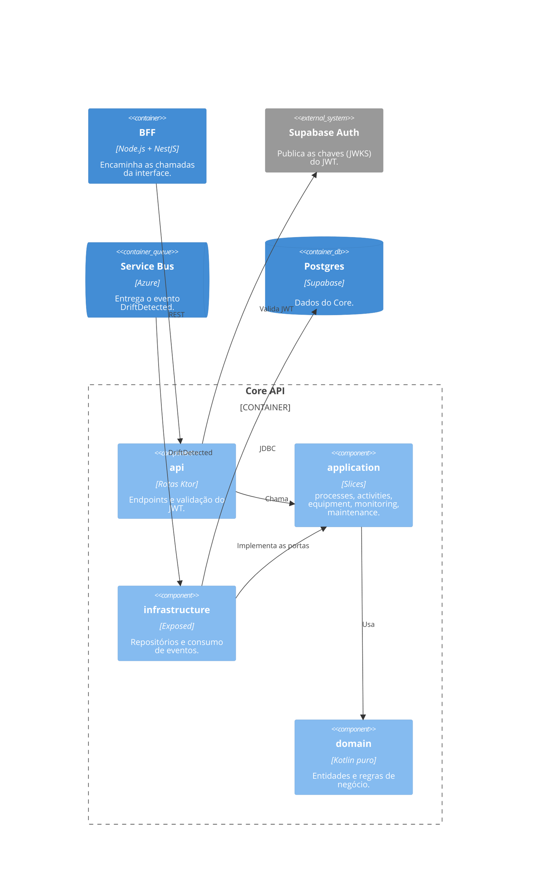
```mermaid
%%{init: {"wrap": true, "c4": {"width": 200, "wrap": true}}}%%
C4Component

    Container(bff, "BFF", "Node.js + NestJS", "Encaminha as chamadas da interface.")
    System_Ext(auth, "Supabase Auth", "Publica as chaves (JWKS) do JWT.")
    ContainerQueue(bus, "Service Bus", "Azure", "Entrega o evento DriftDetected.")
    ContainerDb(db, "Postgres", "Supabase", "Dados do Core.")

    Container_Boundary(core, "Core API") {
        Component(api, "api", "Rotas Ktor", "Endpoints e validação do JWT.")
        Component(app, "application", "Slices", "processes, activities, equipment, monitoring, maintenance.")
        Component(infra, "infrastructure", "Exposed", "Repositórios e consumo de eventos.")
        Component(s1, " ", " ")
        Component(s2, " ", " ")
        Component(domain, "domain", "Kotlin puro", "Entidades e regras de negócio.")
    }

    Rel(bff, api, "REST")
    Rel(api, auth, "Valida JWT")
    Rel(api, app, "Chama")
    Rel(app, domain, "Usa")
    Rel(infra, app, "Implementa as portas")
    Rel(infra, db, "JDBC")
    Rel(bus, infra, "DriftDetected")

    UpdateRelStyle(infra, app, $offsetX="-75", $offsetY="-30")

    UpdateElementStyle(s1, $bgColor="transparent", $borderColor="transparent", $fontColor="transparent")
    UpdateElementStyle(s2, $bgColor="transparent", $borderColor="transparent", $fontColor="transparent")

    UpdateLayoutConfig($c4ShapeInRow="4", $c4BoundaryInRow="1")
```

**Motivação.** O Core foi escolhido para abrir porque é dono de cinco dos seis objetos ORCA (§8.1) e concentra as regras de negócio. MS1 e MS2 seguem a mesma divisão, e o cálculo de drift, que é a parte de maior risco, já está isolado na Function (ADR 01). O Core combina Clean Architecture (RNF-20), com o `domain` sem dependências externas, e Vertical Slice (RNF-21), com uma pasta por feature dentro de `application`.

**Blocos contidos**

| Componente | Responsabilidade |
|---|---|
| `api` | Rotas Ktor, validação do JWT (JWKS) e conversão de requisição e resposta |
| `application` | Casos de uso, uma slice por feature: `processes` (CreateProcess, UpdateProcess, DeleteProcess, ListProcesses), `activities` (ManageActivityCatalog, MapOperation, UnmapOperation), `equipment` (CreateEquipment, UpdateEquipment, DeleteEquipment, ManageParameters), `monitoring` (CreateMonitoring, LinkEquipment, RecordReading) e `maintenance` (RecommendMaintenance, ScheduleMaintenance, CompleteMaintenance) |
| `domain` | Entidades e regras em Kotlin puro, detalhadas na §5.3 |
| `infrastructure` | Repositórios com Exposed sobre o Postgres e consumo do evento `DriftDetected`; implementa as portas definidas em `application` |

### 5.3 Nível 3 — Código (C4 · Nível 4)

O nível de código é detalhado por três diagramas UML: Classes e Componentes aqui, e Sequência na seção 6.

**C4 — Nível 4 · UML de Classes** (componente `domain` do Core API)

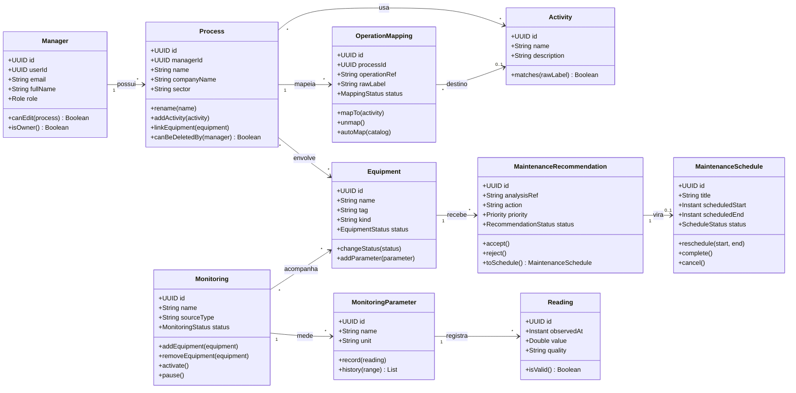
```mermaid
classDiagram
    direction LR

    class Manager {
      +UUID id
      +UUID userId
      +String email
      +String fullName
      +Role role
      +canEdit(process) Boolean
      +isOwner() Boolean
    }
    class Process {
      +UUID id
      +UUID managerId
      +String name
      +String companyName
      +String sector
      +rename(name)
      +addActivity(activity)
      +linkEquipment(equipment)
      +canBeDeletedBy(manager) Boolean
    }
    class Activity {
      +UUID id
      +String name
      +String description
      +matches(rawLabel) Boolean
    }
    class OperationMapping {
      +UUID id
      +UUID processId
      +String operationRef
      +String rawLabel
      +MappingStatus status
      +mapTo(activity)
      +unmap()
      +autoMap(catalog)
    }
    class Equipment {
      +UUID id
      +String name
      +String tag
      +String kind
      +EquipmentStatus status
      +changeStatus(status)
      +addParameter(parameter)
    }
    class Monitoring {
      +UUID id
      +String name
      +String sourceType
      +MonitoringStatus status
      +addEquipment(equipment)
      +removeEquipment(equipment)
      +activate()
      +pause()
    }
    class MonitoringParameter {
      +UUID id
      +String name
      +String unit
      +record(reading)
      +history(range) List
    }
    class Reading {
      +UUID id
      +Instant observedAt
      +Double value
      +String quality
      +isValid() Boolean
    }
    class MaintenanceRecommendation {
      +UUID id
      +String analysisRef
      +String action
      +Priority priority
      +RecommendationStatus status
      +accept()
      +reject()
      +toSchedule() MaintenanceSchedule
    }
    class MaintenanceSchedule {
      +UUID id
      +String title
      +Instant scheduledStart
      +Instant scheduledEnd
      +ScheduleStatus status
      +reschedule(start, end)
      +complete()
      +cancel()
    }

    Manager "1" --> "*" Process : possui
    Process "*" --> "*" Activity : usa
    Process "1" --> "*" OperationMapping : mapeia
    OperationMapping "*" --> "0..1" Activity : destino
    Process "*" --> "*" Equipment : envolve
    Monitoring "*" --> "*" Equipment : acompanha
    Monitoring "1" --> "*" MonitoringParameter : mede
    MonitoringParameter "1" --> "*" Reading : registra
    Equipment "1" --> "*" MaintenanceRecommendation : recebe
    MaintenanceRecommendation "1" --> "0..1" MaintenanceSchedule : vira
```

**C4 — Nível 4 · UML de Componentes** (interfaces fornecidas e requeridas entre os containers da §5.1)

```mermaid
flowchart LR
    subgraph BFF["«component» BFF"]
        bffAgg(["IAggregatedData"])
    end
    subgraph CORE["«component» Core API"]
        coreRest(["IDomainCrud"])
        coreEvt(["IDriftDetectedHandler"])
    end
    subgraph MS1["«component» MS1 Ingestão"]
        ms1Rest(["IEventLogs"])
    end
    subgraph MS2["«component» MS2 Análises"]
        ms2Rest(["IAnalyses"])
        ms2Evt(["IEventLogParsedHandler"])
    end
    subgraph FN["«component» Azure Function"]
        fnHttp(["IDriftCalculation"])
    end
    BFF -.->|requer| coreRest
    BFF -.->|requer| ms1Rest
    BFF -.->|requer| ms2Rest
    BFF -.->|requer| fnHttp
    MS2 -.->|requer| fnHttp
    MS1 -.->|publica para| ms2Evt
    MS2 -.->|publica para| coreEvt
```

---

## 6. Visão de Runtime

Esta seção mostra como os blocos da seção 5 colaboram em tempo de execução. Foram escolhidos os cenários que carregam o objetivo do sistema (do event log até a manutenção), a interação com a interface externa de identidade e o comportamento quando algo falha. Cada cenário traz o diagrama de sequência (C4 nível 4) e a análise do que ele mostra.

### 6.1 Upload do event log e análise de drift

**C4 — Nível 4 · UML de Sequência**

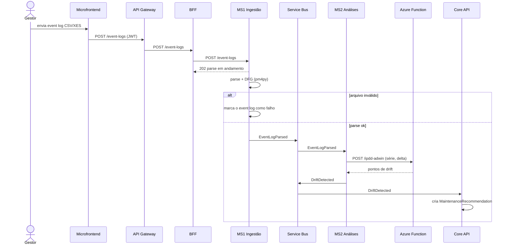
```mermaid
sequenceDiagram
    actor G as Gestor
    participant W as Microfrontend
    participant GW as API Gateway
    participant B as BFF
    participant M1 as MS1 Ingestão
    participant Q as Service Bus
    participant M2 as MS2 Análises
    participant F as Azure Function
    participant C as Core API
    G->>W: envia event log CSV/XES
    W->>GW: POST /event-logs (JWT)
    GW->>B: POST /event-logs
    B->>M1: POST /event-logs
    M1-->>B: 202 parse em andamento
    M1->>M1: parse + DFG (pm4py)
    alt arquivo inválido
        M1->>M1: marca o event log como falho
    else parse ok
    M1->>Q: EventLogParsed
    Q->>M2: EventLogParsed
    M2->>F: POST /ipdd-adwin (série, delta)
    F-->>M2: pontos de drift
    M2->>Q: DriftDetected
    Q->>C: DriftDetected
    C->>C: cria MaintenanceRecommendation
    end
```

**Análise.** O gestor envia o event log exportado do MES/ERP. A ingestão responde na hora e o resto da cadeia segue por eventos, até o Core criar a recomendação de manutenção. Se o arquivo for inválido, o MS1 marca o event log como falho e nenhum evento é publicado.

### 6.2 Abrir o processo (`GET /aggregated-data`)

**C4 — Nível 4 · UML de Sequência**

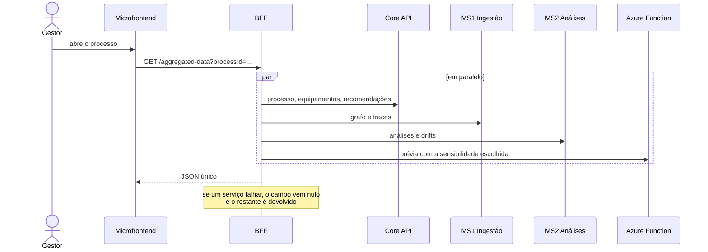
```mermaid
sequenceDiagram
    actor G as Gestor
    participant W as Microfrontend
    participant B as BFF
    participant C as Core API
    participant M1 as MS1 Ingestão
    participant M2 as MS2 Análises
    participant F as Azure Function
    G->>W: abre o processo
    W->>B: GET /aggregated-data?processId=...
    par em paralelo
        B->>C: processo, equipamentos, recomendações
        B->>M1: grafo e traces
        B->>M2: análises e drifts
        B->>F: prévia com a sensibilidade escolhida
    end
    B-->>W: JSON único
    Note over B: se um serviço falhar, o campo vem nulo<br/>e o restante é devolvido
```

**Análise.** Ao abrir um processo, o Microfrontend faz uma única chamada. O BFF consulta os serviços em paralelo e devolve um JSON único, mesmo que um deles falhe.

### 6.3 Login com Google

**C4 — Nível 4 · UML de Sequência**

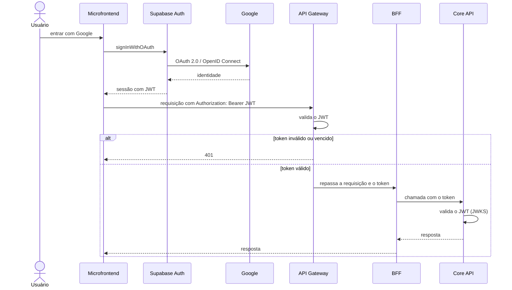
```mermaid
sequenceDiagram
    actor U as Usuário
    participant W as Microfrontend
    participant S as Supabase Auth
    participant G as Google
    participant GW as API Gateway
    participant B as BFF
    participant C as Core API
    U->>W: entrar com Google
    W->>S: signInWithOAuth
    S->>G: OAuth 2.0 / OpenID Connect
    G-->>S: identidade
    S-->>W: sessão com JWT
    W->>GW: requisição com Authorization: Bearer JWT
    GW->>GW: valida o JWT
    alt token inválido ou vencido
        GW-->>W: 401
    else token válido
        GW->>B: repassa a requisição e o token
        B->>C: chamada com o token
        C->>C: valida o JWT (JWKS)
        C-->>B: resposta
        B-->>W: resposta
    end
```

**Análise.** O login é a única interação com o provedor de identidade. Depois dele, toda chamada leva o JWT, que é validado no API Gateway e de novo no Core.

### 6.4 Da recomendação à manutenção realizada

**C4 — Nível 4 · UML de Sequência**

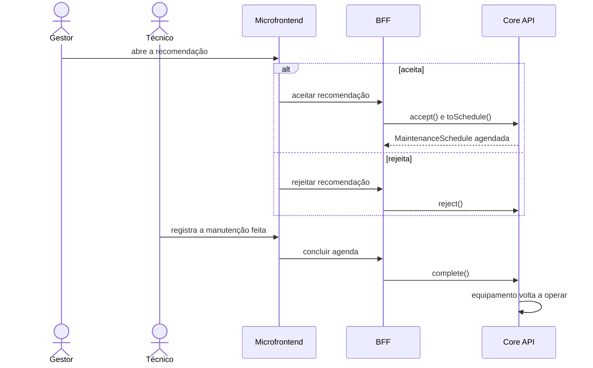
```mermaid
sequenceDiagram
    actor G as Gestor
    actor T as Técnico
    participant W as Microfrontend
    participant B as BFF
    participant C as Core API
    G->>W: abre a recomendação
    alt aceita
        W->>B: aceitar recomendação
        B->>C: accept() e toSchedule()
        C-->>B: MaintenanceSchedule agendada
    else rejeita
        W->>B: rejeitar recomendação
        B->>C: reject()
    end
    T->>W: registra a manutenção feita
    W->>B: concluir agenda
    B->>C: complete()
    C->>C: equipamento volta a operar
```

**Análise.** A recomendação criada em 6.1 só vira manutenção quando o gestor aceita. O técnico registra a execução, o que fecha o ciclo e reabilita a máquina.

---

## 7. Visão de Implantação

Esta seção mostra a infraestrutura onde o Deviante roda e onde cada bloco da seção 5 é implantado. Tudo roda em planos gratuitos ou de estudante de nuvem pública, sem servidor próprio.

### 7.1 Infraestrutura — nível 1 (produção)

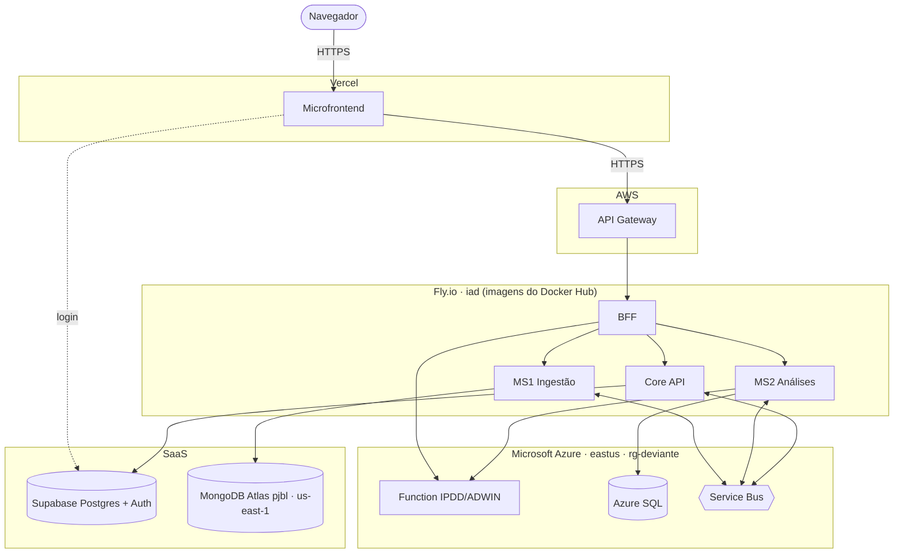
```mermaid
flowchart TB
    browser([Navegador])
    subgraph vercel["Vercel"]
        fe["Microfrontend"]
    end
    subgraph aws["AWS"]
        gw["API Gateway"]
    end
    subgraph fly["Fly.io · iad (imagens do Docker Hub)"]
        bff["BFF"]
        core["Core API"]
        ms1["MS1 Ingestão"]
        ms2["MS2 Análises"]
    end
    subgraph azure["Microsoft Azure · eastus · rg-deviante"]
        fn["Function IPDD/ADWIN"]
        sql[("Azure SQL")]
        bus{{"Service Bus"}}
    end
    subgraph saas["SaaS"]
        supa[("Supabase Postgres + Auth")]
        mongo[("MongoDB Atlas pjbl · us-east-1")]
    end
    browser -->|HTTPS| fe
    fe -->|HTTPS| gw --> bff
    bff --> core & ms1 & ms2
    bff --> fn
    ms2 --> fn
    fe -.->|login| supa
    core --> supa
    ms1 --> mongo
    ms2 --> sql
    ms1 & ms2 & core <--> bus
```

**Motivação.** As restrições de Cloud (§2) fixam o API Gateway na AWS e a Azure Function e o Azure SQL na Azure, que também hospeda o barramento de eventos. Os serviços em contêiner ficam no Fly.io, onde o deploy já funcionava no plano gratuito (ADR 04), rodando as mesmas imagens publicadas no Docker Hub. Os bancos gerenciados (Supabase, MongoDB Atlas e Azure SQL) evitam operar banco próprio, um por serviço (ADR 08). Azure, Fly.io e Atlas ficam na mesma área, a costa leste dos EUA (eastus, iad e us-east-1); a assinatura Azure for Students não libera East US 2.

**Características de qualidade.** O Fly.io e a Azure Function escalam a zero quando não há uso, o que mantém o custo em zero, mas a primeira chamada depois de um período parado demora mais (cold start). O BFF tolera essa latência com timeout por serviço e resposta parcial (§6.2, §8.4).

**Mapeamento dos blocos na infraestrutura**

| Bloco (§5) | Nó de infraestrutura | Implantação |
|---|---|---|
| Microfrontend | Vercel | Deploy a cada push na `main` |
| API Gateway | AWS API Gateway (HTTP API) | Configuração de rotas e autorizador JWT |
| BFF, Core API, MS1, MS2 | Fly.io, uma app por serviço | Imagem no Docker Hub, deploy via GitHub Actions |
| Azure Function IPDD/ADWIN | Azure Functions, plano Consumption, eastus, resource group `rg-deviante` | Deploy via GitHub Actions com login OIDC na managed identity, sem segredo |
| Service Bus | Azure Service Bus | Filas e tópicos dos eventos `EventLogParsed` e `DriftDetected` |
| Bancos | Supabase Postgres, MongoDB Atlas M0 `pjbl` (us-east-1), Azure SQL Free (eastus) | Serviços gerenciados; um usuário de banco por serviço, com acesso só aos próprios dados; strings de conexão nos secrets do GitHub Actions |
| Autenticação | Supabase Auth | Login Google e emissão do JWT |

---

## 8. Conceitos Transversais

Esta seção reúne as regras e soluções que valem para vários blocos ao mesmo tempo, para não repeti-las em cada um: o modelo de domínio, a segurança, os padrões de reuso, o tratamento de erros, os testes de arquitetura e a configuração.

### 8.1 Modelo de domínio e dados

**Objetos de negócio (OOUX / ORCA).** Os seis objetos do ORCA são o vocabulário comum entre interface, código e dados. Cada objeto vira uma classe de domínio (§5.3), uma tela no Microfrontend e uma tabela ou coleção; cada CTA vira um caso de uso.

| Objeto ORCA | Classe / dado | Serviço dono | CTAs | Requisitos |
|---|---|---|---|---|
| Process | `Process` | Core API | criar, editar, excluir, ver detalhe | RF-03, RF-05, RF-06, RF-09, RF-12 |
| Activity | `Activity` (+ `OperationMapping` dos rótulos do log) | Core API | mapear, editar e remover mapeamento | RF-07, RF-08, RF-10 |
| Analysis | `DriftAnalysis`, `DriftPoint` (+ cálculo na Function) | MS2 · Análises | criar, filtrar traces, executar, ajustar sensibilidade | RF-14, RF-15 |
| Monitoring | `Monitoring`, `MonitoringParameter`, `Reading` | Core API | criar, editar, excluir, agrupar máquinas | RF-11, RF-12, RF-13 |
| Machine | `Equipment` | Core API | ver diagnóstico de saúde | RF-12, RF-16 |
| Maintenance | `MaintenanceRecommendation` → `MaintenanceSchedule` | Core API | criar ação proativa, editar, excluir | RF-17, RF-18 |

O gestor (`Manager`) é o ator, não um objeto ORCA. O event log, os traces e o grafo (MS1) são dados de suporte de Process e Activity.

Cada serviço é dono dos seus dados; entre bancos só trafegam ids (`*_ref`). Cada serviço acessa só o próprio banco, com um usuário seu; nenhum serviço lê os dados do outro.

**Diagrama de Entidades e Relacionamentos — Core (Supabase Postgres)**

```mermaid
erDiagram
    MANAGERS ||--o{ PROCESSES : possui
    MANAGERS ||--o{ EQUIPMENT : cadastra
    MANAGERS ||--o{ MONITORINGS : cria
    PROCESSES ||--o{ PROCESS_ACTIVITIES : usa
    ACTIVITIES ||--o{ PROCESS_ACTIVITIES : compoe
    PROCESSES ||--o{ OPERATION_MAPPINGS : mapeia
    ACTIVITIES ||--o{ OPERATION_MAPPINGS : destino
    PROCESSES ||--o{ PROCESS_EQUIPMENT : envolve
    EQUIPMENT ||--o{ PROCESS_EQUIPMENT : participa
    MONITORINGS ||--o{ MONITORING_EQUIPMENT : acompanha
    EQUIPMENT ||--o{ MONITORING_EQUIPMENT : monitorado
    MONITORINGS ||--o{ MONITORING_PARAMETERS : mede
    MONITORING_PARAMETERS ||--o{ MONITORING_READINGS : registra
    EQUIPMENT ||--o{ MAINTENANCE_RECOMMENDATIONS : recebe
    MAINTENANCE_RECOMMENDATIONS ||--o| MAINTENANCE_SCHEDULES : vira
    MANAGERS {
        uuid id PK
        uuid user_id
        string email
        string role
    }
    PROCESSES {
        uuid id PK
        uuid manager_id FK
        string name
        string company_name
        string sector
    }
    ACTIVITIES {
        uuid id PK
        string name
    }
    OPERATION_MAPPINGS {
        uuid id PK
        uuid process_id FK
        uuid activity_id FK
        string operation_ref
        string raw_label
        string status
    }
    EQUIPMENT {
        uuid id PK
        uuid manager_id FK
        string name
        string tag
        string status
    }
    MONITORINGS {
        uuid id PK
        uuid manager_id FK
        string name
        string status
    }
    MONITORING_PARAMETERS {
        uuid id PK
        uuid monitoring_id FK
        uuid equipment_id FK
        string name
        string unit
    }
    MONITORING_READINGS {
        uuid id PK
        uuid parameter_id FK
        timestamp observed_at
        float value
    }
    MAINTENANCE_RECOMMENDATIONS {
        uuid id PK
        uuid equipment_id FK
        string analysis_ref
        string priority
        string status
    }
    MAINTENANCE_SCHEDULES {
        uuid id PK
        uuid recommendation_id FK
        string title
        timestamp scheduled_start
        string status
    }
```

**MS2 (Azure SQL)**

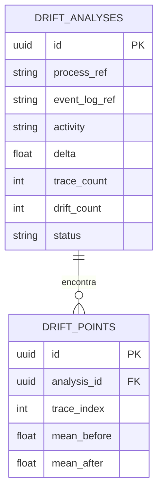
```mermaid
erDiagram
    DRIFT_ANALYSES ||--o{ DRIFT_POINTS : encontra
    DRIFT_ANALYSES {
        uuid id PK
        string process_ref
        string event_log_ref
        string activity
        float delta
        int trace_count
        int drift_count
        string status
    }
    DRIFT_POINTS {
        uuid id PK
        uuid analysis_id FK
        int trace_index
        float mean_before
        float mean_after
    }
```

**MS1 (MongoDB Atlas)** — coleções `event_logs`, `traces` (eventos embutidos), `operations` e `process_graphs` (nós e arestas do DFG com frequências).

### 8.2 Segurança

O login é feito no Supabase Auth com Google. O JWT é validado no API Gateway e de novo no Core (JWKS); o BFF repassa o token. Os serviços só aceitam chamadas vindas do BFF ou do Service Bus.

**Autenticação separada dos dados (RNF-10).** O Supabase Auth emite o JWT com o identificador e o papel do usuário. O front só conhece a chave pública do Auth; as tabelas do Core são acessadas apenas pela Core API, no servidor, com credencial própria.

**Isolamento por gestor e por serviço (RNF-08).** Toda consulta da Core API filtra pelo gestor identificado no JWT, e um teste de arquitetura garante o filtro (§8.5). Cada serviço acessa o banco com um usuário próprio e restrito aos seus dados: o Core com uma role própria no PostgreSQL, sem usar o usuário `postgres`, o MS1 com um usuário do Atlas só na sua database e o MS2 com um usuário só no seu schema do Azure SQL. Nenhum serviço lê os dados de outro. Atlas e Azure SQL aceitam conexões só dos IPs de saída dos serviços, nunca do navegador.

**Azure sem segredo.** O deploy acessa a Azure por uma managed identity com papel Contributor só no resource group `rg-deviante`, com login OIDC do GitHub Actions, sem senha guardada.

### 8.3 Padrões de reuso

Um padrão de cada família, todos sobre o que a v1 faz de fato (upload, grafo, análise de drift, investigação). Manutenção preditiva (RUL, probabilidade de falha) fica fora da v1.

| Padrão | Família | Exemplos | Onde |
|---|---|---|---|
| Singleton | Criacional | `AnalysisEngine` (instância única do wrapper do detector, reaproveitada entre chamadas), `AppConfig` (registro único de configuração e parâmetros padrão da análise) | Function, Core |
| Adapter | Estrutural | `IpddAdwinAdapter` → `DriftDetector` (código IPDD/ADWIN da pesquisa), `Pm4pyGraphAdapter` → `GraphMiner` (pm4py) | Function, MS1 |
| Observer | Comportamental | `DriftSubject` notifica `InvestigationPanel`, `MonitoringContext` e `AnalysisHud` quando o ADWIN detecta um drift ou a análise conclui | Microfrontend |

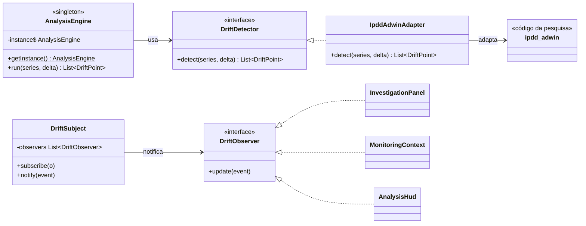
```mermaid
classDiagram
    direction LR
    class DriftDetector {
      <<interface>>
      +detect(series, delta) List~DriftPoint~
    }
    class IpddAdwinAdapter {
      +detect(series, delta) List~DriftPoint~
    }
    class ipdd_adwin {
      <<código da pesquisa>>
    }
    class AnalysisEngine {
      <<singleton>>
      -instance$ AnalysisEngine
      +getInstance()$ AnalysisEngine
      +run(series, delta) List~DriftPoint~
    }
    class DriftSubject {
      -observers List~DriftObserver~
      +subscribe(o)
      +notify(event)
    }
    class DriftObserver {
      <<interface>>
      +update(event)
    }
    class InvestigationPanel
    class MonitoringContext
    class AnalysisHud
    AnalysisEngine --> DriftDetector : usa
    DriftDetector <|.. IpddAdwinAdapter
    IpddAdwinAdapter --> ipdd_adwin : adapta
    DriftSubject --> DriftObserver : notifica
    DriftObserver <|.. InvestigationPanel
    DriftObserver <|.. MonitoringContext
    DriftObserver <|.. AnalysisHud
```

O Adapter é o padrão que preserva a pesquisa: o código da pesquisa é envolvido, não copiado nem alterado ("wrap, não fork"). O Singleton evita recarregar o detector a cada chamada, e o Observer desacopla a detecção das telas que reagem a ela.

### 8.4 Tratamento de erros e resiliência

Erros saem como JSON com um campo `error` e status HTTP adequado. O BFF usa timeout por serviço e devolve agregado parcial. Eventos são idempotentes (chave = id do event log ou da análise).

### 8.5 Testes de arquitetura

| Serviço | Ferramenta | Regras |
|---|---|---|
| Core (Kotlin) | Konsist | `domain` não importa `infrastructure`, `api` nem Ktor; classes de uma slice não importam outra slice; toda consulta dos repositórios filtra por `manager_id` |
| BFF (Node) | dependency-cruiser | módulos de feature não se importam entre si; nenhum driver de banco no BFF |
| MS1, MS2 (Python) | import-linter | contrato de camadas `api → application → domain`, `infrastructure → domain` |

### 8.6 Configuração e segredos

Cada serviço lê a configuração de variáveis de ambiente, e a mesma imagem roda em qualquer ambiente. Credenciais (strings de conexão, chaves do Supabase, tokens de deploy) ficam nos secrets do GitHub Actions e são injetadas no deploy; nenhuma credencial vai para os repositórios, que são públicos.

---

## 9. Decisões de Arquitetura

Esta seção registra as decisões de arquitetura importantes, caras de reverter ou arriscadas, que não estão fixadas pelas restrições da seção 2. As ideias gerais aparecem na seção 4; aqui fica o porquê de cada escolha e o que ela custa.

| ADR | Decisão | Motivo | Alternativa descartada | Consequência |
|---|---|---|---|---|
| 01 | IPDD/ADWIN roda como Azure Function e o MS2 só gerencia as análises | Reaproveitar o código da pesquisa sem estado; o enunciado conta MS2 (CRUD + Azure SQL) e Function separadamente | Rodar o detector dentro do MS2 | Uma chamada HTTP a mais por análise |
| 02 | MS1 = ingestão + grafo com pm4py, em MongoDB | Log e traces têm forma de documento | Guardar o log em tabelas no Postgres, como hoje | Consultas relacionais sobre traces ficam no MS2/Core |
| 03 | Core API em Kotlin continua como serviço de domínio no Supabase Postgres | Reaproveita o `deviante-api` e o Auth já em produção; o domínio (processos, atividades, equipamentos, monitoramento e manutenção) é relacional e usa chaves estrangeiras | Reescrever o domínio em Node ou Python; mover o Core para o MongoDB Atlas do MS1 | Três bancos para operar, um por serviço (ADR 08) |
| 04 | BFF, Core, MS1 e MS2 hospedados no Fly.io | Deploy já funcionando, free tier | Contêineres na Azure ou na AWS | Tráfego entre nuvens (Fly, Azure, AWS) |
| 05 | Eventos via Azure Service Bus | Desacoplar ingestão, análise e domínio (EDA) | Chamadas REST encadeadas entre os serviços | Consistência eventual |
| 06 | Prognóstico de manutenção (RUL) fica fora do escopo desta versão | Foco no drift para esta entrega | Calcular o RUL na Azure Function junto com o drift | Nenhum serviço calcula nem guarda RUL; se voltar ao escopo, entra como nova decisão |
| 08 | Persistência poliglota: cada serviço usa o banco que combina com o seu dado (Postgres no Core, MongoDB no MS1, Azure SQL no MS2) | O domínio do Core é relacional, logs e traces do MS1 são documentos e o Azure SQL do MS2 é exigência da disciplina; atende à integração com múltiplos bancos da Entrega 3 | Consolidar Core e MS1 no MongoDB Atlas | Três provedores de dados, cada um com sua credencial; entre bancos só trafegam ids |

---

## 10. Requisitos de Qualidade

Esta seção detalha as metas de qualidade da seção 1.2 em cenários que podem ser testados. A árvore resume quais características da ISO/IEC 25010 importam e em quais cenários cada uma é verificada.

### 10.1 Árvore de qualidade

| Característica (ISO/IEC 25010) | Subcaracterística | Meta da §1.2 | Cenários |
|---|---|---|---|
| Adequação funcional | Correção | Sim | Q1 |
| Eficiência de desempenho | Comportamento no tempo | Não | Q2 |
| Confiabilidade | Tolerância a falhas | Sim | Q3 |
| Manutenibilidade | Modificabilidade | Sim | Q4 |
| Segurança | Confidencialidade, autenticidade | Sim | Q5 |
| Flexibilidade | Instalabilidade | Sim | Q6 |

### 10.2 Cenários de qualidade

| ID | Atributo | Cenário | Medida |
|---|---|---|---|
| Q1 | Correção | Rodar a análise em `DR_01.xes` … `DR_30.xes` | Drift a até 5 traces do ground truth em ≥ 90% dos logs |
| Q2 | Desempenho | `GET /aggregated-data` com os quatro serviços no ar | Resposta em até 2 s |
| Q3 | Tolerância a falhas | MS2 fora do ar | CRUD de processos segue funcionando; agregado vem sem análises |
| Q4 | Modificabilidade | Novo formato de log | Uma classe nova no MS1, zero mudança nos demais |
| Q5 | Segurança | Chamada sem JWT | 401 no API Gateway |
| Q6 | Instalabilidade | Subir um serviço num ambiente novo | A mesma imagem do Docker Hub sobe só com variáveis de ambiente, sem rebuild |

---

## 11. Riscos e Dívida Técnica

Esta seção lista, por prioridade, os riscos técnicos e as dívidas conhecidas, cada um com a forma de mitigação prevista.

| Prioridade | Tipo | Risco / dívida | Mitigação |
|---|---|---|---|
| 1 | Dívida | Hoje MS1 e MS2 são um só serviço (`mining/`) sobre Postgres | Separar em dois deploys e migrar dados para Mongo e Azure SQL |
| 2 | Risco | Limites do free tier: Azure SQL com 1 DTU no MS2, Atlas M0 com 512 MB e sem backup automático no MS1, cold start da Function | Séries pequenas e consultas leves no MS2, cache no BFF, aquecer a Function antes da demo; acompanhar o uso do M0 e exportar com `mongodump` antes das entregas |
| 3 | Risco | Latência entre três nuvens | Chamadas em paralelo no BFF |
| 4 | Dívida | Código atual organizado por tipo, não por feature | Reorganizar em slices junto com os testes de arquitetura |
| 5 | Dívida | Testes de arquitetura ainda não existem | Konsist, dependency-cruiser e import-linter (§8.5) |
| 6 | Risco | O isolamento entre gestores é feito na aplicação, não no banco | Todo repositório do Core filtra por `manager_id` do JWT, com teste de arquitetura no Konsist (§8.5) |
| 7 | Risco | A assinatura Azure for Students só libera algumas regiões (East US 2 bloqueada) | Recursos Azure em eastus, na mesma área do Fly.io (iad) e do Atlas (us-east-1) |

---

## 12. Glossário

Termos de domínio e técnicos usados neste documento, para que o grupo, os professores e os parceiros usem as mesmas palavras.

| Termo | Definição |
|---|---|
| Event log | Registro de eventos de um processo: caso (trace), atividade e tempos de início e fim. |
| Trace | Sequência de eventos de um mesmo caso. |
| Sojourn time | Tempo que um caso passa numa atividade (fim − início). |
| Drift | Mudança estatisticamente relevante no comportamento de uma série, aqui o sojourn time. |
| IPDD | Interactive Process Drift Detection, framework de detecção de desvios do grupo de pesquisa IPDD da PUCPR. |
| ADWIN | Adaptive Windowing: algoritmo que detecta mudança na média de uma série. |
| DFG | Directly-Follows Graph: grafo de quais atividades seguem quais. |
| RUL | Remaining Useful Life: vida útil restante estimada de um equipamento. |
| BFF | Backend for Frontend: API feita sob medida para a interface. |
| API Gateway | Porta de entrada única das requisições externas; roteia, valida o JWT e limita a taxa. |
| Service Bus | Barramento de mensagens da Azure que transporta os eventos entre os serviços. |
| JWT | JSON Web Token: token assinado que identifica o usuário em cada chamada. |
| MES/ERP | Sistemas de execução e de gestão da fábrica; são a origem do event log. |
| Delta (sensibilidade) | Parâmetro de confiança do ADWIN; quanto menor, mais evidência é exigida para apontar um drift. |
| Process (Processo) | Objeto ORCA: processo de manufatura monitorado. Ver §8.1. |
| Activity (Atividade) | Objeto ORCA: etapa normalizada do processo; os rótulos do event log são mapeados para ela. |
| Analysis (Análise) | Objeto ORCA: execução do IPDD/ADWIN com parâmetros e pontos de drift. |
| Monitoring (Monitoramento) | Objeto ORCA: agrupamento de máquinas acompanhadas por parâmetros e leituras. |
| Machine (Máquina) | Objeto ORCA: equipamento do chão de fábrica; no código, `Equipment`. |
| Maintenance (Manutenção) | Objeto ORCA: ação proativa (manutenção ou inspeção) recomendada e agendada antes da falha. |
| OOUX / ORCA | Object-Oriented UX; ORCA = Objects, Relationships, CTAs, Attributes. |
