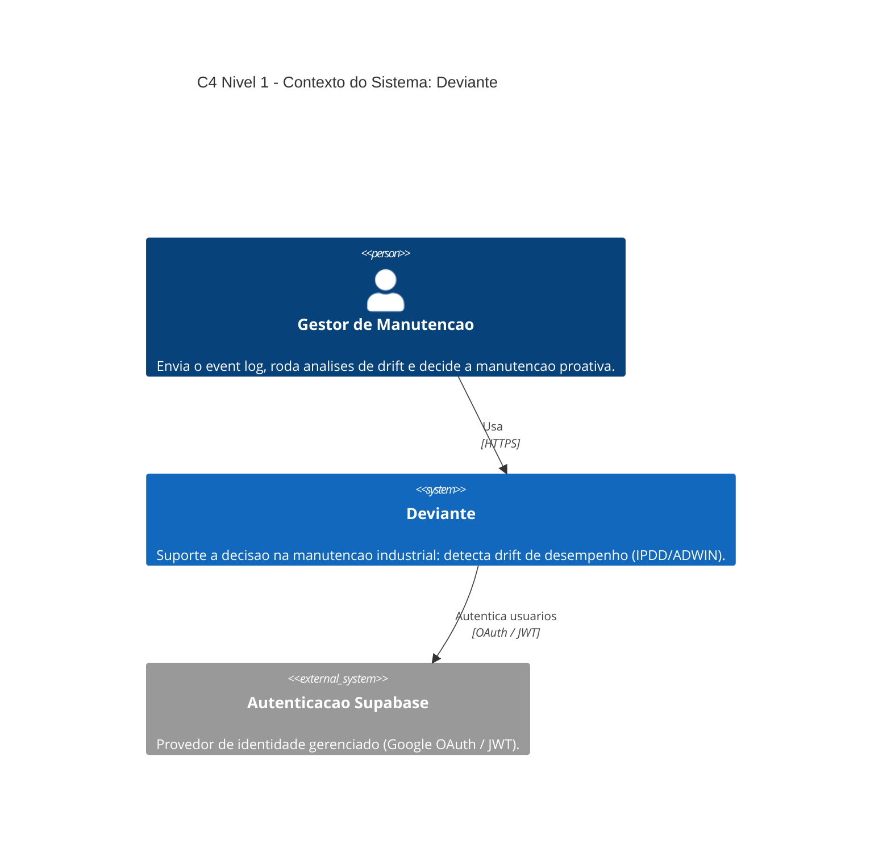
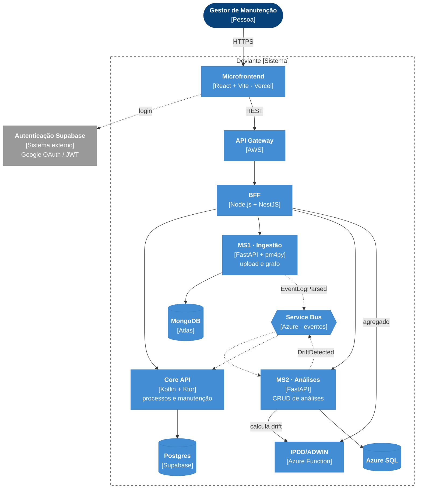
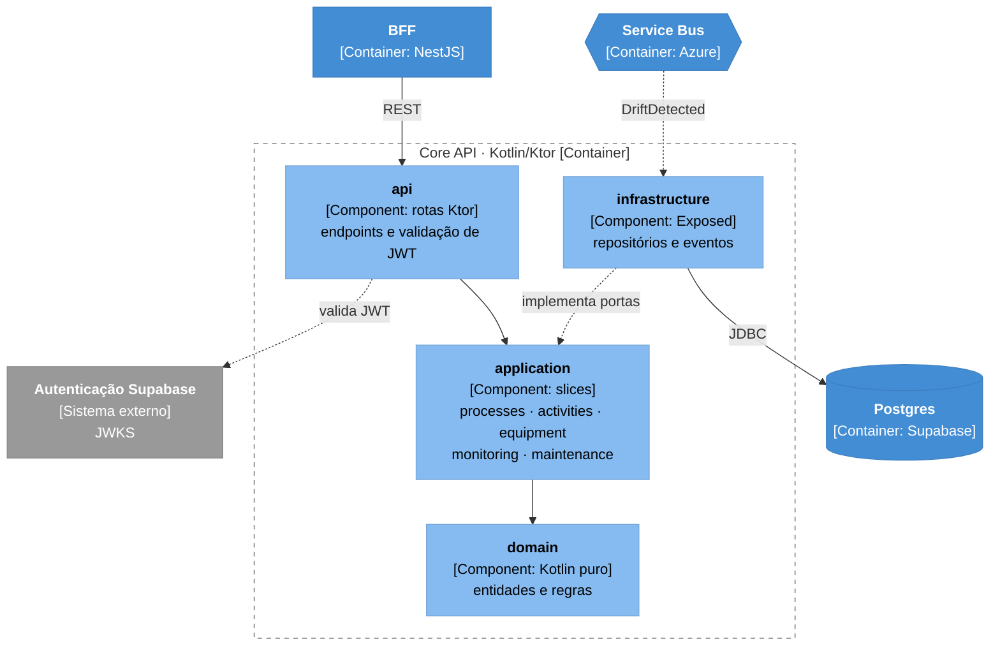
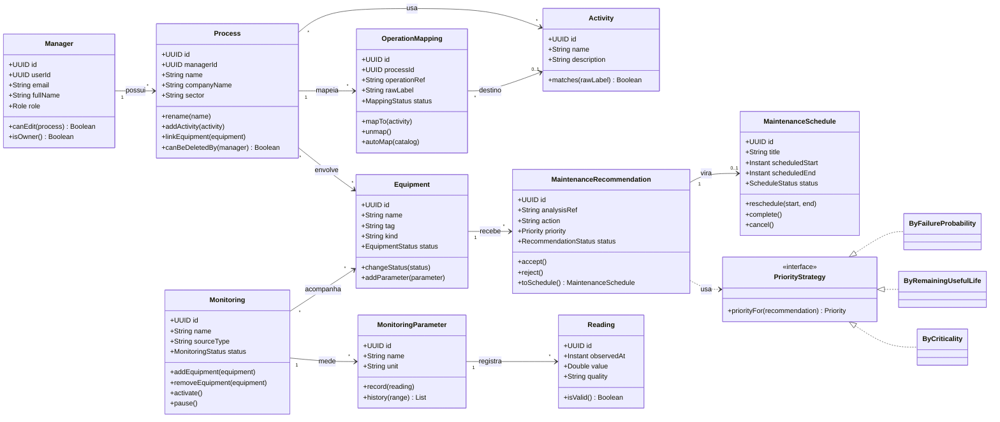
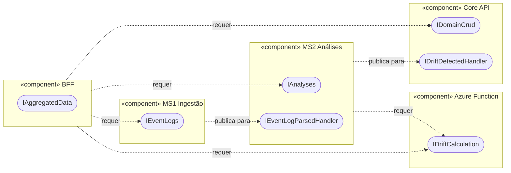
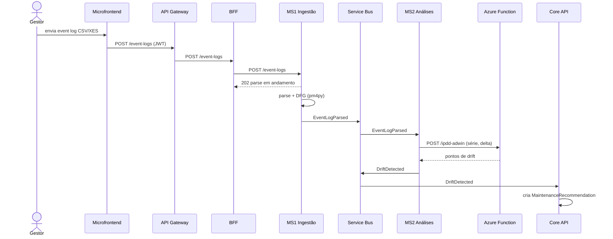
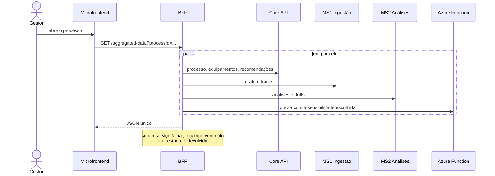
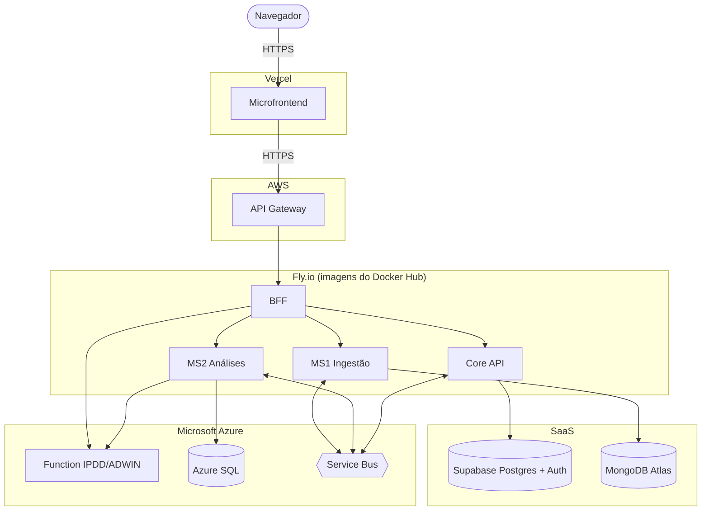
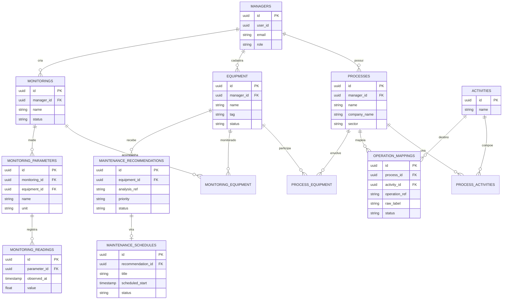
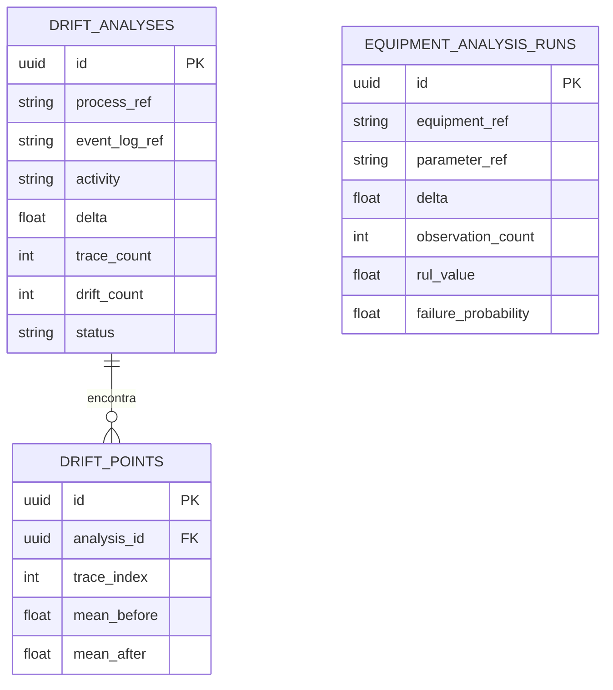

# Arquitetura do Deviante — arc42

_Deviante é suporte à decisão em manutenção industrial. O núcleo analítico é o
framework **IPDD** (Interactive Process Drift Detection), de **Denise M. V. Sato**
(Sato et al., 2025), com a implementação IPDD/ADWIN de **Luiz F. Picolo**._

**Grupo:** Alander, Bernardo, Emanuelle, Murilo.

> Documento escrito como código: este `.md` é a fonte única. O site
> [deviante.alander.io/documentacao](https://deviante.alander.io/documentacao)
> renderiza este arquivo direto da branch `main`, e o PDF entregue é gerado a
> partir dele. Diagramas C4 e UML são Mermaid embutido, cada um na seção arc42
> que explica; as versões avulsas ficam em `architecture/c4/`.

---

## 1. Introdução e Metas

O Deviante detecta, a partir do event log do chão de fábrica, quando o tempo de
execução de uma atividade muda de comportamento (drift de desempenho) e
transforma esse sinal em recomendação de manutenção proativa, antes da falha.

### 1.1 Visão Geral de Requisitos

Fonte: base **Requirements** do Notion (IPDD: SEVEN DIMENSIONS). Aqui ficam só os
requisitos de **negócio** e de **arquitetura** (disciplina de Cloud), um por
linha, com o mesmo ID do Notion. Os requisitos exclusivos de Reuso ficam na
documentação de Reuso.

**Requisitos funcionais de negócio**

| ID | Requisito | Atendido por |
|----|-----------|--------------|
| RF-01 | Login via conta Google (OAuth) | Microfrontend + Supabase Auth |
| RF-02 | Criar processos, análises e monitoramentos a partir do dashboard | Core API (processos, monitoramentos), MS2 (análises) |
| RF-03 | Editar e excluir processos, análises e monitoramentos | Core API, MS2 |
| RF-04 | Upload de log de eventos em CSV ou XES | MS1 · Ingestão |
| RF-05 | Gerar e exibir o DFG (Directly-Follows Graph) do log | MS1 (pm4py) |
| RF-06 | Mapear atividades do log em uma ou mais operações do processo | Core API |
| RF-07 | Editar e remover o mapeamento de operações | Core API |
| RF-08 | Configurar o filtro de traces antes da 1ª execução da análise | MS2 |
| RF-09 | Executar a análise de desvio (drift) sobre um processo ou máquina | MS2 + Azure Function |
| RF-10 | Ajustar a sensibilidade do IPDD/ADWIN e reexecutar sem novo upload | MS2 + Azure Function |
| RF-11 | Criar ação proativa (manutenção ou inspeção) a partir de uma recomendação | Core API |
| RF-12 | Editar e excluir ações proativas | Core API |
| RF-13 | Exibir diagnóstico e prognóstico de saúde de uma máquina monitorada | Core API (classe de prognóstico em Kotlin, etapa futura) |
| RF-14 | Exibir os equipamentos no detalhe do processo | Core API |
| RF-15 | Agrupar um ou mais equipamentos sob um monitoramento | Core API |

**Requisitos funcionais de negócio da Entrega 1 (v1, fluxo principal)**

| ID | Requisito | Atendido por |
|----|-----------|--------------|
| RF1 | Autenticar o gestor (convite, Google/JWT) e compartilhar processos entre usuários | Supabase Auth + Core API |
| RF2 | Manter processos de manufatura (criar, listar, editar; excluir só pelo dono) | Core API |
| RF3 | Manter um catálogo global de atividades normalizadas | Core API |
| RF4 | Importar event log (CSV/XES), fazer o parse e persistir operações, traces e tempos | MS1 · Ingestão |
| RF5 | Mapear cada rótulo bruto (operation) para uma atividade normalizada | Core API |
| RF6 | Gerar o grafo do processo observado a partir do log mapeado | MS1 (pm4py) |
| RF7 | Executar a análise de drift (IPDD/ADWIN) e persistir o resultado | MS2 + Azure Function |
| RF8 | Investigar o desvio e registrar a decisão de manutenção proativa | Core API |
| RF9 | Monitorar a saúde de equipamentos por parâmetros de máquina | Core API |

**Requisitos funcionais de arquitetura (Cloud)**

| ID | Requisito | Atendido por |
|----|-----------|--------------|
| RF01 | CRUD completo no Microserviço 1 | MS1 · Ingestão (event logs) |
| RF02 | CRUD completo no Microserviço 2 | MS2 · Análises (análises de drift) |
| RF03 | Proxy das requisições de CRUD no BFF | BFF |
| RF04 | `GET /aggregated-data` consome MS1, MS2 e a Function num único response | BFF |
| RF05 | Function faz cálculo ou enriquecimento de dados | Azure Function (IPDD/ADWIN) |

**Requisitos não funcionais de negócio**

| ID | Requisito | Atendido por |
|----|-----------|--------------|
| RNF-01 | Back-end em Kotlin | Core API (Ktor) |
| RNF-02 | Supabase com PostgreSQL em nuvem | Banco do Core |
| RNF-03 | Interface em React + Vite | Microfrontend |
| RNF-04 | Figma como fonte única de tokens e componentes de UI | Microfrontend |
| RNF-05 | Microsserviços Python em FastAPI, consumidos via REST | MS1, MS2 |
| RNF-06 | Microsserviços Python como Azure Functions (serverless) | Parcial: o IPDD/ADWIN é Function; MS1 e MS2 rodam no Fly.io (ADR 04) |
| RNF-07 | Ingestão multiformato (CSV, XES, JSON) só por configuração | MS1 (parser por formato) |
| RNF-08 | Isolamento de dados entre clientes com RLS | Banco do Core (RLS no Supabase) |
| RNF-09 | Git e CI/CD com build, testes e deploy a cada alteração | GitHub Actions em cada repositório |
| RNF-10 | Autenticação Supabase Auth com Google; JWT com tenant e papel | Supabase Auth, API Gateway, Core API |

**Requisitos não funcionais de arquitetura (Cloud)**

| ID | Requisito | Atendido por |
|----|-----------|--------------|
| RNF01 | SPA estruturada como microfrontend que consome só o BFF | Microfrontend |
| RNF02 | BFF em Node.js (Express ou NestJS) | BFF (NestJS) |
| RNF03 | Microservices com Database per Service | Core, MS1 e MS2, cada um com seu banco |
| RNF04 | Microserviço 1 com MongoDB Atlas (Free Tier) | MS1 |
| RNF05 | Microserviço 2 com Azure SQL (Free, 1 DTU) | MS2 |
| RNF06 | Azure Function exposta via HTTP | Azure Function (HTTP Trigger) |
| RNF07 | API Gateway na AWS | API Gateway |
| RNF08 | Arquitetura Orientada a Eventos | Azure Service Bus (`EventLogParsed`, `DriftDetected`) |
| RNF09 | Clean Architecture (Domain, Application, Infrastructure, API) | Todos os serviços (§5.2) |
| RNF10 | Vertical Slice (uma pasta por feature) | Todos os serviços (§5.2) |
| RNF11 | Testes unitários e de arquitetura | §8.5 |
| RNF12 | Swagger no BFF, microserviços e eventos | OpenAPI do NestJS e do FastAPI |
| RNF13 | Imagens do BFF e dos microserviços no Docker Hub | §7 |
| RNF14 | Aplicação em URLs da nuvem, não localhost | §7 |

### 1.2 Metas de Qualidade

| Prioridade | Meta | Cenário |
|-----------|------|---------|
| 1 | Correção analítica | Para os logs sintéticos `DR_*` o drift detectado cai a até 5 traces do ponto injetado (ground truth de `adwin_dataset.py`). |
| 2 | Modificabilidade | Um novo formato de log (ex.: JSON) entra com uma nova subclasse de parser, sem alterar MS2, BFF ou Core. |
| 3 | Isolamento | Uma falha no MS2 ou na Function não derruba o CRUD de processos e equipamentos; o BFF devolve o agregado parcial. |
| 4 | Segurança | Nenhum serviço é acessível sem JWT válido emitido pelo Supabase Auth; dados de um gestor não aparecem para outro. |
| 5 | Implantabilidade | Cada serviço é uma imagem Docker publicada no Docker Hub e implantada de forma independente. |

### 1.3 Stakeholders

| Papel | Expectativa |
|-------|-------------|
| Gestor de manutenção | Ver o processo, saber quando ele desviou e agendar a manutenção a tempo. |
| Analista / mentor | Validar as análises e ajustar a sensibilidade do IPDD/ADWIN. |
| Pesquisadores (D. Sato, L. F. Picolo) | Ver o método aplicado com fidelidade ao trabalho original. |
| Professores de Cloud e Reuso | Avaliar estilos arquiteturais, implantação em nuvem e reuso. |
| Grupo de desenvolvimento | Uma arquitetura que caiba no prazo e no free tier. |

## 2. Restrições da Arquitetura

| Restrição | Origem |
|-----------|--------|
| Microfrontend em React (ou Angular) que consome só o BFF | Disciplina de Cloud |
| BFF em Node.js (Express ou NestJS) | Disciplina de Cloud |
| Microserviço 1 com MongoDB Atlas (Free Tier) e Microserviço 2 com Azure SQL (Free, 1 DTU) | Disciplina de Cloud |
| Azure Function com HTTP Trigger ou Message Trigger | Disciplina de Cloud |
| API Gateway na AWS | Disciplina de Cloud |
| Imagens do BFF e de cada microserviço no Docker Hub; tudo em repositórios públicos | Disciplina de Cloud |
| Back-end de domínio em Kotlin; microsserviços analíticos em Python | Decisão do grupo (RNF-01, RNF-05) |
| Supabase (Auth com Google e Postgres) | Decisão do grupo (RNF-02, RNF-10) |
| Código IPDD/ADWIN reaproveitado de L. F. Picolo sem reescrita | Fidelidade científica |
| Custo zero: só free tiers | Projeto acadêmico |

## 3. Contexto e Escopo

O Deviante recebe event logs exportados pelo sistema de origem da fábrica, e o
gestor interage com ele pelo navegador. Autenticação, bancos e computação
serverless são serviços gerenciados de terceiros.

### 3.1 Contexto de negócio

**C4 — Nível 1 · System Context**

```mermaid
C4Context
    title C4 Nivel 1 - Contexto do Sistema: Deviante

    Person(gestor, "Gestor de Manutencao", "Envia o event log, roda analises de drift e decide a manutencao proativa.")
    System(deviante, "Deviante", "Suporte a decisao na manutencao industrial: detecta drift de desempenho (IPDD/ADWIN).")
    System_Ext(auth, "Autenticacao Supabase", "Provedor de identidade gerenciado (Google OAuth / JWT).")

    Rel(gestor, deviante, "Usa", "HTTPS")
    Rel(deviante, auth, "Autentica usuarios", "OAuth / JWT")

    UpdateLayoutConfig($c4ShapeInRow="1", $c4BoundaryInRow="1")
```

| Parceiro | Entrada | Saída |
|----------|---------|-------|
| Gestor de manutenção | Event log, mapeamentos, parâmetros de análise | Grafo, drifts, recomendações |
| Sistema de origem (MES/ERP) | — | Event log XES/CSV (exportado pelo gestor) |
| Google | — | Identidade (OAuth 2.0) |

### 3.2 Contexto técnico

| Canal | Protocolo |
|-------|-----------|
| Navegador → API Gateway → BFF | HTTPS / JSON, JWT no header `Authorization` |
| BFF → Core, MS1, MS2 | REST / JSON |
| BFF e MS2 → Azure Function | HTTPS (HTTP Trigger) |
| MS1 → MS2 → Core | Eventos no Azure Service Bus (AMQP) |

## 4. Estratégia da Solução

| Meta / restrição | Decisão |
|------------------|---------|
| Separar responsabilidades e bancos | **BFF + Microservices + Database per Service**: Core (Postgres), MS1 (Mongo), MS2 (Azure SQL); nenhum banco compartilhado |
| Uma porta de entrada segura | **API Gateway** (AWS) na frente do BFF |
| Interface independente | **Microfrontend** React que fala só com o BFF |
| Cálculo sob demanda e barato | **Serverless**: IPDD/ADWIN como Azure Function sem estado |
| Desacoplar ingestão, análise e domínio | **EDA**: `EventLogParsed` e `DriftDetected` no Service Bus |
| Modificabilidade | **Clean Architecture** (`domain`, `application`, `infrastructure`, `api`) e **Vertical Slice** (uma pasta por feature em `application`) |
| Reuso | Padrões Singleton, Template Method e Strategy (ver §8.3) |

### 4.1 Software Architecture Canvas

| Bloco | Conteúdo |
|-------|----------|
| Propósito | Antecipar a manutenção detectando drift de desempenho no event log. |
| Usuários | Gestor de manutenção, analista/mentor. |
| Requisitos-chave | Upload CSV/XES, grafo do processo, análise IPDD/ADWIN, recomendação e agenda de manutenção. |
| Atributos de qualidade | Correção analítica, modificabilidade, isolamento, segurança, implantabilidade. |
| Restrições | Stack da disciplina (Node BFF, Mongo, Azure SQL, Azure Function, AWS Gateway), free tier, prazo. |
| Estilos | Microfrontend, BFF, Microservices, Database per Service, API Gateway, Serverless, EDA, Clean Architecture, Vertical Slice. |
| Componentes | Microfrontend, API Gateway, BFF, Core API, MS1 Ingestão, MS2 Análises, Azure Function, Service Bus. |
| Tecnologias | React + Vite, NestJS, Kotlin + Ktor, Python + FastAPI + pm4py, Supabase, MongoDB Atlas, Azure SQL, Azure Functions, AWS API Gateway, Docker, Fly.io, Vercel. |
| Riscos | Limites do free tier, latência entre nuvens, consistência eventual (§11). |

## 5. Visão de Blocos de Construção

### 5.1 Nível 1 — Containers

**C4 — Nível 2 · Container**

```mermaid
flowchart TB
    gestor(["<b>Gestor de Manutenção</b><br/>[Pessoa]"])
    auth["<b>Autenticação Supabase</b><br/>[Sistema externo]<br/>Google OAuth / JWT"]

    subgraph dv["Deviante [Sistema]"]
        web["<b>Microfrontend</b><br/>[React + Vite · Vercel]"]
        gw["<b>API Gateway</b><br/>[AWS]"]
        bff["<b>BFF</b><br/>[Node.js + NestJS]"]
        core["<b>Core API</b><br/>[Kotlin + Ktor]<br/>processos e manutenção"]
        ms1["<b>MS1 · Ingestão</b><br/>[FastAPI + pm4py]<br/>upload e grafo"]
        ms2["<b>MS2 · Análises</b><br/>[FastAPI]<br/>CRUD de análises"]
        fn["<b>IPDD/ADWIN</b><br/>[Azure Function]"]
        bus{{"<b>Service Bus</b><br/>[Azure · eventos]"}}
        dbCore[("<b>Postgres</b><br/>[Supabase]")]
        dbMs1[("<b>MongoDB</b><br/>[Atlas]")]
        dbMs2[("<b>Azure SQL</b>")]
    end

    gestor -->|HTTPS| web
    web -.->|login| auth
    web -->|REST| gw --> bff
    bff --> core & ms1 & ms2
    bff -->|agregado| fn
    ms2 -->|calcula drift| fn
    core --> dbCore
    ms1 --> dbMs1
    ms2 --> dbMs2
    ms1 -.->|EventLogParsed| bus
    bus -.-> ms2
    ms2 -.->|DriftDetected| bus
    bus -.-> core

    classDef person fill:#08427B,stroke:#073B6F,color:#fff
    classDef container fill:#438DD5,stroke:#3C7FC0,color:#fff
    classDef external fill:#999999,stroke:#8A8A8A,color:#fff
    class gestor person
    class web,gw,bff,core,ms1,ms2,fn,bus,dbCore,dbMs1,dbMs2 container
    class auth external
    style dv fill:none,stroke:#666,stroke-dasharray:5 5
```

| Container | Responsabilidade | Tecnologia | Banco |
|-----------|------------------|------------|-------|
| Microfrontend | SPA do produto e do site público | React + Vite, Vercel | — |
| API Gateway | Entrada única, roteamento, JWT, rate limit | AWS API Gateway (HTTP API) | — |
| BFF | Proxy dos CRUDs; `GET /aggregated-data` junta Core, MS1, MS2 e Function num único JSON | Node.js + NestJS, Fly.io | — |
| Core API | Processos, atividades, mapeamentos, equipamentos, monitoramento, recomendações e agendas | Kotlin + Ktor, Fly.io | Supabase Postgres |
| MS1 · Ingestão | Upload CSV/XES, parse, operações, traces e grafo (DFG) com pm4py; CRUD de event logs | Python + FastAPI + pm4py, Fly.io | MongoDB Atlas |
| MS2 · Análises | CRUD das análises de drift; monta a série de tempos e chama a Function | Python + FastAPI, Fly.io | Azure SQL |
| Azure Function | IPDD/ADWIN: recebe a série, devolve os pontos de drift; sem estado | Python, HTTP Trigger | — |
| Service Bus | Transporte de eventos entre serviços | Azure Service Bus | — |

### 5.2 Nível 2 — Componentes do Core API

Cada serviço segue a mesma organização; o Core é o exemplo detalhado. Os
componentes de domínio espelham os objetos do OOUX (ver [[UX/OBJECTS]]).

**C4 — Nível 3 · Component**

```mermaid
flowchart TB
    bff["<b>BFF</b><br/>[Container: NestJS]"]
    auth["<b>Autenticação Supabase</b><br/>[Sistema externo]<br/>JWKS"]
    bus{{"<b>Service Bus</b><br/>[Container: Azure]"}}
    db[("<b>Postgres</b><br/>[Container: Supabase]")]

    subgraph core["Core API · Kotlin/Ktor [Container]"]
        api["<b>api</b><br/>[Component: rotas Ktor]<br/>endpoints e validação de JWT"]
        app["<b>application</b><br/>[Component: slices]<br/>processes · activities · equipment<br/>monitoring · maintenance"]
        domain["<b>domain</b><br/>[Component: Kotlin puro]<br/>entidades e regras"]
        infra["<b>infrastructure</b><br/>[Component: Exposed]<br/>repositórios e eventos"]
    end

    bff -->|REST| api
    api -.->|valida JWT| auth
    api --> app --> domain
    infra -.->|implementa portas| app
    infra -->|JDBC| db
    bus -.->|DriftDetected| infra

    classDef container fill:#438DD5,stroke:#3C7FC0,color:#fff
    classDef component fill:#85BBF0,stroke:#78A8D8,color:#000
    classDef external fill:#999999,stroke:#8A8A8A,color:#fff
    class bff,bus,db container
    class api,app,domain,infra component
    class auth external
    style core fill:none,stroke:#666,stroke-dasharray:5 5
```

| Slice (`application/`) | Features |
|------------------------|----------|
| `processes` | CreateProcess, UpdateProcess, DeleteProcess, ListProcesses |
| `activities` | ManageActivityCatalog, MapOperation, UnmapOperation |
| `equipment` | CreateEquipment, UpdateEquipment, DeleteEquipment, ManageParameters |
| `monitoring` | CreateMonitoring, LinkEquipment, RecordReading |
| `maintenance` | RecommendMaintenance, ScheduleMaintenance, CompleteMaintenance |

### 5.3 Nível 3 — Classes de domínio

**C4 — Nível 4 · UML de Classes** (Core API)

```mermaid
classDiagram
    direction LR

    class Manager {
      +UUID id
      +UUID userId
      +String email
      +String fullName
      +Role role
      +canEdit(process) Boolean
      +isOwner() Boolean
    }
    class Process {
      +UUID id
      +UUID managerId
      +String name
      +String companyName
      +String sector
      +rename(name)
      +addActivity(activity)
      +linkEquipment(equipment)
      +canBeDeletedBy(manager) Boolean
    }
    class Activity {
      +UUID id
      +String name
      +String description
      +matches(rawLabel) Boolean
    }
    class OperationMapping {
      +UUID id
      +UUID processId
      +String operationRef
      +String rawLabel
      +MappingStatus status
      +mapTo(activity)
      +unmap()
      +autoMap(catalog)
    }
    class Equipment {
      +UUID id
      +String name
      +String tag
      +String kind
      +EquipmentStatus status
      +changeStatus(status)
      +addParameter(parameter)
    }
    class Monitoring {
      +UUID id
      +String name
      +String sourceType
      +MonitoringStatus status
      +addEquipment(equipment)
      +removeEquipment(equipment)
      +activate()
      +pause()
    }
    class MonitoringParameter {
      +UUID id
      +String name
      +String unit
      +record(reading)
      +history(range) List
    }
    class Reading {
      +UUID id
      +Instant observedAt
      +Double value
      +String quality
      +isValid() Boolean
    }
    class MaintenanceRecommendation {
      +UUID id
      +String analysisRef
      +String action
      +Priority priority
      +RecommendationStatus status
      +accept()
      +reject()
      +toSchedule() MaintenanceSchedule
    }
    class MaintenanceSchedule {
      +UUID id
      +String title
      +Instant scheduledStart
      +Instant scheduledEnd
      +ScheduleStatus status
      +reschedule(start, end)
      +complete()
      +cancel()
    }
    class PriorityStrategy {
      <<interface>>
      +priorityFor(recommendation) Priority
    }
    class ByFailureProbability
    class ByRemainingUsefulLife
    class ByCriticality

    Manager "1" --> "*" Process : possui
    Process "*" --> "*" Activity : usa
    Process "1" --> "*" OperationMapping : mapeia
    OperationMapping "*" --> "0..1" Activity : destino
    Process "*" --> "*" Equipment : envolve
    Monitoring "*" --> "*" Equipment : acompanha
    Monitoring "1" --> "*" MonitoringParameter : mede
    MonitoringParameter "1" --> "*" Reading : registra
    Equipment "1" --> "*" MaintenanceRecommendation : recebe
    MaintenanceRecommendation "1" --> "0..1" MaintenanceSchedule : vira
    MaintenanceRecommendation ..> PriorityStrategy : usa
    PriorityStrategy <|.. ByFailureProbability
    PriorityStrategy <|.. ByRemainingUsefulLife
    PriorityStrategy <|.. ByCriticality
```

Classes dos outros serviços: MS1 — `EventLog`, `Trace`, `Event`, `ProcessGraph`,
`EventLogParser` (+ `CsvParser`, `XesParser`, `JsonParser`); MS2 —
`DriftAnalysis`, `DriftPoint`; Function — `IpddAdwinDetector`.

### 5.4 UML de Componentes

**C4 — Nível 4 · UML de Componentes** (interfaces fornecidas e requeridas)

```mermaid
flowchart LR
    subgraph BFF["«component» BFF"]
        bffAgg(["IAggregatedData"])
    end
    subgraph CORE["«component» Core API"]
        coreRest(["IDomainCrud"])
        coreEvt(["IDriftDetectedHandler"])
    end
    subgraph MS1["«component» MS1 Ingestão"]
        ms1Rest(["IEventLogs"])
    end
    subgraph MS2["«component» MS2 Análises"]
        ms2Rest(["IAnalyses"])
        ms2Evt(["IEventLogParsedHandler"])
    end
    subgraph FN["«component» Azure Function"]
        fnHttp(["IDriftCalculation"])
    end
    BFF -.->|requer| coreRest
    BFF -.->|requer| ms1Rest
    BFF -.->|requer| ms2Rest
    BFF -.->|requer| fnHttp
    MS2 -.->|requer| fnHttp
    MS1 -.->|publica para| ms2Evt
    MS2 -.->|publica para| coreEvt
```

## 6. Visão de Runtime

### 6.1 Upload do event log e análise de drift

**C4 — Nível 4 · UML de Sequência**

```mermaid
sequenceDiagram
    actor G as Gestor
    participant W as Microfrontend
    participant GW as API Gateway
    participant B as BFF
    participant M1 as MS1 Ingestão
    participant Q as Service Bus
    participant M2 as MS2 Análises
    participant F as Azure Function
    participant C as Core API
    G->>W: envia event log CSV/XES
    W->>GW: POST /event-logs (JWT)
    GW->>B: POST /event-logs
    B->>M1: POST /event-logs
    M1-->>B: 202 parse em andamento
    M1->>M1: parse + DFG (pm4py)
    M1->>Q: EventLogParsed
    Q->>M2: EventLogParsed
    M2->>F: POST /ipdd-adwin (série, delta)
    F-->>M2: pontos de drift
    M2->>Q: DriftDetected
    Q->>C: DriftDetected
    C->>C: cria MaintenanceRecommendation
```

### 6.2 Abrir o processo (`GET /aggregated-data`)

```mermaid
sequenceDiagram
    actor G as Gestor
    participant W as Microfrontend
    participant B as BFF
    participant C as Core API
    participant M1 as MS1 Ingestão
    participant M2 as MS2 Análises
    participant F as Azure Function
    G->>W: abre o processo
    W->>B: GET /aggregated-data?processId=...
    par em paralelo
        B->>C: processo, equipamentos, recomendações
        B->>M1: grafo e traces
        B->>M2: análises e drifts
        B->>F: prévia com a sensibilidade escolhida
    end
    B-->>W: JSON único
    Note over B: se um serviço falhar, o campo vem nulo<br/>e o restante é devolvido
```

## 7. Visão de Implantação

```mermaid
flowchart TB
    browser([Navegador])
    subgraph vercel["Vercel"]
        fe["Microfrontend"]
    end
    subgraph aws["AWS"]
        gw["API Gateway"]
    end
    subgraph fly["Fly.io (imagens do Docker Hub)"]
        bff["BFF"]
        core["Core API"]
        ms1["MS1 Ingestão"]
        ms2["MS2 Análises"]
    end
    subgraph azure["Microsoft Azure"]
        fn["Function IPDD/ADWIN"]
        sql[("Azure SQL")]
        bus{{"Service Bus"}}
    end
    subgraph saas["SaaS"]
        supa[("Supabase Postgres + Auth")]
        mongo[("MongoDB Atlas")]
    end
    browser -->|HTTPS| fe
    fe -->|HTTPS| gw --> bff
    bff --> core & ms1 & ms2
    bff --> fn
    ms2 --> fn
    core --> supa
    ms1 --> mongo
    ms2 --> sql
    ms1 & ms2 & core <--> bus
```

| Nó | Implantação |
|----|-------------|
| Microfrontend | Vercel, deploy a cada push na `main` |
| BFF, Core, MS1, MS2 | Imagem no Docker Hub, deploy no Fly.io via GitHub Actions |
| Azure Function | Plano Consumption, deploy via GitHub Actions |
| Bancos | Supabase, MongoDB Atlas M0, Azure SQL Free |

## 8. Conceitos Transversais

### 8.1 Modelo de domínio e dados

**Objetos de negócio (OOUX / ORCA).** Os objetos levantados no ORCA
(`UX/OBJECTS.md` e `UX/CTAs.md`) são o vocabulário comum entre interface,
código e dados. Cada objeto vira uma classe de domínio (§5.3), uma tela no
Microfrontend e uma tabela ou coleção; cada CTA vira um caso de uso.

| Objeto ORCA | Classe / dado | Serviço dono | CTAs | Requisitos |
|-------------|---------------|--------------|------|------------|
| User | `Manager` (+ usuário do Supabase Auth) | Core API | Create Account | RF-01 |
| Process | `Process` | Core API | Run Process Analysis | RF-02, RF-03, RF-14 |
| Operation | `OperationMapping` → `Activity` | Core API (rótulos vêm do MS1) | Run Operation Analysis | RF-06, RF-07 |
| Asset | `Equipment` | Core API | Run Asset Analysis | RF-13, RF-14, RF-15 |
| Analysis | `Analysis` (+ cálculo na Function) | MS2 · Análises | Run Drift Analysis | RF-08, RF-09, RF-10 |
| Proactive Action | `MaintenanceRecommendation` → `MaintenanceSchedule` | Core API | Recommend Proactive Action, Schedule Proactive Action | RF-11, RF-12 |

O event log, os traces e o grafo (MS1) são dados de suporte do objeto
Process, não objetos ORCA próprios.

Cada serviço é dono dos seus dados; entre bancos só trafegam ids (`*_ref`).

**Diagrama de Entidades e Relacionamentos — Core (Supabase Postgres)**

```mermaid
erDiagram
    MANAGERS ||--o{ PROCESSES : possui
    MANAGERS ||--o{ EQUIPMENT : cadastra
    MANAGERS ||--o{ MONITORINGS : cria
    PROCESSES ||--o{ PROCESS_ACTIVITIES : usa
    ACTIVITIES ||--o{ PROCESS_ACTIVITIES : compoe
    PROCESSES ||--o{ OPERATION_MAPPINGS : mapeia
    ACTIVITIES ||--o{ OPERATION_MAPPINGS : destino
    PROCESSES ||--o{ PROCESS_EQUIPMENT : envolve
    EQUIPMENT ||--o{ PROCESS_EQUIPMENT : participa
    MONITORINGS ||--o{ MONITORING_EQUIPMENT : acompanha
    EQUIPMENT ||--o{ MONITORING_EQUIPMENT : monitorado
    MONITORINGS ||--o{ MONITORING_PARAMETERS : mede
    MONITORING_PARAMETERS ||--o{ MONITORING_READINGS : registra
    EQUIPMENT ||--o{ MAINTENANCE_RECOMMENDATIONS : recebe
    MAINTENANCE_RECOMMENDATIONS ||--o| MAINTENANCE_SCHEDULES : vira
    MANAGERS {
        uuid id PK
        uuid user_id
        string email
        string role
    }
    PROCESSES {
        uuid id PK
        uuid manager_id FK
        string name
        string company_name
        string sector
    }
    ACTIVITIES {
        uuid id PK
        string name
    }
    OPERATION_MAPPINGS {
        uuid id PK
        uuid process_id FK
        uuid activity_id FK
        string operation_ref
        string raw_label
        string status
    }
    EQUIPMENT {
        uuid id PK
        uuid manager_id FK
        string name
        string tag
        string status
    }
    MONITORINGS {
        uuid id PK
        uuid manager_id FK
        string name
        string status
    }
    MONITORING_PARAMETERS {
        uuid id PK
        uuid monitoring_id FK
        uuid equipment_id FK
        string name
        string unit
    }
    MONITORING_READINGS {
        uuid id PK
        uuid parameter_id FK
        timestamp observed_at
        float value
    }
    MAINTENANCE_RECOMMENDATIONS {
        uuid id PK
        uuid equipment_id FK
        string analysis_ref
        string priority
        string status
    }
    MAINTENANCE_SCHEDULES {
        uuid id PK
        uuid recommendation_id FK
        string title
        timestamp scheduled_start
        string status
    }
```

**MS2 (Azure SQL)**

```mermaid
erDiagram
    DRIFT_ANALYSES ||--o{ DRIFT_POINTS : encontra
    DRIFT_ANALYSES {
        uuid id PK
        string process_ref
        string event_log_ref
        string activity
        float delta
        int trace_count
        int drift_count
        string status
    }
    DRIFT_POINTS {
        uuid id PK
        uuid analysis_id FK
        int trace_index
        float mean_before
        float mean_after
    }
    EQUIPMENT_ANALYSIS_RUNS {
        uuid id PK
        string equipment_ref
        string parameter_ref
        float delta
        int observation_count
        float rul_value
        float failure_probability
    }
```

**MS1 (MongoDB Atlas)** — coleções `event_logs`, `traces` (eventos embutidos),
`operations` e `process_graphs` (nós e arestas do DFG com frequências).

### 8.2 Segurança

O login é feito no Supabase Auth com Google. O JWT é validado no API Gateway e
de novo no Core (JWKS); o BFF repassa o token. Os serviços só aceitam chamadas
vindas do BFF ou do Service Bus.

### 8.3 Padrões de reuso

| Padrão | Exemplos | Onde |
|--------|----------|------|
| Singleton (2) | `DatabaseFactory`, `AppConfig` (Kotlin `object`) | Core |
| Template Method (3) | `EventLogParser` → `CsvParser`, `XesParser`, `JsonParser` | MS1 |
| Strategy (3) | `PriorityStrategy` → `ByFailureProbability`, `ByRemainingUsefulLife`, `ByCriticality` | Core |

O Strategy é também o ponto de variabilidade por cliente da linha de produto.

### 8.4 Tratamento de erros e resiliência

Erros saem como JSON `{ "error": "..." }` com status HTTP adequado. O BFF usa
timeout por serviço e devolve agregado parcial. Eventos são idempotentes
(chave = id do event log ou da análise).

### 8.5 Testes de arquitetura

| Serviço | Ferramenta | Regras |
|---------|-----------|--------|
| Core (Kotlin) | Konsist | `domain` não importa `infrastructure`, `api` nem Ktor; classes de uma slice não importam outra slice |
| BFF (Node) | dependency-cruiser | módulos de feature não se importam entre si; nenhum driver de banco no BFF |
| MS1, MS2 (Python) | import-linter | contrato de camadas `api → application → domain`, `infrastructure → domain` |

## 9. Decisões de Arquitetura

| ADR | Decisão | Motivo | Consequência |
|-----|---------|--------|--------------|
| 01 | IPDD/ADWIN roda como Azure Function e o MS2 só gerencia as análises | Reaproveitar o código de L. F. Picolo sem estado; o enunciado conta MS2 (CRUD + Azure SQL) e Function separadamente | Uma chamada HTTP a mais por análise |
| 02 | MS1 = ingestão + grafo com pm4py, em MongoDB | Log e traces têm forma de documento | Consultas relacionais sobre traces ficam no MS2/Core |
| 03 | Core API em Kotlin continua como serviço de domínio no Supabase | Reaproveita o `deviante-api` e o Auth já em produção | Três bancos para operar |
| 04 | BFF, Core, MS1 e MS2 hospedados no Fly.io | Deploy já funcionando, free tier | Tráfego entre nuvens (Fly, Azure, AWS) |
| 05 | Eventos via Azure Service Bus | Desacoplar ingestão, análise e domínio (EDA) | Consistência eventual |
| 06 | Prognóstico de manutenção (RUL) fica para depois, como classe Kotlin no Core | Foco no drift para esta entrega | Campos de RUL ficam vazios por enquanto |
| 07 | Arquitetura documentada como código (Markdown + Mermaid) | Uma fonte para site e PDF | PDF é gerado, não editado |

## 10. Requisitos de Qualidade

| ID | Atributo | Cenário | Medida |
|----|----------|---------|--------|
| Q1 | Correção | Rodar a análise em `DR_01.xes` … `DR_30.xes` | Drift a até 5 traces do ground truth em ≥ 90% dos logs |
| Q2 | Desempenho | `GET /aggregated-data` com os quatro serviços no ar | Resposta em até 2 s |
| Q3 | Disponibilidade parcial | MS2 fora do ar | CRUD de processos segue funcionando; agregado vem sem análises |
| Q4 | Modificabilidade | Novo formato de log | Uma classe nova no MS1, zero mudança nos demais |
| Q5 | Segurança | Chamada sem JWT | 401 no API Gateway |

## 11. Riscos e Dívida Técnica

| Prioridade | Risco / dívida | Mitigação |
|-----------|----------------|-----------|
| 1 | Hoje MS1 e MS2 são um só serviço (`mining/`) sobre Postgres | Separar em dois deploys e migrar dados para Mongo e Azure SQL |
| 2 | Limites do free tier (Azure SQL 1 DTU, Atlas M0, cold start da Function) | Séries pequenas, cache no BFF, aquecer a Function antes da demo |
| 3 | Latência entre três nuvens | Chamadas em paralelo no BFF |
| 4 | Código atual organizado por tipo, não por feature | Reorganizar em slices junto com os testes de arquitetura |
| 5 | Testes de arquitetura ainda não existem | Konsist, dependency-cruiser e import-linter (§8.5) |

## 12. Glossário

| Termo | Definição |
|-------|-----------|
| Event log | Registro de eventos de um processo: caso (trace), atividade e tempos de início e fim. |
| Trace | Sequência de eventos de um mesmo caso. |
| Sojourn time | Tempo que um caso passa numa atividade (fim − início). |
| Drift | Mudança estatisticamente relevante no comportamento de uma série, aqui o sojourn time. |
| IPDD | Interactive Process Drift Detection, framework de D. Sato. |
| ADWIN | Adaptive Windowing: algoritmo que detecta mudança na média de uma série. |
| DFG | Directly-Follows Graph: grafo de quais atividades seguem quais. |
| RUL | Remaining Useful Life: vida útil restante estimada de um equipamento. |
| BFF | Backend for Frontend: API feita sob medida para a interface. |
| Process (Processo) | Objeto ORCA: processo de manufatura monitorado. Ver §8.1. |
| Operation (Operação) | Objeto ORCA: rótulo de atividade vindo do event log, mapeado para uma atividade normalizada. |
| Asset (Equipamento) | Objeto ORCA: máquina ou equipamento ligado a processos e monitoramentos. |
| Analysis (Análise) | Objeto ORCA: execução do IPDD/ADWIN com parâmetros e pontos de drift. |
| Proactive Action (Ação proativa) | Objeto ORCA: manutenção ou inspeção recomendada e agendada antes da falha. |
| OOUX / ORCA | Object-Oriented UX; ORCA = Objects, Relationships, CTAs, Attributes. |
