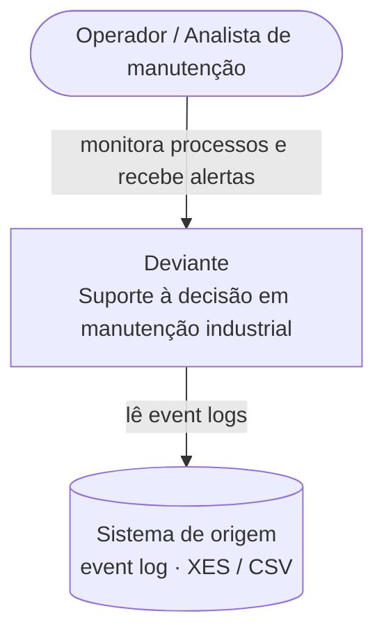
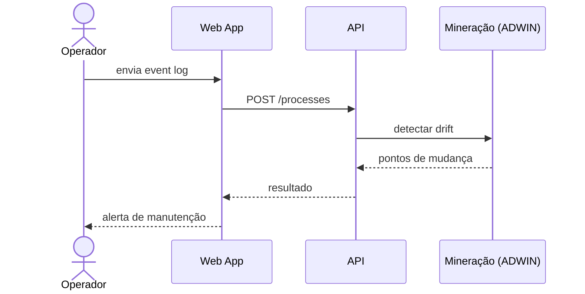

# Arquitetura do Deviante — arc42

> **Nota:** este é o esqueleto arc42 (12 seções). Os textos abaixo são
> _placeholders substituíveis_ — escreva o conteúdo real direto no Obsidian e
> dê push; o site atualiza sozinho. Os diagramas são Mermaid (C4 / UML) e
> renderizam inline.

---

## 1. Introdução e Metas

_Substituir: visão geral do sistema, principais requisitos funcionais e as 3–5
metas de qualidade mais importantes. Quem são os stakeholders._

| Prioridade | Meta de qualidade | Cenário (substituir) |
|-----------|-------------------|----------------------|
| 1 | _(ex.: Precisão de detecção)_ | _…_ |
| 2 | _(ex.: Latência)_ | _…_ |
| 3 | _(ex.: Usabilidade)_ | _…_ |

## 2. Restrições da Arquitetura

_Substituir: restrições técnicas, organizacionais e convenções que limitam as
decisões (stack fixa, normas, prazos, etc.)._

## 3. Contexto e Escopo

_Substituir: fronteira do sistema, atores externos e interfaces. O diagrama C4
de contexto (nível 1) resume as relações externas._

## 4. Estratégia da Solução

_Substituir: decisões-chave de tecnologia e de arquitetura que endereçam as
metas de qualidade — resumo antes do detalhe._

## 5. Visão de Blocos de Construção

_Substituir: decomposição estática do sistema. Ver os diagramas C4 nível 2
(containers) e nível 3 (componentes) na barra lateral._

## 6. Visão de Runtime

_Substituir: cenários dinâmicos importantes (ex.: upload de log → detecção de
drift → alerta). O diagrama UML de sequência abaixo é um placeholder._

## 7. Visão de Implantação

_Substituir: mapeamento para infraestrutura (Vercel, Fly.io, Supabase, etc.) e
os canais entre os nós._

## 8. Conceitos Transversais

_Substituir: padrões recorrentes — modelo de domínio, segurança/autenticação,
i18n, tratamento de erros, observabilidade._

## 9. Decisões de Arquitetura

_Substituir: registro de decisões (ADRs) relevantes, com contexto e
consequências._

## 10. Requisitos de Qualidade

_Substituir: árvore de qualidade e cenários de qualidade detalhados (refina a
seção 1)._

## 11. Riscos e Dívida Técnica

_Substituir: riscos conhecidos e dívida técnica, ordenados por prioridade._

## 12. Glossário

| Termo | Definição (substituir) |
|-------|------------------------|
| _Drift_ | _…_ |
| _Event log_ | _…_ |
| _Sojourn time_ | _…_ |
